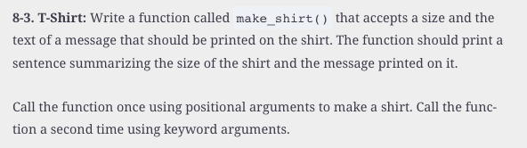

#  Reading: Introduction to Functions

---

## Pre Class Reading Assignment

On the O'Reilly's website read chapter 8 in _Python Crash Course, 3rd Edition_. 
 Here is a direct link to the readings: [PCC Chapter 8: Functions](https://learning.oreilly.com/library/view/python-crash-course/9781098156664/c08.xhtml){:target="_blank"}.

Remember that you will have to sign in to you free account that you created earlier.

### Things to Look Out For
- Similar to mathematical functions, Python functions will take one or more inputs (defined by its parameters), manipulate them, and return one or more outputs
- Creating a function allows you to create a block of code once, and then use that same code multiple times by simply calling it
- Parameters are placeholder variables within the parantheses of a function definition, and arguments are the actual values being sent to the function when it is called
- Defining a function is not the same as using it - you must call your function whenever you want it to run

---

## Pre-Class Quiz Challenge
In a Colab notebook, complete Problem 8-3 found in chapter 8 of the textbook. Do not worry about calling the function using keyword arguments, just call it once using positional arguments. Submit a link to the completed problem in your Pre-Class Quiz. 

---

## Turning in/Rubric

**_REMINDER_** - For this class, **you will only turn in the links to your colab notebooks**. You will get a 0 for this assignment if you turn in a python file or a link that is not correct, wrong assignment, or does not give editor permission.

**Rubric:**

|                      Item                      | Points Possible |
|:----------------------------------------------:|:---------------:|
| 
**Total**
 |        3        |

---

The following is not a part of the rubric, but specifies how you can lose points. For example: if you fail to share your link correctly.

| **Reasons for Points Lost** |    **Amount**     |  
|:---------------------------:|:-----------------:|
|   Link shared incorrectly   |       -10%        | 