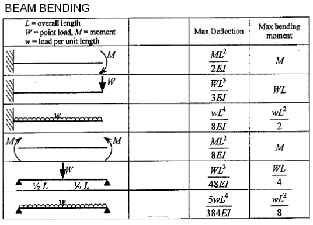

#  HW: Functions (Part 2)

**Purpose:** Learn how to use functions to create more simplified blocks of code

##  Instructions
1. First, make a copy of the starter sheet here: 

2. Rename it something like "[Your Name]Functions_(Part 2)_homework"

In this assignment, you will be creating code that will allow a user to find the maximum deflection and maximum bending stress on a beam given these six scenarios:

&nbsp;&nbsp;&nbsp;&nbsp;Scenario 1: Cantilever beam with a moment load

&nbsp;&nbsp;&nbsp;&nbsp;Scenario 2: Cantilever beam with a point load

&nbsp;&nbsp;&nbsp;&nbsp;Scenario 3: Cantilever beam with a distributed load

&nbsp;&nbsp;&nbsp;&nbsp;Scenario 4: Simply supported beam with a moment load

&nbsp;&nbsp;&nbsp;&nbsp;Scenario 5: Simply supported beam with a point load

&nbsp;&nbsp;&nbsp;&nbsp;Scenario 6: Simply supported beam with a distributed load

**These scenarios are in the same exact order of the chart below. For example, scenario 1 corresponds to the very first image in the chart, scenario 2 corresponds to the second image in the chart, and so on.**

---

#### Part 1

1. In the first code block, write six appropriately named functions that calculate and return the maximum deflection and maximum moment for each beam scenario shown in the chart below. Your parameters will be the variables corresponding to each scenario's max deflection and max bending moment.

    

Source: [LearnEASY: Beam Bending Formulas](https://www.mem50212.com/MDME/MEMmods/MEM09155A-CAE/resources/Beams.htm){:target="_blank"}

where:

>>$M$ = the moment load (in lb-in) 
$W$ = the point load (in lb) 
$w$ = the distributed load (in lb/in) 
$L$ = the length of the beam (in inches) 
$E$ = the modulus of elasticity (in psi) 
$I$ = the moment of inertia (in inches^4)

2. Create a seventh function that calculates and returns the moment of inertia using this formula:

>>$I=\frac{bh^3}{12}$

where:

>>$b$ = the base of the beam (in inches) 
$h$ = the height of the beam (in inches)

3. Create an eighth function that calculates and returns maximum bending stress using this formula:

>>$\sigma_{max}=\frac{My}{I}$

where:

>>$M$ = the maximum moment (in lb-in) 
$y$ = half of the height of the beam (in inches) 
$I$ = the moment of inertia (in inches^4)

#### Part 2

1. In the second code block, create the following input statements:

   | Variable Name |                            Prompt                           | Variable Type |
   |:-------------:|:-----------------------------------------------------------:|:-------------:|
   |   beam_type   | Asks what the beam type is (cantilever or simply supported) |    string     |
   |   load_type   | Asks what the load type is (moment, point, or distributed)  |    string     |

2. On a new line, create IF and ELIF statements that check if the **load_type** entered is a moment, a point, or a distributed load. Depending on which **load_type** is entered, your IF and ELIF statements will run one of the following input statements:

   | Variable Name |                            Prompt                            | Variable Type |
   |:-------------:|:------------------------------------------------------------:|:-------------:|
   |  moment_load  |   Asks what the value of the moment load is (in lb-inches)   |     float     |
   |   point_load  |      Asks what the value of the point load is (in lbs)       |     float     |
   |   dist_load   | Asks what the value of the distributed load is (in lbs/inch) |     float     |

3. On a new line, create the following input statements:

   | Variable Name |                            Prompt                           | Variable Type |
   |:-------------:|:-----------------------------------------------------------:|:-------------:|
   |       L       |        Asks what the length of the beam is (in inches)      |     float     |
   |       E       |        Asks what the modulus of elasticity is (in psi)      |     float     |
   |       b       |         Asks what the base of the beam is (in inches)       |     float     |
   |       h       |        Asks what the height of the beam is (in inches)      |     float     |

4. On a new line, create the variable **y** using the following equation:

>>$y=\frac{h}{2}$

5. On a new line within the code block, create a variable **I** that you set by calling the moment of inertia 
   function you created earlier, with the variables **b** and **h**  as its arguments. These variables were defined earlier.

6. On a new line, create IF and ELIF statements that check if the **beam_type** is a cantilever or a simply supported beam. Within those IF and ELIF statements, nest more IF and ELIF statements that check if the **load_type** is a moment, a point, or a distributed load. 

7. Depending on your **beam_type** and **load_type**, use the appropriate function to assign values to the variables **max_deflection** and **max_moment**  within the nested IF and ELIF statements. For example, if your **beam_type** is a cantilever and your **load_type** is a moment load, your variables **max_deflection** and **max_moment** should be set using the function you created for a cantilever and moment load.

8. On a new unindented line, create the variable **max_stress** and set the value by calling the maximum bending 
   stress function you created earlier, with the variables **max_moment**, **y**, and **I** as its arguments. These 
   variables were defined earlier.

9. On a new line, create a print statement that tells the user what the maximum deflection of the beam is (in inches)
   as well as the maximum bending stress (in psi).
10. On a new line, create a text file called "beam_results.txt" and open the file using a context manager. (make 
    sure this comes after all the other code.) Open your created file in "append" mode, and write the maximum 
    deflection and 
    maximum bending stress to the file, each on a new line. Make sure that the file is appending the results, not 
    writing over them. If you cant remember how to do this, refer back to the preclass reading.

10. Check if your functions work by using the following inputs:

   | Variable Name |                            Input                            |
   |:-------------:|:-----------------------------------------------------------:|
   |  moment_load / point_load / dist_load  |                            192000 / 1500 / 1700                        |
   |       L       |                             144                             |
   |       E       |                           29e6                          |
   |       b       |                              8                              |
   |       h       |                              12                             |

11. If you did everything correct, you should get the following values for each scenario (the deflection values are rounded to the thousandths place):

   |                     Scenario                         | Maximum Deflection | Maximum Bending Stress |
   |:----------------------------------------------------:|:------------------:|:----------------------:|
   |       Cantilever beam with a moment load             |     0.06 inches    |        1000 psi        |
   |       Cantilever beam with a point load              |     0.045 inches   |        1125 psi        |
   |       Cantilever beam with a distributed load        |     2.735 inches   |        91800 psi       |
   |       Simply supported beam with a moment load       |     0.015 inches   |        1000 psi        |
   |       Simply supported beam with a point load        |     0.003 inches   |       281.25 psi       |
   |       Simply supported beam with a distributed load  |     0.285 inches   |        22950 psi       |
   
12. If your txt file was created correctly, you should end up with a file that has the answers to the trial runs, 
    each on a new line. Try opening the file to check if it has the correct formatting and values. **Note: The txt file 
    does 
    not have to have all the trial problems, it just has to have a few of them so we can see if it 
    is working correctly and has the right formatting.**

---

# Turning In/Rubric

Turn on sharing and editing. Turn in the link to the Learning Suite feedback box

|                            **Item**                             | **Amount** |
|:---------------------------------------------------------------:|:----------:|
|            1st scenario function is defined correctly           |     2      |
|            2nd scenario function is defined correctly           |     2      |
|            3rd scenario function is defined correctly           |     2      |
|            4th scenario function is defined correctly           |     2      |
|            5th scenario function is defined correctly           |     2      |
|            6th scenario function is defined correctly           |     2      |
|         Moment of inertia function is defined correctly         |     2      |
|         Max bending stress function is defined correctly        |     2      |
|   IF and input statements are defined correctly for load_type   |     2      |
|    Input statements for L, E, b, and h are defined correctly    |     2      |
|               Variables y and I are defined correctly           |     2      |
| Functions and related IF statements are called/defined correctly|     4      |
|                Variable max_stress defined correctly            |     2      |
| Second code block prints maximum deflection and bending stress  |     2      |
|         
**Total**
          |   **30**   |

The following is not a part of the rubric, but specifies how you can lose points. For example: if you do not explain 
your code when using AI to help you create it or fail to share your link correctly.

|                      **Reasons for Points Lost**                         | **Amount** |  
|:------------------------------------------------------------------------:|:----------:|
|  No comments explaining why AI is used and what its provided code does   |     2-3    |
|                       Link shared incorrectly                            |      3     |
