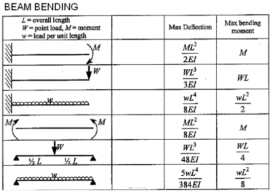

#  HW: Functions and Files

**Purpose:** Learn how to use functions to create more simplified blocks of code

## Beam Equations

In this assignment, you will be creating code that will allow a user to find the maximum deflection and maximum bending stress on a beam given these six scenarios:

>Scenario 1: Cantilever beam with a moment load 
>Scenario 2: Cantilever beam with a point load 
>Scenario 3: Cantilever beam with a distributed load 
>Scenario 4: Simply supported beam with a moment load 
>Scenario 5: Simply supported beam with a point load 
>Scenario 6: Simply supported beam with a distributed load

These scenarios are in the same order of the chart below. For example, scenario 1 corresponds to the very first image in the chart, scenario 2 corresponds to the second image in the chart, and so on.

  

Source: [LearnEASY: Beam Bending Formulas](https://www.mem50212.com/MDME/MEMmods/MEM09155A-CAE/resources/Beams.htm){:target="_blank"}

where:

>>$M$ = the moment load (in lb-in) 
$W$ = the point load (in lb) 
$w$ = the distributed load (in lb/in) 
$L$ = the length of the beam (in inches) 
$E$ = the modulus of elasticity (in psi) 
$I$ = the moment of inertia (in inches^4)

The moment of inertia (I) is based on the cross-sectional shape of the beam. For this assignment, we will assume a rectangular cross-section. The formula for the moment of inertia for a rectangular cross-section is:

>>$I=\dfrac{bh^3}{12}$

where:
>>$b$ = the base of the beam (in inches) 
> $h$ = the height of the beam (in inches)

The maximum bending stress can be calculated using this formula:

>>$\sigma_{max}=\dfrac{My}{I}$

where:
>>$M$ = the maximum moment (in lb-in) 
> $y$ = half of the height of the beam (in inches) = $\dfrac{h}{2}$ 
> $I$ = the moment of inertia (in inches^4)
> 
> 
---

##  Getting Started
1. First, make a copy of the starter sheet here: 

2. Rename it something like "(Your_Name)_HW_Adv_Function_File".

#### Part 1

1. In the first code block, write two functions: **cantilever()** and **simply_supported()** that calculate and 
   return the maximum deflection and maximum moment for each beam scenario shown in the chart below. The arguments 
   to the function will be the load type (load_type: "moment", "point", or "distributed"), load value (load), length of 
   the beam 
   (L), modulus of elasticity (E), and moment of inertia (I). You will need to use IF and ELIF statements within each function to determine which formulas to use based on the type of load. Use the formulas from the chart above to create your functions.

2. Create a third function called **inertia()** that calculates and returns the moment of inertia using the equation above. The inputs are the base (b) and height (h) of the beam.

3. Create a fourth function called **sigma_max()** that calculates and returns maximum bending stress using the equation above. The inputs are the maximum moment (M), half of the height of the beam (y), and moment of inertia (I).

#### Part 2

Click here to download a text file containing a set of beams and their associated parameters: [beam_inputs.csv]
(beam_inputs.csv).

The contents of the file are as follows:

| beam_id  | beam_type   | load_type   | load   | L   | E         | b  | h  |
|----------|-------------|-------------|--------|-----|-----------|----|----|
| B01      | cantilever  | moment      | 180000 | 120 | 29000000  | 8  | 10 |
| B02      | cantilever  | moment      | 250000 | 96  | 29000000  | 6  | 12 |
| B03      | cantilever  | point       | 2000   | 120 | 29000000  | 8  | 10 |
| B04      | cantilever  | point       | 1200   | 84  | 10000000  | 6  | 8  |
| B05      | cantilever  | distributed | 1600   | 144 | 29000000  | 8  | 12 |
| B06      | cantilever  | distributed | 2200   | 96  | 3600000   | 10 | 16 |

Each row in the file corresponds to a different beam and its associated parameters. You will be using this data to test your functions and write the results to a text file. The columns are separated by commas. The first row contains the headers for each column.

Write code in the indicated code block to do the following:

1. Open the CSV file using a context manager. Read each line of the file, skipping the header row. For each line, extract the values for each column and assign them to appropriately named variables. You will need to convert the values to the correct data type (string or float) as needed.
2. For each line, use the functions you created in Part 1 to calculate the maximum deflection and maximum bending 
   stress for each beam. 
3. Write the results to a text file called **"beam_results.txt"**. Each line in the text file should contain the 
   beam id, the maximum deflection, and the maximum bending stress for each beam, formatted as follows:

   >Beam ID: XXXX, Maximum Deflection: Y.YYY inches, Maximum Bending Stress: ZZZ.ZZ psi

   where XXXX is the beam id, Y.YYY is the maximum deflection rounded to three decimal places and ZZZ.ZZ is the maximum 
   bending stress rounded to two decimal places. Be sure to append each result on a new line in the text file and to close the file when you are done.

---

## Turning in/Rubric

**_REMINDER_** - For this class, **you will only turn in the links to your colab notebooks**. You will get a 0 for this assignment if you turn in a python file or a link that is not correct, wrong assignment, or does not give editor permission.

**Rubric:**

|                             **Item**                             | **Amount** |
|:----------------------------------------------------------------:|:----------:|
|            1st scenario function is defined correctly            |     2      |
|            2nd scenario function is defined correctly            |     2      |
|            3rd scenario function is defined correctly            |     2      |
|            4th scenario function is defined correctly            |     2      |
|            5th scenario function is defined correctly            |     2      |
|            6th scenario function is defined correctly            |     2      |
|         Moment of inertia function is defined correctly          |     2      |
|         Max bending stress function is defined correctly         |     2      |
|   IF and input statements are defined correctly for load_type    |     2      |
|    Input statements for L, E, b, and h are defined correctly     |     2      |
|             Variables y and I are defined correctly              |     2      |
| Functions and related IF statements are called/defined correctly |     4      |
|              Variable max_stress defined correctly               |     2      |
|  Second code block prints maximum deflection and bending stress  |     2      |
|       Files is created correctly and appends new solutions       |     2      |
|          
**Total**
          |   **32**   |

---

The following is not a part of the rubric, but specifies how you can lose points. For example: if you do not explain your code when using AI to help you create it or fail to share your link correctly.

|                       **Reasons for Points Lost**                       |    **Amount**     |  
|:-----------------------------------------------------------------------:|:-----------------:|
|                         Link shared incorrectly                         |       -10%        |
|                        Turned in late (per week)                        | -10% (up to -50%) |
| No comments explaining where AI is used and what its provided code does |       -10%        |
