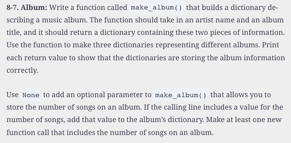

#  Reading: Functions (Part 2) and Files

---

# Pre Class Reading Assignment

On the W3Schools website, read the Python Tutorial chapter on Python Functions. 
 Here is a direct link to the reading: [W3Schools: Python Functions](https://www.w3schools.com/python/python_functions.asp){:target="_blank"}.

We suggest you re-read the chapter on Python Functions in the _Python Crash Course, 3rd Edition_ textbook. It will help understand the W3School discussion.
 Here is a direct link to the previous reading: [PCC Chapter 8: Functions](https://learning.oreilly.com/library/view/python-crash-course/9781098156664/c08.xhtml){:target="_blank"}.

## Things to Look Out For
- Anything that you found confusing on the previous functions reading
- What is the difference between parameters and arguments?
- How many arguments can a function take?
- If your function expects a certain number of arguments, you have to call the function with that many arguments. 
- What should you do if you don't know how many arguments will be passed into your function?
- If the order of the arguments is important, you can use key = value syntax to make sure the arguments are passed in the correct order.
- Can you pass a list as an argument to a function?
- Recursion means that a function calls itself

---

# Files 

This section will introduce you to file handling in Python. You will learn how to read from and write to files, which is essential for data persistence and manipulation.

There are two main ways that you can open and close a file in Python:

1. Using the `open()` function with a context manager (`with` statement), which automatically closes the file when done.
2. Using the `open()` function without a context manager, which requires you to manually close the file using the `close()` method.

# Pre-Class Quiz Challenge
In a Colab notebook, complete Problem 8-7 found in chapter 8 of the textbook. Submit a link to the completed problem in your Pre-Class Quiz. 

