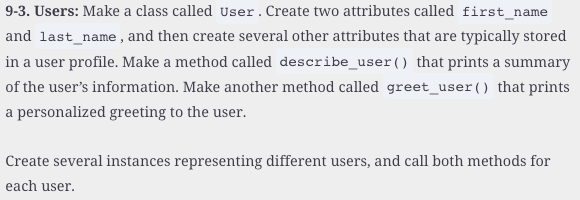
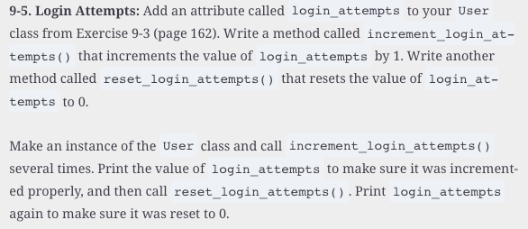

#  Reading: Introduction to Classes

---

## Pre Class Reading Assignment

On the O'Reilly's website read chapter 9 in _Python Crash Course, 3rd Edition_. 
 Here is a direct link to the readings: [PCC Chapter 9: Classes](https://learning.oreilly.com/library/view/python-crash-course/9781098156664/c09.xhtml){:target="_blank"}.

Remember that you will have to sign in to you free account that you created earlier.

### Things to Look Out For
- A class is like a template or plan that defines how objects should be created 
- Creating a class allows you to define an object once and then create many similar objects from it
- A class describes the data (attributes) an object will have and the actions (methods) it can perform
- Defining a class is not the same as using it — you must create an object from the class to use it

---

## Pre-Class Quiz Challenge
In a Colab notebook, complete Problem 9-3 and 9-5 found in chapter 9 of the textbook. Be sure to create and run several instances to test your class. Submit a link to the completed problem in your Pre-Class Quiz.

If you have time and want to practice more, you can also complete Problem 9-7 and 9-8

---

## Turning in/Rubric

**_REMINDER_** - For this class, **you will only turn in the links to your colab notebooks**. You will get a 0 for this assignment if you turn in a python file or a link that is not correct, wrong assignment, or does not give editor permission.

**Rubric:**

|                      Item                      | Points Possible |
|:----------------------------------------------:|:---------------:|
| 
**Total**
 |        3        |

---

The following is not a part of the rubric, but specifies how you can lose points. For example: if you fail to share your link correctly.

| **Reasons for Points Lost** |    **Amount**     |  
|:---------------------------:|:-----------------:|
|   Link shared incorrectly   |       -10%        | 