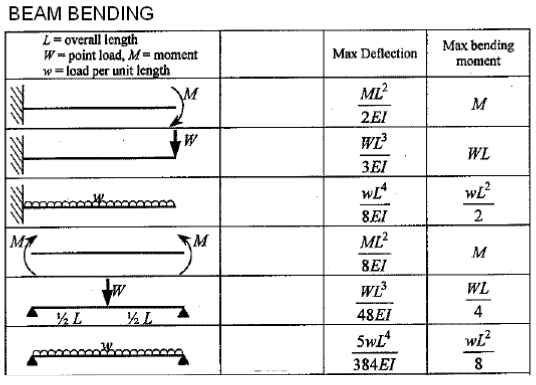

#  HW: Functions (Part 2)

**Purpose:** Learn how to use functions to create more simplified blocks of code

##  Instructions
1. First, make a copy of the starter sheet here: 

2. Rename it something like "[Your Name] HW 2.6b - Functions (Part 2)"

In this assignment, you will be creating code that will allow a user to find the maximum deflection and maximum bending stress on a beam given these six scenarios:

Scenario 1: Cantilever beam with a moment load

Scenario 2: Cantilever beam with a point load

Scenario 3: Cantilever beam with a distributed load

Scenario 4: Simply supported beam with a moment load

Scenario 5: Simply supported beam with a point load

Scenario 6: Simply supported beam with a distributed load

**These scenarios are in the same exact order of the chart below. For example, scenario 1 corresponds to the very first image in the chart, scenario 2 corresponds to the second image in the chart, and so on.**

---

#### Part 1

1. In the first code block, write six appropriately named functions that calculate and return the maximum deflection and maximum moment for each beam scenario shown in the chart below. Your parameters will be the variables corresponding to each scenario's max deflection and max bending moment.

    

   Source: <a href="https://www.mem50212.com/MDME/MEMmods/MEM09155A-CAE/resources/Beams.htm" target="_blank">

&nbsp;&nbsp;&nbsp;&nbsp;where:

&nbsp;&nbsp;&nbsp;&nbsp;&nbsp;&nbsp;&nbsp;&nbsp;\(M\) = the moment load (in lb-in)

&nbsp;&nbsp;&nbsp;&nbsp;&nbsp;&nbsp;&nbsp;&nbsp;\(W\) = the point load (in lb)

&nbsp;&nbsp;&nbsp;&nbsp;&nbsp;&nbsp;&nbsp;&nbsp;\(w\) = the distributed load (in lb/in)

&nbsp;&nbsp;&nbsp;&nbsp;&nbsp;&nbsp;&nbsp;&nbsp;\(L\) = the length of the beam (in inches)

&nbsp;&nbsp;&nbsp;&nbsp;&nbsp;&nbsp;&nbsp;&nbsp;\(E\) = the modulus of elasticity (in psi)
   
&nbsp;&nbsp;&nbsp;&nbsp;&nbsp;&nbsp;&nbsp;&nbsp;\(I\) = the moment of inertia (in inches^4)

 

2. Create a seventh function that calculates and returns the moment of inertia using this formula:

    $$\ I=\frac{bh^3}{12} \$$

&nbsp;&nbsp;&nbsp;&nbsp;where:

&nbsp;&nbsp;&nbsp;&nbsp;&nbsp;&nbsp;&nbsp;&nbsp;\(b\) = the base of the beam (in inches)

&nbsp;&nbsp;&nbsp;&nbsp;&nbsp;&nbsp;&nbsp;&nbsp;\(h\) = the height of the beam (in inches)

 

3. Create an eighth function that calculates and returns maximum bending stress using this formula:

     $$\sigma_{max}=\frac{My}{I}\$$

&nbsp;&nbsp;&nbsp;&nbsp;where:

&nbsp;&nbsp;&nbsp;&nbsp;&nbsp;&nbsp;&nbsp;&nbsp;\(M\) = the maximum moment (in lb-in)

&nbsp;&nbsp;&nbsp;&nbsp;&nbsp;&nbsp;&nbsp;&nbsp;\(y\) = half of the height of the beam (in inches)

&nbsp;&nbsp;&nbsp;&nbsp;&nbsp;&nbsp;&nbsp;&nbsp;\(I\) = the moment of inertia (in inches^4)

 

#### Part 2

1. In the second code block, create the following input statements:

   | Variable Name |                            Prompt                           | Variable Type |
   |:-------------:|:-----------------------------------------------------------:|:-------------:|
   |   beam_type   | Asks what the beam type is (cantilever or simply supported) |    string     |
   |   load_type   | Asks what the load type is (moment, point, or distributed)  |    string     |

2. On a new line, create IF and ELIF statements that check if the **load_type** entered is a moment, a point, or a distributed load. Depending on which **load_type** is entered, your IF and ELIF statements will return one of the following input statements:

   | Variable Name |                            Prompt                           | Variable Type |
   |:-------------:|:-----------------------------------------------------------:|:-------------:|
   |  moment_load  |    Asks what the value of the moment load is (in lb-in)     |     float     |
   |   point_load  |      Asks what the value of the point load is (in lb)       |     float     |
   |   dist_load   |  Asks what the value of the distributed load is (in lb/in)  |     float     |

3. On a new line, create the following input statements:

   | Variable Name |                            Prompt                           | Variable Type |
   |:-------------:|:-----------------------------------------------------------:|:-------------:|
   |       L       |        Asks what the length of the beam is (in inches)      |     float     |
   |       E       |        Asks what the modulus of elasticity is (in psi)      |     float     |
   |       b       |         Asks what the base of the beam is (in inches)       |     float     |
   |       h       |        Asks what the height of the beam is (in inches)      |     float     |

4. On a new line, create the variable **y**:

   $$\ y=\frac{h}{2} \$$

5. On a new line within the code block, create a variable **I** that calls the moment of inertia function you created earlier, with the variables **b** and **h** defined earlier as its arguments

6. On a new line, create IF and ELIF statements that check if the **beam_type** is a cantilever or a simply supported beam. Within those IF and ELIF statements, nest more IF and ELIF statements that check if the **load_type** is a moment, a point, or a distributed load. 

7. Depending on your **beam_type** and **load_type**, create the variables **max_deflection** and **max_moment** that call its related function within the nested IF and ELIF statements. For example, if your **beam_type** is a cantilever and your **load_type** is a moment load, your variables **max_deflection** and **max_moment** should be set equal to the function you created for a cantilever and moment load.

8. On a new unindented line, create a variable **max_stress** that calls the maximum bending stress function you created earlier, with the variables **max_moment**, **y**, and **I** defined earlier as its arguments

9. Create a print statement that tells the user what the maximum deflection of the beam is (in inches) as well as the maximum bending stress (in psi)
