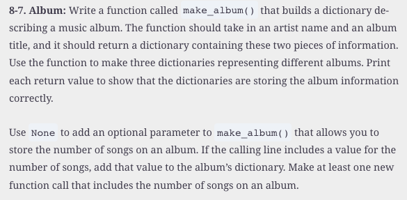

#  Reading: Functions (Part 2)

---

# Pre Class Reading Assignment

On the W3Schools website, read the Python Tutorial chapter on Python Functions. 
 Here is a direct link to the reading: [W3Schools: Python Functions](https://www.w3schools.com/python/python_functions.asp){:target="_blank"}.

We suggest you re-read the chapter on Python Functions in the _Python Crash Course, 3rd Edition_ textbook. It will help understand the W3School discussion.
 Here is a direct link to the previous reading: [PCC Chapter 8: Functions](https://learning.oreilly.com/library/view/python-crash-course/9781098156664/c08.xhtml){:target="_blank"}.

## Things to Look Out For
- Anything that you found confusing on the previous functions reading

---

# Pre-Class Quiz Challenge
In a Colab notebook, complete Problem 8-7 found in chapter 8 of the textbook. Submit a link to the completed problem in your Pre-Class Quiz. 

