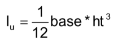
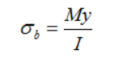

#  HW: Functions (Part 2)

**Purpose:** Learn how to use functions to create more simplified blocks of code

##  Instructions
1. First make a copy of the starter sheet here: [Starter Sheet - HW Functions (Part 2)]
2. Rename is something like "[Your Name] HW 2.7B - Functions"

---

#### Part 1

1. Using the chart below, write six functions that calculate and return the deflection and moment for each beam scenario shown

    

2. Create a seventh function that calculates and returns the moment of inertia using this formula

    

3. Create an eighth function that calculates and returns maximum bending stress using this formula

     

#### Part 2

1. Create a new code block

2. Create a function for calculating the beam loads

3. Make a variable to store the inputs for the beam type (
