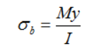

#  HW: Functions (Part 2)

**Purpose:** Learn how to use functions to create more simplified blocks of code

##  Instructions
1. First make a copy of the starter sheet here: [Starter Sheet- HW Functions (Part 2)]
2. Rename is something like "[Your Name] HW 2.7B - Functions"

---

#### Part 1

3. Using the chart below, write six functions that calculate and return the deflection and moment for each beam scenario shown

  

4. Calculate and return the moment of inertia using this formula

  

5. Calculate and return maximum bending stress using this formula

  

#### Part 2

6. 
