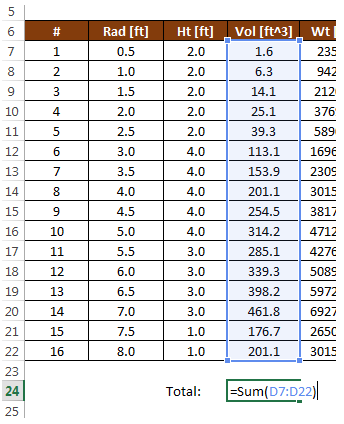

# Variables and Simple Data Types

More content

## This is a second level heading

More content

## Another second level heading

This is a link to a colab notebook:

<a href="https://colab.research.google.com/github/BYU-Hydroinformatics/ggst-notebooks/blob/main/ggst_api.ipynb" target="_blank">
    
</a>

Note that you can simply put raw HTML anywhere and it will render if for you.

This is a list:

* item 1
* item 2
* item 3

This is another list:

- item 1
- item 2
- item 3

This is a table:

First Header | Second Header | Third Header
------------ | ------------- | ------------
Content Cell | Content Cell  | Content Cell
Content Cell | Content Cell  | Content Cell

Links for how to use Markup language:

[MKDocs Overview](https://www.mkdocs.org/user-guide/writing-your-docs/#writing-with-markdown)

[Daring Fireball Primer](https://daringfireball.net/projects/markdown/basics)

^Note the syntax used here. For internal documents it is simpler:

[Lists Homework](lists.md)

[Lists Exercise](../exercises/lists.md)

A link to a file to download for homework:

Click here to download sample CSV file: [sample wells file](variables-files/ut_2015-2020_wells.csv)

That seesms to work fine. Or you can use raw html.

Let's try this: <a href="variables-files/ut_2015-2020_wells.csv" download="sample_file.csv">download this</a>

Here is how you link an image:



This is how you embed python code:

```python
def my_function(food):
  for x in food:
    print(x)

fruits = ["apple", "banana", "cherry"]

my_function(fruits)
```

TESTING - End of sample text. 
