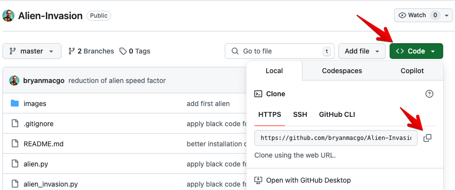
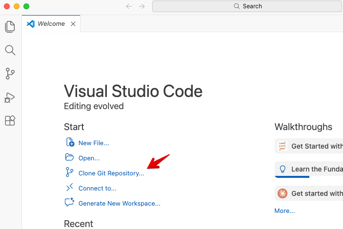
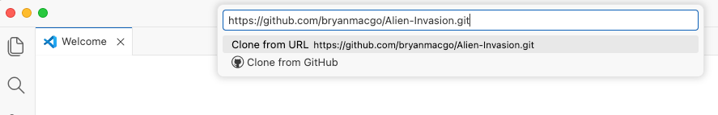
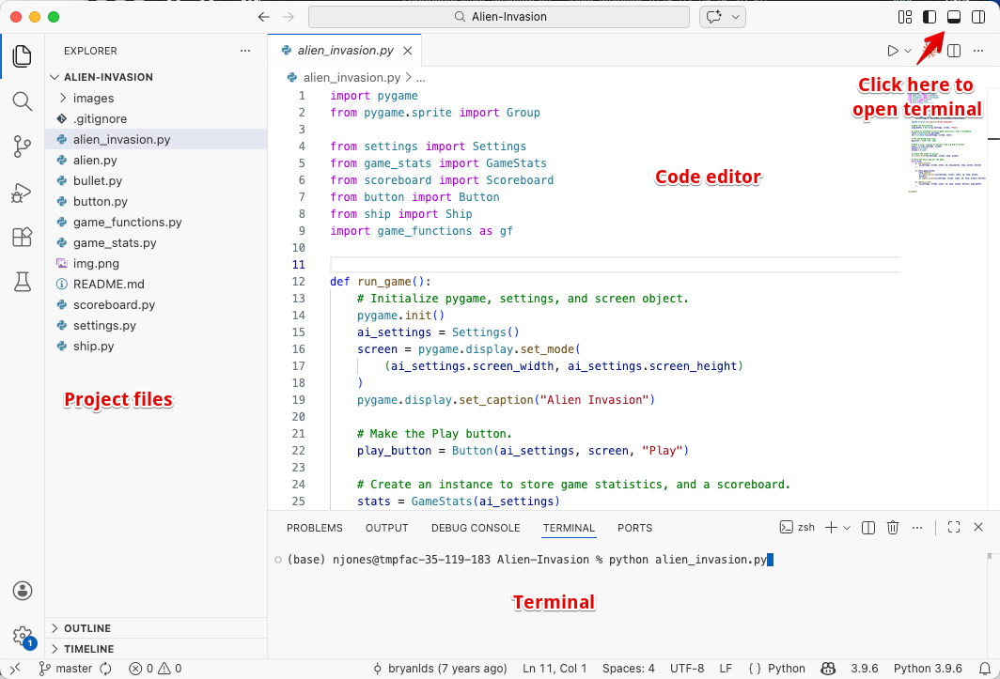
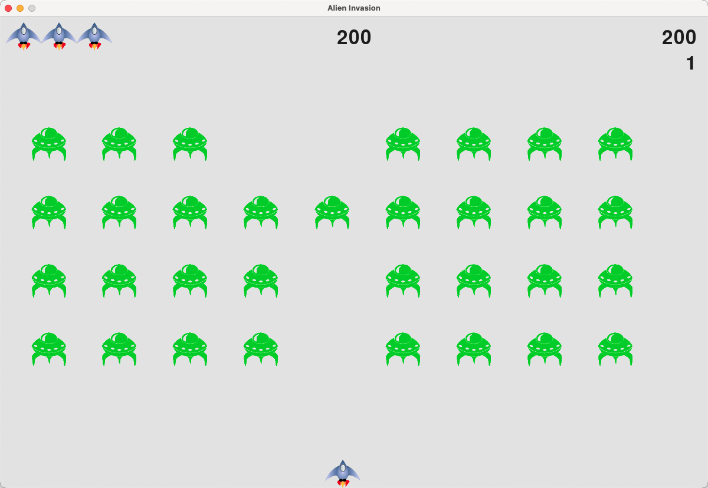
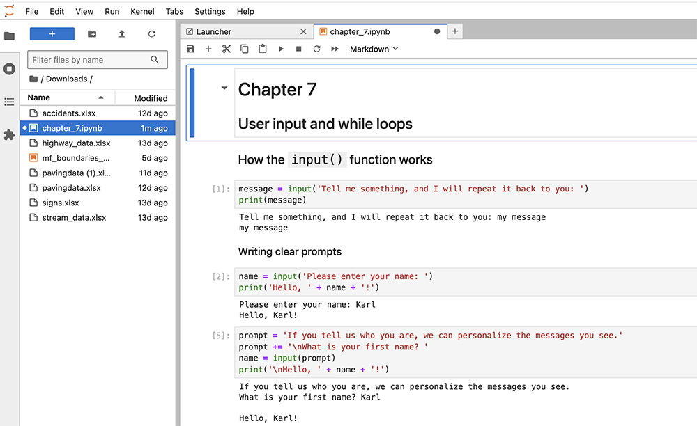
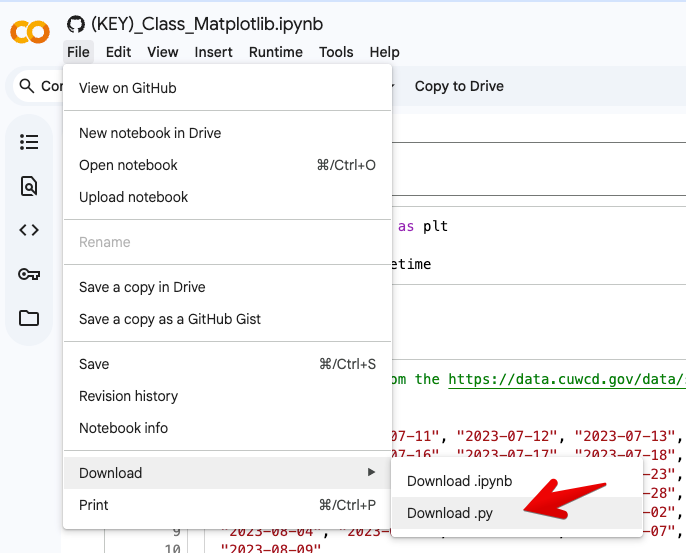

# In-Class Exercise: Running Python Locally

After installing Python, VS Code, and git as described in the reading, do the following exercises.


## Sample Problem 1 - Alien Invasion

For a fun hands-on exercise, try the following. The textbook we have used for this class (Python Crash Course) has a number of exercises related to building a game called "Alien Invasion". You can find the exercises in Chapter 12. Try to implement the game locally on your machine using Python and VS Code. This will give you a chance to practice your Python skills and get familiar with running Python locally.

### Clone the Repository

We are going to use a solution that someone has already written and posted on GitHub. This is a common practice in programming — you can use existing code as a reference or starting point for your own projects. Since we already installed Git above, we can use it to clone (download) the repository to our local machine. Follow these steps:

1. Browse to the repo here: [https://github.com/bryanmacgo/Alien-Invasion](https://github.com/bryanmacgo/Alien-Invasion)

2. Click on the green **Code** button and copy the URL.

    

3. Open VS Code. On the Welcome tab, click **Clone Git Repository**. 



4. Paste the URL you copied here:



5. Choose a folder to save the project. VS Code will clone the repo and offer to open 
   it automatically.

### Install Dependencies

The Alien Invasion game requires the **pygame** package. Open the terminal in VS Code (**Terminal → New Terminal**) and install it:

```bash
pip install pygame-ce
```

**Note:** We are installing `pygame-ce` (the community edition) instead of `pygame` because the original `pygame` package does not yet support Python 3.14+. `pygame-ce` is a drop-in replacement — it uses the same `import pygame` syntax and the code works without any changes.

### Viewing the Code

Once the repository is cloned and opened in VS Code, you will see the project files in the Explorer panel on the left side. The project structure will look something like this:



The files you just cloned are in the "alien_invasion" folder. You can click on any of the Python files to view the code. For example, click on "alien_invasion.py" to see the main code that launches the game. The other files contain the game logic, settings, and other components.

### Running the Game

To run the game, open the terminal in VS Code (**Terminal → New Terminal** or click on the icon as shown above) and 
type:

```bash
python alien_invasion.py
```

You will then see the game launch in a new window:

{width=800}

## Sample Problem 2 - Running Notebooks in Jupyter Lab

Now let's try running an existing notebook in Jupyter Lab. Here is a public repo with notebooks from the Python Crash Course book:

[https://github.com/khiner/notebooks/tree/master/python_crash_course](https://github.com/khiner/notebooks/tree/master/python_crash_course)

1. To download a notebook, click on its name to open a Preview tab, then click the **Download** icon in the upper right corner.

2. Launch Jupyter Lab from your terminal:

```bash
jupyter lab
```

    **Note (Windows):** If you get an error like `'jupyter' is not recognized`, use `python -m jupyter lab` instead.

3. In Jupyter Lab, navigate to where you downloaded the notebook and open it. Here is one of the notebooks from the repo:

    

4. Run the code cells by clicking the **Run** button in the toolbar or by pressing **Shift + Enter**, just like in Colab.

You may also want to try downloading some of your own notebooks from this class and running them locally. Remember that unlike Colab, you need to install any packages yourself using **pip** before they can be used in Jupyter Lab.

## Sample Problem 3 - Converting Colab Notebooks to Python Scripts

One of the drawbacks of Google Colab is that you have to upload your input files to the Colab file space and then 
download any output files you create. This can be time-consuming and error-prone. If you want to run a notebook 
locally, you can convert it to a Python script. This will allow you to run the notebook locally and save the output 
files directly to your local file system. Python also runs much faster than Colab, so this can be a useful option 
for running large notebooks.

To convert a Colab notebook to a Python script, you can use the "Download as" option in the "File" menu. This will 
create a new Python script with the same name as the notebook. You can then run the script locally and save the output 
files to your local file system.



Then copy the file and any associated files you will be using to a folder on your local machine. Open the script in 
your favorite IDE and run it. You may need to install any packages you use in the script and you may need to make some 
changes to the code to make it compatible with your local environment. For example, some of the code we used to 
create forms and form elements in the previous exercises will not work in a Python script.
