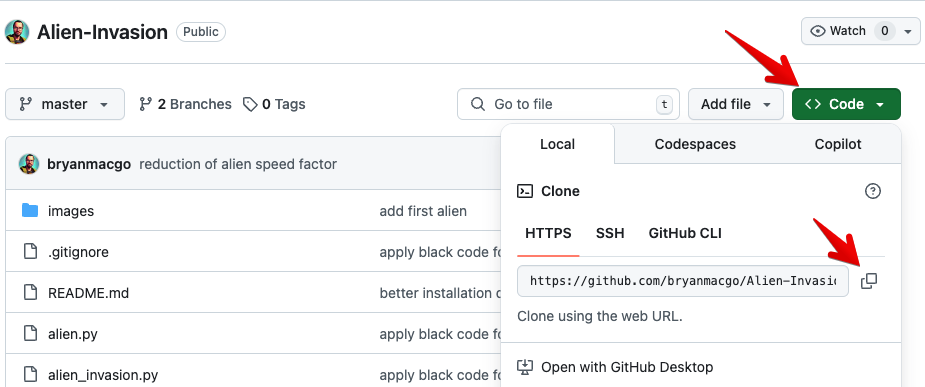
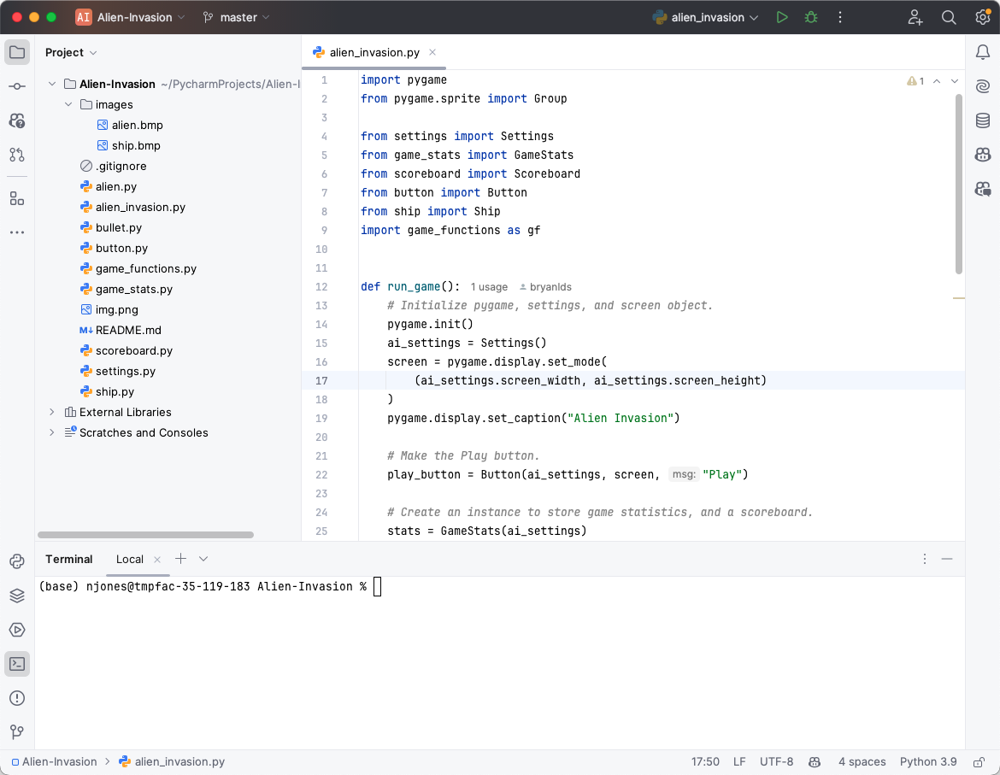
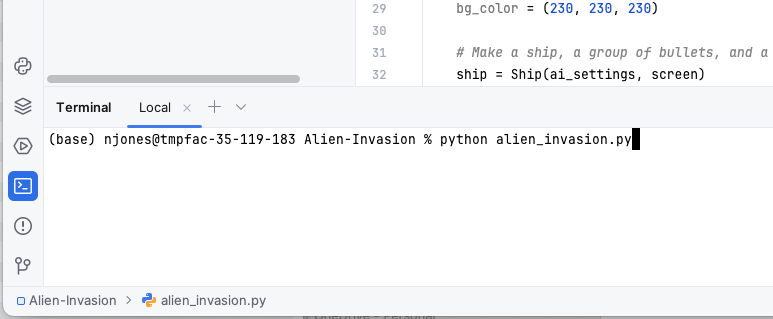
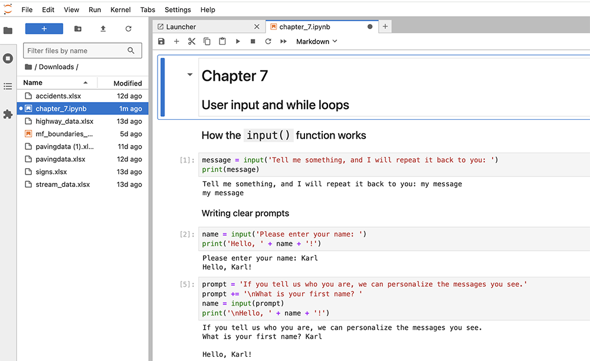
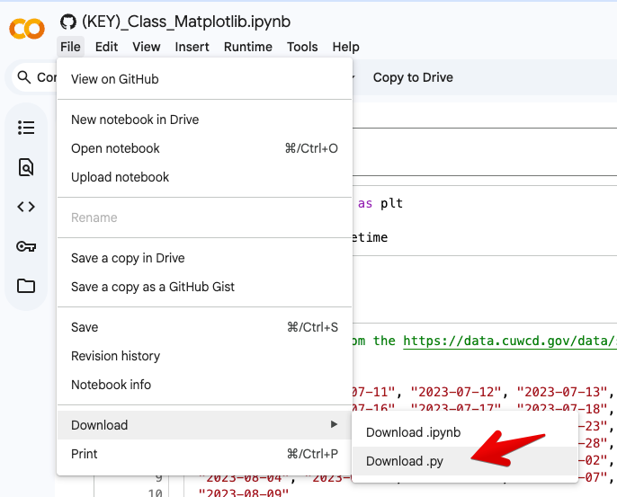

# HW: Using Python Locally

---

Last unit we have been using Python in a Google Colab environment, which is a cloud-based platform. However, you can also run Python locally on your own machine. This can be useful for various reasons, such as working offline, using specific libraries, referencing your files directly without uploading them, or running larger projects. This document provides a brief overview of how to use Python locally, including installation, running scripts, and using virtual environments. We will also discuss some common IDEs (Integrated Development Environments) that can help you write and run Python code more efficiently. In class, we will give a live demonstration of how to install Python and run a simple script locally. We will also show you how to use Jupyter Notebook, which is a popular tool for writing and running Python code in an interactive environment.

## Overview of Installation Methods

There are two common ways to locally install Python:

1) Install Python from the official website, then use  pip to manage packages.<br>
2) Use Anaconda (or miniconda) to install Python and manage packages, as a single step. 
        With this method, you can use either conda or pip to install and manage packages

Most people will use the first method, but if you are using Anaconda/Miniconda (generally called "conda"), the second method can be easier. With conda, you can install Python and manage packages in a single step and also create virtual environments (explained below). As a bonus, conda keeps all packages in sync while with pip you can update packages that break other packages. 

We generally recommend using conda, as it keeps all the package management and installations steps together. However, most web resources will provide instructions that use the first method, so we will cover both methods here. However, if you use the first method to install Python, you CANNOT  use conda as a package manager. You have to use pip.

For both methods, you will need to interact with the installation using the command line. This is a common practice in programming, where you can use the command line to run commands and scripts. The command line is a powerful tool that allows you to interact with your computer and run commands without using a graphical interface. You can use the command line to run Python scripts, install packages, and manage your Python environment.

## Method 1: Installing Python from the Official Website

When you run Python in Google Colab, you are using a version of Python that is hosted on Google's servers. To run Python locally, you need to install it on your own machine. Here are the steps to do that:

To install Python locally, you need to download the Python installer for your operating system. Follow these steps:

1. Go to the official Python website: [python.org](https://www.python.org/downloads/).<br>
2. Download the latest version of Python for your operating system (Windows, macOS, or Linux).<br>
3. Run the installer and follow the instructions. Make sure to check the box that says "Add Python to PATH" during installation.

After installation, you can verify that Python is installed correctly by opening a terminal (Command Prompt on Windows, Terminal on macOS/Linux) and typing the following command:

```bash
python --version
```
This should display the version of Python you installed. If you see an error message, it means Python is not installed correctly or not added to your PATH.

After installing Python, you can use `pin` to easily download and install additional packages. `pip` is a package manager for Python that allows you to install additional libraries and packages. To install a package using `pip`, open your terminal and run the following command:

```bash
pip install package_name
```

For example, to install NumPy and Pandas, you can run:

```bash
pip install numpy pandas
```

# Method 2: Installing Python with Conda

To install Python using conda, you can follow these steps:

1) Go to the Anaconda download page: [Anaconda](https://www.anaconda.com/products/distribution). <br>
2) Download the installer for your operating system (Windows, macOS, or Linux). <br>
3) Run the installer and follow the instructions. <br>
4) Open a terminal and verify the installation by running: <br>

```bash 
conda --version
``` 

The full Anaconda distribution includes Python and many popular libraries, as well as the conda package manager. You can also use Miniconda, which is a lightweight version of Anaconda that includes only the conda package manager and Python. You can install Miniconda by following the same steps as above, but downloading the Miniconda installer instead of the Anaconda installer.

The full Anaconda installation includes a graphical manager called Anaconda Navigator, which allows you to manage packages and environments using a graphical interface. You can also use the command line interface to manage packages and environments.

!!!Hint
    The graphical package manager seems to break often. It is better to just use the command line (i.e., terminal)

!!!Note
    We recommend you DO NOT use the Anaconda Navigator, as it is not as powerful as the command line interface and as noted above, things break often. The command line interface is more flexible and allows you to use all of the features of conda. However, if you prefer a graphical interface, you can use Anaconda Navigator.

!!!Note
    If you install python using `conda` you can use either `conda` or `pip` to manage your packages. If you use `pip` then `conda` won't be aware of those packages. They will work, but they won't be updated when you do a `conda update --all` commane


To install packages on a command line using conda, you can use the following command:

```bash
conda install package_name
```

For example, to install NumPy and Pandas, you can run:

```bash
conda install numpy pandas
```

As you can see, it works the same way as `pip`.

## Running Python Code Locally

Once you have installed Python and any necessary libraries, you can run Python scripts locally. You can create a Python script using any text editor (e.g., Notepad, Visual Studio Code, PyCharm). Just create a new file with a `.py` extension (e.g., `script.py`) and write your Python code in it. For example:

```python
# script.py
print("Hello, World!")
```

!!!Note
    Windows by default hides the file extention, so your file may be called `script.py.txt` which won't work. You need to turn off the "Hide Extensions" and make sure the fine is both a text file and has a .py extension

To run the script, open your terminal, navigate to the directory where the script is located, and run the following command:

```bash
python script.py
```

This will execute the script and display the output in the terminal. In this case, it should print "Hello, World!" to the console.

## Using Virtual Environments

When working on Python projects, it's a good practice to use virtual environments. A virtual environment is an isolated environment that allows you to manage dependencies for different projects separately. This way, you can avoid conflicts between different versions of libraries. For example, if you have two projects that require different versions of the same library, using virtual environments allows you to keep them separate.

### Creating a Virtual Environment using pip/python

To create a virtual environment, navigate to your project directory in the terminal and run the following command:

```bash
python -m venv myenv
```

Or with conda
```bash
conda create --name myenv
```

This will create a new directory called `myenv` that contains the virtual environment along with all the files needed to run python. This lets you have different packaged or even python verions installed at the same time.

To activate the virtual environment, run the following command:

- On Windows:
```bash
myenv\Scripts\activate
```

- On macOS/Linux:
```bash
source myenv/bin/activate
```


Once activated, your terminal prompt will change to indicate that you are now working within the virtual environment.

When the virtual environment is activated, you can install packages using `pip` or `conda` (see below), and they will only be available within that environment. For example:

```bash
pip install numpy pandas
```


To deactivate the virtual environment and return to your system's default Python environment, simply run:

```bash
deactivate
```

This will return you to your system's default Python environment.

### Creating a Virtual Environment with Conda
While we gave you the conda commands above, here is some more detail


To create a new conda environment, run the following command:

```bash
conda create --name myenv python=3.9
```

This will create a new conda environment named `myenv` with Python 3.9 installed. To activate the conda environment, run the following command:

```bash
conda activate myenv
```

To deactivate a Conda environment use:
```bash
conda deactivate
```

## Common IDEs for Python Development

There are several IDEs (Integrated Development Environments) that can help you write and run Python code more efficiently. An IDE provides features like code completion, debugging, and project management, making it easier to develop Python applications. Depending on your needs and preferences, you can choose from a variety of IDEs. Below are some popular options:

### Visual Studio Code (VS Code)

Visual Studio Code is a lightweight and powerful code editor that supports Python development. It has a rich ecosystem of extensions, including support for Jupyter Notebooks, debugging, and version control. You can install the Python extension for VS Code to enhance your Python development experience.

Link: [Visual Studio Code](https://code.visualstudio.com/){target="_blank"}

To install the Python extension, open VS Code, go to the Extensions view (Ctrl+Shift+X), and search for "Python". Install the extension provided by Microsoft. Once installed, you can create and run Python scripts directly within VS Code. It also has a built-in terminal, allowing you to run Python scripts and commands without leaving the editor.

VS Code also natively supports Co-pilot, an AI-powered code completion tool that can help you write code faster and more efficiently. You can install the Co-pilot extension from the Extensions view in VS Code. This works similarly to the AI feature in Google Colab, providing suggestions and code snippets as you type.

VS Code is free and open-source and it is available for Windows, macOS, and Linux. 

The VS Code user interface looks like this:


### PyCharm

PyCharm is a popular IDE specifically designed for Python development. It offers a wide range of features, including code completion, debugging, and version control integration. PyCharm has both a free Community edition and a paid Professional edition with additional features.

Link: [PyCharm](https://www.jetbrains.com/pycharm/){target="_blank"}

Unlike VS Code, PyCharm is not free. However, students can get a free license by showing their ID card for validation.

To install PyCharm, go to the official website and download the version that suits your operating system. Once installed, you can create a new project and start writing Python code. PyCharm also supports virtual environments, allowing you to manage dependencies for different projects easily. PyCharm has a built-in terminal, so you can run Python scripts and commands without leaving the IDE. It also includes a powerful debugger that allows you to step through your code and inspect variables.PyCharm is available for Windows, macOS, and Linux.

PyCharm also has a built-in feature called "Code Intelligence," which provides code suggestions and autocompletion as you type. It also supports the use of GitHub Co-pilot, an AI-powered code completion tool that can help you write code faster and more efficiently. You can install the Co-pilot extension from the PyCharm marketplace. This works similarly to the AI feature in Google Colab, providing suggestions and code snippets as you type.

The PyCharm user interface looks like this:

{target="_blank"}

### Spyder

Spyder is an open-source IDE specifically designed for scientific programming in Python. It includes features like an interactive console, variable explorer, and integrated debugging tools. Spyder is part of the Anaconda distribution but can also be installed separately.

Link: [Spyder](https://docs.spyder-ide.org/current/){target="_blank"}

You can install Spyder using `conda` as follows:

```bash 
conda install spyder
```

Once installed, you can launch Spyder by running `spyder` in the terminal. Spyder is particularly useful for data analysis and scientific computing, as it provides a MATLAB-like interface with support for inline plotting and data visualization.

The Spyder user interface looks like this:


### Jupyter Notebook

Jupyter Notebook is a popular tool for writing and running Python code in an interactive environment. It allows you to create notebooks that can contain code, text, images, and more. You can use Jupyter Notebook to run Python code locally, similar to how you do it in Google Colab. If you want to use Jupyter Notebook locally, you can install it using pip. Open your terminal and run the following command:

```bash
pip install jupyter
```

Or you can install it using conda:

```bash
conda install jupyter
```

This will install Jupyter Notebook, which allows you to create and run notebooks similar to those in Google Colab. To launch Jupyter Notebook, run the following command in your terminal:

```bash
jupyter notebook
```
Now jupyter has an environment that is closer to Colab and has some nice features. It is called `jupyter lab`. To start `jupyter lab` use the command:
```bash
jupyter lab 
```

The interface to Jupyter Notebook will open in your web browser, and you can create new notebooks or open existing ones. You can write and run Python code in the cells, add text and images, and save your work as a notebook file.

The interface to Jupyter Notebook looks like this:


## Conclusion

Using Python locally can provide you with more flexibility and control over your projects. By following the steps outlined in this document, you can install Python, run scripts, and manage dependencies using virtual environments. Additionally, using an IDE can enhance your development experience and make it easier to write and run Python code. Whether you're working on small scripts or larger projects, having Python set up locally can be a valuable skill.

## Additional Resources

- [Python Official Documentation](https://docs.python.org/3/)
- [Python Package Index (PyPI)](https://pypi.org/)
- [Jupyter Notebook Documentation](https://jupyter-notebook.readthedocs.io/en/stable/)
- [Anaconda Documentation](https://docs.anaconda.com/)
- [Visual Studio Code Documentation](https://code.visualstudio.com/docs)
- [PyCharm Documentation](https://www.jetbrains.com/pycharm/documentation/)
- [Spyder Documentation](https://docs.spyder-ide.org/current/)
- [Python Virtual Environments Documentation](https://docs.python.org/3/tutorial/venv.html)
- [Python pip Documentation](https://pip.pypa.io/en/stable/)
- [Python Installation Guide](https://realpython.com/installing-python/)

## Sample Problem 1 - Alien Invasion

For a fun hands-on exercise, try the following. The textbook we have used for this class (Python Crash Course), has a number of exercises related to building a game called "Alien Invasion". You can find the exercises in Chapter 12. Try to implement the game locally on your machine using Python and any of the IDEs mentioned above. This will give you a chance to practice your Python skills and get familiar with running Python locally.

Here is how you would do it with PyCharm.

### Clone the Repository

We are going to cheat and use a solution that someone has already written. This is a common practice in programming, where you can use existing code as a reference or starting point for your own projects. You can find the solution to the Alien Invasion game on GitHub. GitHub is a public code repository hosting service that allows developers to share and collaborate on code. The solution is available in a public repository, which means you can access it for free. You can use this code as a reference or starting point for your own projects.

Follow these steps to clone the repository. This will download the code to your local machine, allowing you to run and modify it as needed. You will need to have Git installed on your machine. This method only works if you have a utility called Git installed. If you don't have Git installed, you can download it from [git-scm.com](https://git-scm.com/).

1. Browse to the repo here: [https://github.com/bryanmacgo/Alien-Invasion](https://github.com/bryanmacgo/Alien-Invasion)

2. Click on the green "Code" button and copy the URL.



3. Launch PyCharm and create a new project.

4. In the "New Project" dialog, select "Clone Repository":


5. and paste the URL you copied earlier.


### Viewing the Code

Once the repository is cloned, you can view the code in PyCharm. The project structure will look like this:



The files you just cloned are in the "alien_invasion" folder. You can open any of the Python files to view the code. 
For example, you can open "alien_invasion.py" file to see the main code that is launched. The other files contain the game logic, settings, and other components of the game. 

### Running the Game

To run the gamescript, you can right-click on "alien_invasion.py" and select "Run 'alien_invasion'". This will execute the script and launch the game in a new window.

You can also open the console window and run the script from there. To do this, click on the "Terminal" icon at the 
bottom left of PyCharm and type:

```bash
python alien_invasion.py
```

In the terminal bash line as follows:



You will then see the game launch in a new window:

{width=800}

## Sample Problem 2 - Jupyter Notebook

As mentioned above, Jupyter Notebook is a popular tool for writing and running Python code in an interactive 
environment. It allows you to create notebooks that can contain code, text, images, and more. You can use Jupyter 
Notebook to run Python code locally, similar to how you do it in Google Colab. There is a version of Jupyter 
Notebook called Jupyter Lab, which is a more advanced version of Jupyter Notebook. It has a more modern interface 
and additional features, such as support for multiple tabs and file management. The examples below are from Jupyter Lab.

Juptyper Lab is similar to Google Colab and in fact they both use the same underlying technology. Both notebooks are 
saved in the same format, called "notebook format". This means that you can open a Google Colab notebook in Jupyter 
Lab and vice versa. Notebooks are saved as *.ipynb files, which are JSON files that contain the code, text, and 
other components of the notebook. So for example, if you have a notebook called "my_notebook.ipynb", you can open it 
in Jupyter Lab and run the code cells just like you would in Google Colab. Imagine that you have a notebook that 
reads and writes a lot of files. With Colab, you have to upload the files to the Colab file space and then download 
any files you create. If you are running the notebook locally, you can read and write files directly to your local file system.

### Python Crash Course Notebooks

If you want to experiment with Jupyter, here is a public repo that has a copy of all of the notebooks from the 
Python Crash Course book. You can clone the repo and run the notebooks locally. The repo is available here:

[https://github.com/khiner/notebooks/tree/master/python_crash_course](https://github.com/khiner/notebooks/tree/master/python_crash_course)

To download one of the files, click on the notebook name and it will open in a Preview tab. Then click on the 
Download icon in the upper right corner of the page. This will download the notebook to your local machine. You can then open it in Jupyter Lab

You may also want to try downloading some of your own notebooks from this class and running them locally with 
Jupyter Lab. The examples below in Sample Problem 3 can also be downloaded and run locally.

### Running Jupyter Lab

Then, after installing Jupyter Lab, you can run the following command in your terminal to launch Jupyter Lab:

```bash
jupyter lab
```

This will open Jupyter Lab in your web browser. You can create a new notebook by clicking on the "Python 3" icon in 
the "Launcher" tab. This will create a new notebook with a code cell where you can write and run Python code. You 
can also path to where you downloaded the notebook and open it from there. Here is one of the notebooks from the repo:



You can run the code cells by clicking on the "Run" button in the toolbar or by pressing Shift + Enter, just like in 
Colab. 

### Installing Packages

One important difference between Jupyter Lab and Google Colab is that you need to install any packages you want to 
use in Jupyter Lab. In Colab, most of the popular packages are already installed, but in Jupyter Lab, you need to 
install it them yourself. You can do this using pip or conda, just like you would in a regular Python environment. 

## Sample Problem 3 - Converting Colab Notebooks to Python Scripts

One of the drawbacks of Google Colab is that you have to upload your input files to the Colab file space and then 
download any output files you create. This can be time-consuming and error-prone. If you want to run a notebook 
locally, you can convert it to a Python script. This will allow you to run the notebook locally and save the output 
files directly to your local file system. Python also runs much faster than Colab, so this can be a useful option 
for running large notebooks.

To convert a Colab notebook to a Python script, you can use the "Download as" option in the "File" menu. This will 
create a new Python script with the same name as the notebook. You can then run the script locally and save the output 
files to your local file system.



Then copy the file and any associated files you will be using to a folder on your local machine. Open the script in 
your favorite IDE and run it. You may need to install any packages you use in the script and you may need to make some 
changes to the code to make it compatible with your local environment. For example, some of the code we used to 
create forms and form elements in the previous exercises will not work in a Python script.

---

# Pre-Class Quiz Challenge

For this topic, there is no challenge to complete before class and turn in on the Learning Suite Pre-Class Quiz. As mentioned above, we will give a live demonstration of how to install Python and run a simple script locally. We will have TAs available to help you with any issues you may have with installing Python or running a script locally. If you want to get a head start, you can try installing Python and Jupyter Lab on your local machine before class. If you have any issues or questions, feel free to ask during class or reach out to the TAs for help.