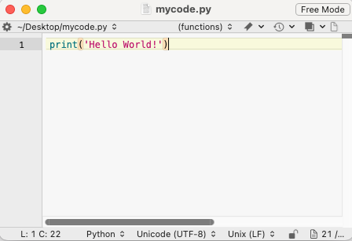
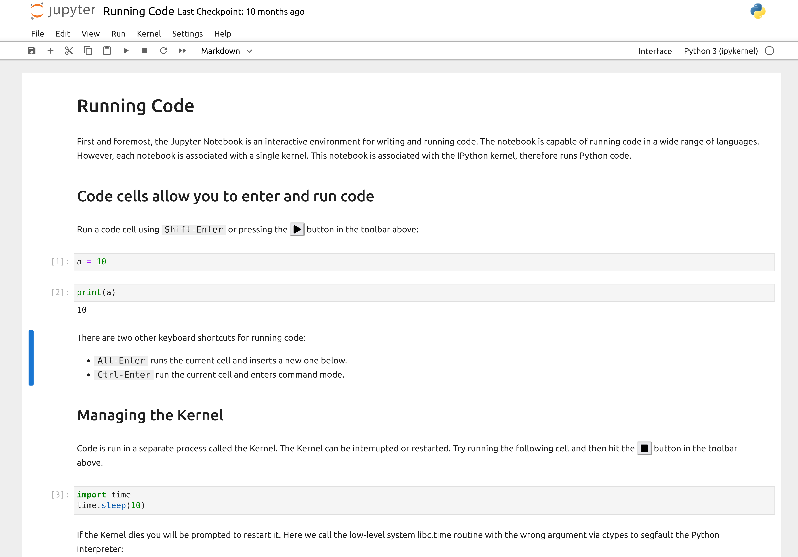

# Reading: Using Python Locally

---

Last unit we have been using Python in a Google Colab environment, which is a cloud-based platform. However, you can also run Python locally on your own machine. This can be useful for various reasons, such as working offline, using specific libraries, referencing your files directly without uploading them, or running larger projects. This document provides a brief overview of how to use Python locally, including installation, running scripts, and managing packages. We will also discuss some common IDEs (Integrated Development Environments) that can help you write and run Python code more efficiently. In class, we will give a live demonstration of how to install Python and run a simple script locally. We will also show you how to use Jupyter Notebook, which is a popular tool for writing and running Python code in an interactive environment.

## Basic Concepts

Before we get into the details, here is an overview of some basic concepts that will be useful in this unit.

**Installing and running Python locally**

In Colab, Python is already installed and you can run Python scripts directly from the notebook. Colab also provides most of the packages that you need. When running locally, you need to install Python and the packages you need. 

Once you have installed Python, you can run it directly from the terminal. For example, you could use a text editor to write a Python script and save it to a file:



and then run it using the following command:

```bash
python mycode.py
```
and the output would be:

```bash
Hello World!
```

**Installing packages**

After you have installed Python, you can install additional packages using **pip**. **pip** is a package manager for Python that allows you to install additional libraries and packages.

For example, to install NumPy and Pandas, you can run:

```bash
pip install numpy pandas
```
There is another package manager called **conda** that is also used to install packages. It works similarly to **pip**, but it is more powerful and can install packages from multiple sources. To get started and to keep things simple for now, we will use **pip** for installing packages.

**Using an IDE**

While you can edit a Python script in a text editor, the best and most efficient way to write and run Python code is to use an Integrated Development Environment (IDE). There are a variety of IDEs available, including [Visual Studio Code (VS Code)](https://code.visualstudio.com/), [PyCharm](https://www.jetbrains.com/pycharm/), and [Spyder](https://www.spyder-ide.org/). We recommend that you start with VS Code. It is free and open-source.

When you use an IDE, you can write and run Python code directly from the IDE, and the IDE provides features like code completion, code formatting, etc.

**Using Git**

There is a website called [GitHub](https://github.com/) that provides a platform for hosting and collaborating on code. You can use GitHub to store your code, share it with others, and collaborate on projects. It is also a great place to explore other Python developers' code. You can easily "clone" a repository (a copy of a project) from GitHub to your local machine and start working on it.

## Python Local Development Setup Guide

Now that we have covered the basics, let's get started. This guide will walk you through installing Python, VS Code, and Git on your laptop. Follow the appropriate section for your operating system.

---

### 🪟 Windows

#### 1. Install Python

1. Go to [python.org/downloads](https://www.python.org/downloads/)
2. Click **Download Python 3.x.x** (the big yellow button). **If the yellow button says "Download Python Install Manager", click the hyperlink below that says "get the standalone installer for Python 3.x.x"**
3. Run the installer
4. ⚠️ **Important:** Check the box that says **"Add Python to PATH"** before clicking Install
5. Click **Install Now**
6. Verify it worked — open **Command Prompt** (search "cmd" in the Start menu) and type:

```
python --version
```

You should see something like **Python 3.12.0**

#### 2. Install VS Code

1. Go to [code.visualstudio.com](https://code.visualstudio.com/)
2. Click **Download for Windows**
3. Run the installer — the defaults are fine
4. When prompted, check **"Add to PATH"** and **"Open with Code"** options
5. Open VS Code and install the **Python extension**:

   - Click the Extensions icon on the left sidebar (or press **Ctrl+Shift+X**)
   - Search for **Python** (by Microsoft)
   - Click **Install**

#### 3. Install Git

1. Go to [git-scm.com/download/win](https://git-scm.com/download/win)
2. Download and run the installer
3. All default options are fine — just keep clicking **Next**
4. Verify it worked — open Command Prompt and type:

```
git --version
```

#### 4. Install Packages with pip

Open **Command Prompt** and use **pip** to install packages:

```
pip install numpy

```

```
pip install pandas matplotlib # you can install multiple at once
```


---

### 🍎 Mac

#### 1. Install Python

1. Go to [python.org/downloads](https://www.python.org/downloads/)
2. Click **Download Python 3.x.x** (the big yellow button)
3. Open the downloaded **.pkg** file and follow the installer steps
4. Verify it worked — open **Terminal** (search "Terminal" in Spotlight with **Cmd+Space**) and type:

```
python --version
```

   You should see something like **Python 3.12.0**

**Note:** On older Macs (pre-2022, before macOS Monterey 12.3), you may need to use **python3** and **pip3** instead of **python** and **pip**. If **python --version** shows an error or Python 2.x, use **python3** instead.

**Note:** Some Macs may prompt you to install **Xcode Command Line Tools** during Python installation or when you first run `python` in Terminal. If you see this prompt, click **Install** and wait for it to finish. You can also install them manually by running the following in Terminal:

```
xcode-select --install
```

#### 2. Install VS Code

1. Go to [code.visualstudio.com](https://code.visualstudio.com/)
2. Click **Download for Mac**
3. Open the downloaded **.zip**, then drag **Visual Studio Code** to your **Applications** folder
4. Open VS Code, then install the **Python extension**:

   - Click the Extensions icon on the left sidebar (or press **Cmd+Shift+X**)
   - Search for **Python** (by Microsoft)
   - Click **Install**

#### 3. Install Git

Git may already be installed on your Mac. Check by opening Terminal and typing:

```
git --version
```

If it's not installed, you'll be prompted to install **Xcode Command Line Tools** — just click **Install** and follow the steps. That will install Git automatically.

#### 4. Install Packages with pip

Open **Terminal** and use **pip** to install packages:

```
pip install numpy
```

```
pip install pandas matplotlib # you can install multiple at once
```

**Note:** If you get an error like `pip: command not found`, pip may not be in your PATH. Try the following fixes:

1. **Use `pip3` instead of `pip`:**

```
pip3 install numpy
```

2. **If `pip3` also doesn't work**, you may need to add Python to your PATH. Run this command in Terminal (replacing `3.12` with your installed Python version):

```
echo 'export PATH="/Library/Frameworks/Python.framework/Versions/3.12/bin:$PATH"' >> ~/.zshrc
source ~/.zshrc
```

Then try `pip install numpy` again.

---

### 🚀 Running Your First Script in VS Code

1. Open VS Code
2. Go to **File → Open Folder** and open a folder for your project
3. Create a new file: **File → New File**, name it **hello.py**
4. Type some code:

```python
print("Hello, world!")
```
   
5. Run it by clicking the **▷ Play button** in the top-right corner, or open the Terminal inside VS Code (**Terminal → New Terminal**) and type:

```
python hello.py
```

## Jupyter Notebook

In addition to VS Code and other IDEs mentioned above, Jupyter Notebook is a popular tool for writing and running Python code in an interactive environment. It allows you to create notebooks that can contain code, text, images, and more. You can use Jupyter Notebook to run Python code locally, similar to how you do it in Google Colab. In most ways, Colab and Jupyter Notebook are very similar. In fact, you can save your Colab notebooks and use them in Jupyter Notebook. These files have a **.ipynb** extension rather than **.py**, as they have the information for the text cells in addition to the code cells.

If you want to use Jupyter locally, you can install it using pip. Open your terminal and run the following command:

```bash
pip install jupyter
```

This installs both Jupyter Notebook and Jupyter Lab. **We recommend using Jupyter Lab**, which has a more modern interface with support for multiple tabs and a file browser — similar to Google Colab. To launch Jupyter Lab, run:

```bash
jupyter lab
```

**Note (Windows):** If you get an error like `'jupyter' is not recognized as an internal or external command`, use the following command instead:

```bash
python -m jupyter lab
```

This will open Jupyter Lab in your web browser, where you can create new notebooks or open existing ones. You can write and run Python code in the cells, add text and images, and save your work as a notebook file.

> **Note:** You can also launch the classic Jupyter Notebook interface with **jupyter notebook**, but Jupyter Lab is more feature-rich and beginner-friendly.

{width=1200}

## AI and Python Development

If you want to use (and we encourage you to do so) AI in your Python projects, an IDE makes this much easier. The newer AI coding agents, directly integrated into the IDE or terminal, can do far more than simple code completion — they can help you plan, write, debug, and refactor entire projects. Below are the most popular AI coding tools available today.

**[Claude Code](https://claude.com/product/claude-code)** — Claude Code is a command-line coding agent from 
Anthropic that runs in your terminal. It is currently the most powerful AI coding tool available. It can understand your entire codebase, create and edit files across your project, run terminal commands, and help you architect solutions from scratch. It works with any IDE since it runs in the terminal. Claude Code is included with the Claude Pro plan (\$20/month) and the Claude Max plans (\$100/month or \$200/month for higher usage). There is also a free tier with limited usage.

**[ChatGPT Codex](https://openai.com/codex/)** — Codex is OpenAI's cloud-based coding agent, available through 
ChatGPT. It can write code, fix bugs, and work through multi-file tasks. Codex is included with ChatGPT Plus 
(\$20/month) and ChatGPT Pro (\$200/month). There is also a free tier with limited access.

**[GitHub Copilot](https://github.com/features/copilot)** — Copilot is an AI coding assistant that integrates
directly into VS Code, PyCharm, and other IDEs. It provides inline code suggestions and autocompletion as you type,
similar to the AI feature in Google Colab. Copilot has a free tier with limited completions, a Pro plan (\$10/month), and a Pro+ plan (\$39/month). **Students can get Copilot Pro for free** through the [GitHub Student Developer Pack](https://education.github.com/pack) — just verify your student status with your university email to get access.

All of these tools can do more than code completion. You can work with an AI agent to plan and architect your code, then have it create functions, classes, and other elements of your project. To get the most out of these tools, you need to clearly understand the problem you are trying to solve and the steps to solve it. If you can describe the problem, the steps, and the expected output clearly, AI coding agents become extremely powerful.

## Conclusion

Using Python locally can provide you with more flexibility and control over your projects. By following the steps outlined in this document, you can install Python, run scripts, and manage packages with pip. Additionally, using an IDE can enhance your development experience and make it easier to write and run Python code. Whether you're working on small scripts or larger projects, having Python set up locally can be a valuable skill.

---

# Pre-Class Quiz Challenge

For this topic, there is no challenge to complete before class and turn in on the Learning Suite Pre-Class Quiz. As mentioned above, we will give a live demonstration of how to install Python and run a simple script locally. We will have TAs available to help you with any issues you may have with installing Python or running a script locally. If you want to get a head start, you can try installing Python and Jupyter Lab on your local machine before class. If you have any issues or questions, feel free to ask during class or reach out to the TAs for help.
