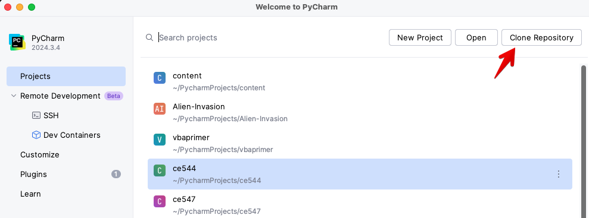
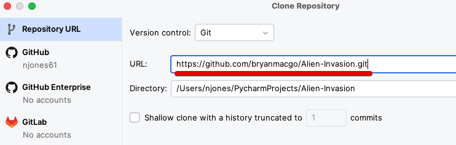
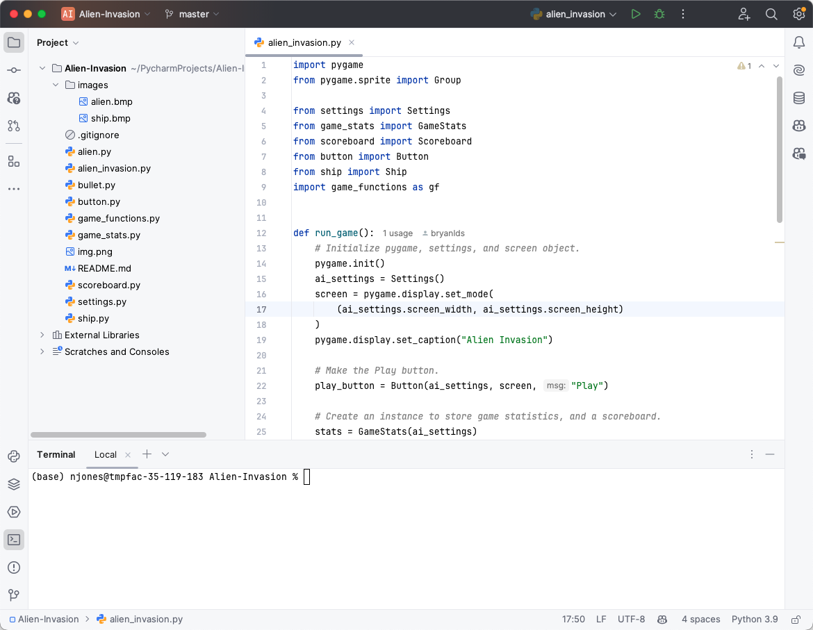
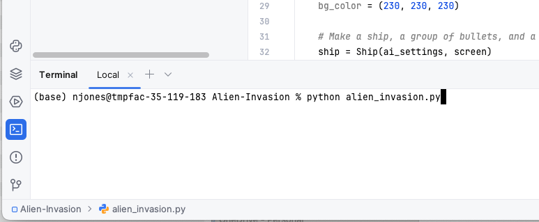

# Reading: Using Python Locally

---

Last unit we have been using Python in a Google Colab environment, which is a cloud-based platform. However, you can also run Python locally on your own machine. This can be useful for various reasons, such as working offline, using specific libraries, referencing your files directly without uploading them, or running larger projects. This document provides a brief overview of how to use Python locally, including installation, running scripts, and using virtual environments. We will also discuss some common IDEs (Integrated Development Environments) that can help you write and run Python code more efficiently. In class, we will give a live demonstration of how to install Python and run a simple script locally. We will also show you how to use Jupyter Notebook, which is a popular tool for writing and running Python code in an interactive environment.

## Basic Concepts

Before we get into the details, here is an overview of some basic concepts that will be useful in this unit.

**Installing and running Python locally**

In Colab, Python is already installed and you can run Python scripts directly from the notebook. Colab also provides most of the packages that you need. When running locally, you need to install Python and the packages you need. 

Once you have installed python, you can run it directly from the terminal. For example, you could use a text editor to write a Python script and save it to a file:

_mycode.py_
```python
print('Hello World!)
```
and then run it using the following command:

```bash
python mycode.py
```
and the output would be:

```bash
Hello World!
```

**Installing packages**

After you have installed Python, you can install additional packages using `pip`. `pip` is a package manager for Python that allows you to install additional libraries and packages. 

For example, to install NumPy and Pandas, you can run:

```bash
pip install numpy pandas
```
There is another package manager called `conda` that is also used to install packages. It works similarly to `pip`, but it is more powerful and can install packages from multiple sources. To get started and to keep things simple for now, we will use `pip` for installing packages.

**Using an IDE**

While you can edit a python script in a text editor, the best and most efficient way to write and run Python code is to use an Integrated Development Environment (IDE). There are a variety of IDEs available, including Visual Studio Code (VS Code), PyCharm, and Spyder. We recommend that you start with VS Code. It is free and open-source. 

When you use an IDE, you can write and run Python code directly from the IDE, and the IDE provides features like code completion, code formatting, etc.

**Using git**

There is a website called [GitHub](https://github.com/) that provides a platform for hosting and collaborating on code. You can use GitHub to store your code, share it with others, and collaborate on projects. It is also a great place to explore other python developers' code. You can easily "clone" a repository (a copy of a project) from GitHub to your local machine and start working on it.

## Python Local Development Setup Guide

Now that we have covered the basics, let's get started. This guide will walk you through installing Python, VS Code, and Git on your laptop. Follow the approprite section for your operating system.

---

### 🪟 Windows

#### 1. Install Python

1. Go to [python.org/downloads](https://www.python.org/downloads/)
2. Click **Download Python 3.x.x** (the big yellow button)
3. Run the installer
4. ⚠️ **Important:** Check the box that says **"Add Python to PATH"** before clicking Install
5. Click **Install Now**
6. Verify it worked — open **Command Prompt** (search "cmd" in the Start menu) and type:

```
python --version
```

You should see something like `Python 3.12.0`

#### 2. Install VS Code

1. Go to [code.visualstudio.com](https://code.visualstudio.com/)
2. Click **Download for Windows**
3. Run the installer — the defaults are fine
4. When prompted, check **"Add to PATH"** and **"Open with Code"** options
5. Open VS Code and install the **Python extension**:

   - Click the Extensions icon on the left sidebar (or press `Ctrl+Shift+X`)
   - Search for **Python** (by Microsoft)
   - Click **Install**

#### 3. Install Git

1. Go to [git-scm.com/download/win](https://git-scm.com/download/win)
2. Download and run the installer
3. All default options are fine — just keep clicking **Next**
4. Verify it worked — open Command Prompt and type:

```
git --version
```

#### 4. Install Packages with pip

Open **Command Prompt** and use `pip` to install packages:

```
pip install numpy
pip install pandas matplotlib
pip install numpy pandas matplotlib scipy  ← install multiple at once
```

---

### 🍎 Mac

#### 1. Install Python

1. Go to [python.org/downloads](https://www.python.org/downloads/)
2. Click **Download Python 3.x.x** (the big yellow button)
3. Open the downloaded `.pkg` file and follow the installer steps
4. Verify it worked — open **Terminal** (search "Terminal" in Spotlight with `Cmd+Space`) and type:

```
python3 --version
```
   
   You should see something like `Python 3.12.0`

> **Why `python3`?** Macs come with an old Python 2 installed. Always use `python3` and `pip3` on Mac.

#### 2. Install VS Code

1. Go to [code.visualstudio.com](https://code.visualstudio.com/)
2. Click **Download for Mac**
3. Open the downloaded `.zip`, then drag **Visual Studio Code** to your **Applications** folder
4. Open VS Code, then install the **Python extension**:

   - Click the Extensions icon on the left sidebar (or press `Cmd+Shift+X`)
   - Search for **Python** (by Microsoft)
   - Click **Install**

#### 3. Install Git

Git may already be installed on your Mac. Check by opening Terminal and typing:

```
git --version
```

If it's not installed, you'll be prompted to install **Xcode Command Line Tools** — just click **Install** and follow the steps. That will install Git automatically.

#### 4. Install Packages with pip

Open **Terminal** and use `pip3` to install packages:

```
pip3 install numpy
pip3 install pandas matplotlib
pip3 install numpy pandas matplotlib scipy  ← install multiple at once
```
---

### 🚀 Running Your First Script in VS Code

1. Open VS Code
2. Go to **File → Open Folder** and open a folder for your project
3. Create a new file: **File → New File**, name it `hello.py`
4. Type some code:

```python
print("Hello, world!")
```
   
5. Run it by clicking the **▷ Play button** in the top-right corner, or open the Terminal inside VS Code (**Terminal → New Terminal**) and type:

   - Windows: `python hello.py`
   - Mac: `python3 hello.py`


## Jupyter Notebook

In addition to VS Code and other IDE's mentioned above, Jupyter Notebook is a popular tool for writing and running Python code in an interactive environment. It allows you to create notebooks that can contain code, text, images, and more. You can use Jupyter Notebook to run Python code locally, similar to how you do it in Google Colab. In most things, Colab and Jupyter Notebook are very similar. In fact you can save your Colab notebooks and use them in Jupyter Notebook. These files have a `.ipynb` extension rather than `.py`. as they have the information for the text cells in addition to the code cells. 

If you want to use Jupyter Notebook locally, you can install it using conda or pip. Open your terminal and run the following command:

```bash
pip install jupyter
```

This will install Jupyter Notebook, which allows you to create and run notebooks similar to those in Google Colab. To launch Jupyter Notebook, run the following command in your terminal:

```bash
jupyter notebook
```
Now jupyter has an environment that is closer to Colab and has some nice features. It is called `jupyter lab`. To start `jupyter lab` use the command:
```bash
jupyter lab 
```
'jupyter lab' has a more modern interface and additional features, such as support for multiple tabs and file management. It is a more advanced version of Jupyter Notebook, but it is still very beginner-friendly and easy to use. FOr exmample, it includes the file browser tab, just like Colab.


The interface to Jupyter Notebook will open in your web browser, and you can create new notebooks or open existing ones. You can write and run Python code in the cells, add text and images, and save your work as a notebook file.

The interface to Jupyter Notebook looks like this:


## AI and Python Development
If you want to use (and we encourage you to do so) AI in your Python projects, and IDE makes this much easier. The newer AI agents, directly integrated into the IDE, can provide code suggestions and autocompletion as you type. This can help you write code faster and more efficiently. For example, both VS Code and PyCharm have built-in support for GitHub Co-pilot, an AI-powered code completion tool that can provide suggestions and code snippets as you type. You can install the Co-pilot extension from the respective marketplaces in each IDE. This works similarly to the AI feature in Google Colab, providing suggestions and code snippets as you type. Using AI tools in your IDE can enhance your coding experience and help you write better code more quickly. 

These can do more than code completion, you can work with an AI agent to plan or architexture your code, then have it start to create functions, classes, and other elements of your code. You need to clearly understand the problem you are trying tos sovle and the steps to solve it. If you can work with the AI agent to layout the problems, the steps to solve, the things you want to get back, etc. then this is a very powerful tool.

## Conclusion

Using Python locally can provide you with more flexibility and control over your projects. By following the steps outlined in this document, you can install Python, run scripts, and manage dependencies using virtual environments. Additionally, using an IDE can enhance your development experience and make it easier to write and run Python code. Whether you're working on small scripts or larger projects, having Python set up locally can be a valuable skill.

## Additional Resources

- [Python Official Documentation](https://docs.python.org/3/)
- [Python Package Index (PyPI)](https://pypi.org/)
- [Jupyter Notebook Documentation](https://jupyter-notebook.readthedocs.io/en/stable/)
- [Anaconda Documentation](https://docs.anaconda.com/)
- [Visual Studio Code Documentation](https://code.visualstudio.com/docs)
- [PyCharm Documentation](https://www.jetbrains.com/pycharm/documentation/)
- [Spyder Documentation](https://docs.spyder-ide.org/current/)
- [Python Virtual Environments Documentation](https://docs.python.org/3/tutorial/venv.html)
- [Python pip Documentation](https://pip.pypa.io/en/stable/)
- [Python Installation Guide](https://realpython.com/installing-python/)

## Sample Problem 1 - Alien Invasion

For a fun hands-on exercise, try the following. The textbook we have used for this class (Python Crash Course), has a number of exercises related to building a game called "Alien Invasion". You can find the exercises in Chapter 12. Try to implement the game locally on your machine using Python and any of the IDEs mentioned above. This will give you a chance to practice your Python skills and get familiar with running Python locally.

Here is how you would do it with PyCharm.

### Clone the Repository

We are going to cheat and use a solution that someone has already written. This is a common practice in programming, where you can use existing code as a reference or starting point for your own projects. You can find the solution to the Alien Invasion game on GitHub. GitHub is a public code repository hosting service that allows developers to share and collaborate on code. The solution is available in a public repository, which means you can access it for free. You can use this code as a reference or starting point for your own projects.

Follow these steps to clone the repository. This will download the code to your local machine, allowing you to run and modify it as needed. You will need to have Git installed on your machine. This method only works if you have a utility called Git installed. If you don't have Git installed, you can download it from [git-scm.com](https://git-scm.com/).

1. Browse to the repo here: [https://github.com/bryanmacgo/Alien-Invasion](https://github.com/bryanmacgo/Alien-Invasion)

2. Click on the green "Code" button and copy the URL.


3. Launch PyCharm and create a new project.

4. In the "New Project" dialog, select "Clone Repository":



5. and paste the URL you copied earlier.



### Viewing the Code

Once the repository is cloned, you can view the code in PyCharm. The project structure will look like this:



The files you just cloned are in the "alien_invasion" folder. You can open any of the Python files to view the code. 
For example, you can open "alien_invasion.py" file to see the main code that is launched. The other files contain the game logic, settings, and other components of the game. 

### Running the Game

To run the gamescript, you can right-click on "alien_invasion.py" and select "Run 'alien_invasion'". This will execute the script and launch the game in a new window.

You can also open the console window and run the script from there. To do this, click on the "Terminal" icon at the 
bottom left of PyCharm and type:

```bash
python alien_invasion.py
```

In the terminal bash line as follows:



You will then see the game launch in a new window:

{width=800}

## Sample Problem 2 - Jupyter Notebook

As mentioned above, Jupyter Notebook is a popular tool for writing and running Python code in an interactive 
environment. It allows you to create notebooks that can contain code, text, images, and more. You can use Jupyter 
Notebook to run Python code locally, similar to how you do it in Google Colab. There is a version of Jupyter 
Notebook called Jupyter Lab, which is a more advanced version of Jupyter Notebook. It has a more modern interface 
and additional features, such as support for multiple tabs and file management. The examples below are from Jupyter Lab.

Juptyper Lab is similar to Google Colab and in fact they both use the same underlying technology. Both notebooks are 
saved in the same format, called "notebook format". This means that you can open a Google Colab notebook in Jupyter 
Lab and vice versa. Notebooks are saved as *.ipynb files, which are JSON files that contain the code, text, and 
other components of the notebook. So for example, if you have a notebook called "my_notebook.ipynb", you can open it 
in Jupyter Lab and run the code cells just like you would in Google Colab. Imagine that you have a notebook that 
reads and writes a lot of files. With Colab, you have to upload the files to the Colab file space and then download 
any files you create. If you are running the notebook locally, you can read and write files directly to your local file system.

### Python Crash Course Notebooks

If you want to experiment with Jupyter, here is a public repo that has a copy of all of the notebooks from the 
Python Crash Course book. You can clone the repo and run the notebooks locally. The repo is available here:

[https://github.com/khiner/notebooks/tree/master/python_crash_course](https://github.com/khiner/notebooks/tree/master/python_crash_course)

To download one of the files, click on the notebook name and it will open in a Preview tab. Then click on the 
Download icon in the upper right corner of the page. This will download the notebook to your local machine. You can then open it in Jupyter Lab

You may also want to try downloading some of your own notebooks from this class and running them locally with 
Jupyter Lab. The examples below in Sample Problem 3 can also be downloaded and run locally.

### Running Jupyter Lab

Then, after installing Jupyter Lab, you can run the following command in your terminal to launch Jupyter Lab:

```bash
jupyter lab
```

This will open Jupyter Lab in your web browser. You can create a new notebook by clicking on the "Python 3" icon in 
the "Launcher" tab. This will create a new notebook with a code cell where you can write and run Python code. You 
can also path to where you downloaded the notebook and open it from there. Here is one of the notebooks from the repo:


You can run the code cells by clicking on the "Run" button in the toolbar or by pressing Shift + Enter, just like in 
Colab. 

### Installing Packages

One important difference between Jupyter Lab and Google Colab is that you need to install any packages you want to 
use in Jupyter Lab. In Colab, most of the popular packages are already installed, but in Jupyter Lab, you need to 
install it them yourself. You can do this using pip or conda, just like you would in a regular Python environment. 

## Sample Problem 3 - Converting Colab Notebooks to Python Scripts

One of the drawbacks of Google Colab is that you have to upload your input files to the Colab file space and then 
download any output files you create. This can be time-consuming and error-prone. If you want to run a notebook 
locally, you can convert it to a Python script. This will allow you to run the notebook locally and save the output 
files directly to your local file system. Python also runs much faster than Colab, so this can be a useful option 
for running large notebooks.

To convert a Colab notebook to a Python script, you can use the "Download as" option in the "File" menu. This will 
create a new Python script with the same name as the notebook. You can then run the script locally and save the output 
files to your local file system.


Then copy the file and any associated files you will be using to a folder on your local machine. Open the script in 
your favorite IDE and run it. You may need to install any packages you use in the script and you may need to make some 
changes to the code to make it compatible with your local environment. For example, some of the code we used to 
create forms and form elements in the previous exercises will not work in a Python script.

---

# Pre-Class Quiz Challenge

For this topic, there is no challenge to complete before class and turn in on the Learning Suite Pre-Class Quiz. As mentioned above, we will give a live demonstration of how to install Python and run a simple script locally. We will have TAs available to help you with any issues you may have with installing Python or running a script locally. If you want to get a head start, you can try installing Python and Jupyter Lab on your local machine before class. If you have any issues or questions, feel free to ask during class or reach out to the TAs for help.