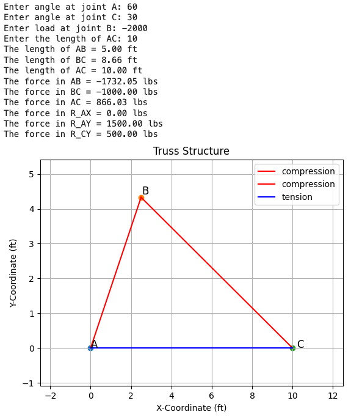
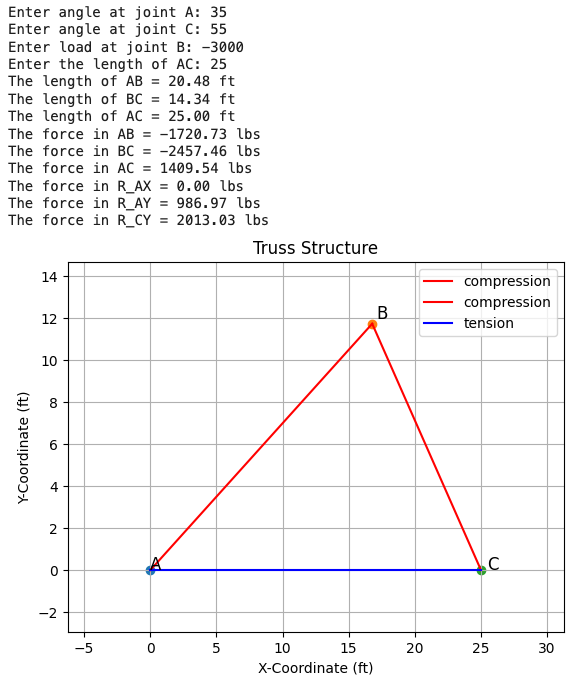
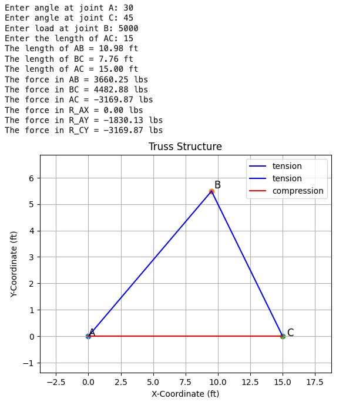

# HW: Numpy

**Purpose:** Create and use numpy arrays to find the forces in a given truss. You will then use matplot to graph it.

### Instructions

1. First, make a copy of the starter sheet here: <a href="https://colab.research.google.com/github/byu-cce270/content/blob/main/docs/unit3/00_numpy/(Starter_Workbook)_HW_Numpy.ipynb" target="_blank"></a>

2. Rename it something like "[name] hw numpy"

For this assignment, Dr. Doofenshmirtz is partnering with BYU to create a new roof for his building. Instead of a dome, he wants to be fancy and install a triangle roof. He needs you to find the internal forces in each of the segments of his roof truss to ensure it will not collapse. Here is the design of the trusses for his roof:

<center>
    
</center>

(image updated from [trussanalysis.com](https://trussanalysis.com/?cat=custom&cmems=0~1~5~29000_0~2~5~29000_1~2~5~29000&cnodes=0~0~p~0~0_4~4~f~0~0_8~0~r~0~0))

Where:

  - $L_{AC}$ is an length of segment AB, you will select
  - $θ_A$ and $θ_C$ are  angles at points A and C, respectively that you will select
  - P is a load being applied at point B acting downward (denoted with the red arrow)
  - Joint A has a pin joint (reaction forces in the x and y direction)
  - Joint C has a roller (reaction force only in the y direction)

For this problem, you will: 

>1) Select two angles for $θ_A$ and $θ_C$ and the length of member $L_{AC}$.<br>
>2) Use numpy to solve for the forces in each segment of the truss.<br>
>3) Solve for the length of member $L_{AC}$.<br>
>4) Use matplot to graph the truss with the forces in each segment.<br>

We will use the Method of Joints to  derive the following equations:

>>$\sum F_{A_x} = ABcos(θ_A) + AC+R_{A_x} = 0$<br>
$\sum F_{A_y} = ABsin(θ_A) + R_{A_y} = 0$<br>
$\sum F_{B_x} = -ABcos(θ_A) + BCcos(θ_C) = 0$<br>
$\sum F_{B_y} = -ABsin(θ_A) - BCcos(θ_C) = -P$<br>
$\sum F_{C_x} = -BCcos(θ_C) - AC = 0$<br>
$\sum F_{C_y} = BCsin(θ_C) + R_{C_y} = 0$

We will arrange the equations so we can create a matrix from the coefficients of the unknowns. We can then use these equations to solve for our unknown forces: $AB, AC, BC, R_{A_x}, R_{A_y}$. Typically, this could take a long time when doing it by hand, but can be solved in seconds with some python code and numpy. The way we go about this is by setting up our forces as a system of equations. The equations shown above can be written in matrix form as:

>>$\begin{bmatrix} 
\cos(\theta_A) & 0 & 1 & 1 & 0 & 0 \\ 
\sin(\theta_A) & 0 & 0 & 0 & 1 & 0 \\ 
-\cos(\theta_A) & \cos(\theta_C) & 0 & 0 & 0 & 0 \\ 
-\sin(\theta_A) & -\sin(\theta_C) & 0 & 0 & 0 & 0 \\ 
0 & -\cos(\theta_C) & -1 & 0 & 0 & 0 \\ 
0 & \sin(\theta_C) & 0 & 0 & 0 & 1 
\end{bmatrix}
\begin{bmatrix}
AB \\
AC \\
BC \\
R_{C_y} \\
R_{A_x} \\
R_{A_y}
\end{bmatrix} =
\begin{bmatrix}
0 \\
0 \\
0 \\
-P \\
0 \\
0
\end{bmatrix}$

Where the first matrix is our forces matrix (or a matrix of the coefficients), the second matrix is our internal forces which are unknown, this is what we are solving for, and the third matrix is our external forces.

This may seem daunting! But it can be rather simple. Let's jump into it!

---

### Part 1: Solve for the Forces in each segment

We just have to provide the force matrix and the external force matrix to numpy and it will solve for the unknowns in the internal force matrix.

We will write the equations in terms of the angles at A and B, so that we can change the angles and solve the problem again. 

We will use functions to solve this problem. This will allow us to call the function multiple times with different inputs. We will create a function that will take in the angles at A and C, and the load at B. This function will return the forces in each segment of the truss. The function will build the force and external load matrices. For this problem, we will hard code the size of these matrices. This is because we know the size of the matrices will not change. The only things that we will allow to change are the angles and the load.
 
1. Import the numpy and matplot library into your notebook.
2. In the next code block, create a function that will take in 3 parameters: the angle at joint A (θ_A), the angle at joint C (θ_C), and the load at joint B (P) to find the forces of each member.

Inside the function we now need to do the following:

3. Because Numpy works in radians and not degrees, convert the given angles for A and C from degrees to radians. Save those values into variables for the two angles.

Now we need to write the force matrix. This will be a 6x6 matrix. We will use the equations we derived above to create the matrix. The first row will be the coefficients of the first equation, the second row will be the coefficients of the second equation, and so on. The last row will be the external forces acting on the truss. Each row needs to contain coefficients for each of the unknowns. If that unknown is not part of that equation, use a coefficient of 0. 

The easiest way to do this is make a matrix for each of the size equations on their own line, then put them together using the square brackets. Here is some example code, you will need to replace the 0's with the actual number or equation. Some of them will still be 0's. 

```python
forces = np.array([
    [0, 0, 0, 0, 0, 0],  # forces in the x direction at A
    [0, 0, 0, 0, 0, 0],  # forces in the y direction at A
    [0, 0, 0, 0, 0, 0],  # forces in the x direction at B
    [0, 0, 0, 0, 0, 0],  # forces in the y direction at B
    [0, 0, 0, 0, 0, 0],  # forces in the x direction at C
    [0, 0, 0, 0, 0, 0]   # forces in the y direction at C
])

```
The order of both the unknowns and the external forces is important. They can be in any order, but each of the three arrays has to use the same order. 


4. Create the force coefficient matrix. Make each row in our matrix represent a given equation. Start by creating the equation  for joint A in the x direction. **Note** you can make each of these rows a separate numpy array with a variable name, then put them together in the end. This will make it easier to read and debug. 

The  array should be in the  same order as the other arrays, if you follow the examples,   $A_x$ should be the first row, $A_y$ should be the second row, etc. Save this array as a variable such as combined_forces.

5. Now, create a new array for the external forces acting on the truss using the given solution matrix in the introduction. Save this as a variable such as loads. Make sure it is in the same order. 
7. We can now solve this! Using your force coefficient and external loads arrays, solve the system of equations. Have your force coefficient array be the first input and your external forces the second. Refer back to your in-class work back with what numpy function to use with solving systems of equations. Save this as a variable such as solutions. This will give you the values for $AB$, $AC$, $BC$, $R_{AY}$, $R_{AX}$, and $R_{CY}$. 
8. You are given a dictionary to store these values for each member/location. It looks like `total_forces = {"AB":0, "BC":0, "AC":0, "R_AX":0, "R_AY":0, "R_CY":0}`, with the 0's replaced by the actual forces. This dictionary has already been created for you.
9. With your solved values, you will now update the dictionary total_forces. You will update the values of the dictionary with the values you got from your system of equations. For example, my dictionary would say something like "AB": 3000, "R_AY": -200 when updated. The dictionary will be used later.
10. Write a loop that will print the values of the dictionary with the solutions you got from your system of equations. For example, my print statement would say somthing like "AB = 3000 lbs", "R_AY = -200 lbs, etc." when displayed.
11. Return this dictionary from your function.

---

### Part 2: Find Coordinates of each point

Now that you have all the forces, Dr. Doofenshmirtz needs to know how high his roof is going to be. This will involve solving for the x and y coordinates of joints A, B, and C. We are going to use trigonometry to solve for the coordinates of each joint and the trig functions in numpy to do the calculations. 

We will create a function that will accept $θ_A$,  $θ_C$ and $L_{AC}$ as inputs, then calculate the coordinates of each of the corners. We will use the sum of the angles to get $θ_B$. We will divide the truss into two right triangles and use the law of sins to get the base and hypotenuse. Using that information, we can solve for the x and y coordinates of each joint.


1. Create a new function that will take in 3 parameters: $θ_A$,  $θ_C$ and $L_{AC}$ as inputs. This function will solve for the X and y values of each joint. (We will say that A is the origin with coordinates [0,0])
2. Since we are given angle A and angle B, solve for theta B. Hint: the sum of the angles in a triangle is 180 degrees.
3. Convert angles A, B, and C from degrees to radians (since this is what Numpy does its calculations in)
4. Time to bring back your geometry skills, now that you know all of your angles and one side length you can use the law of sines to solve for the other lengths. Save each length of the truss in their own variables.

Here is the law of sines for reference:


_(image from [CalcWorkshop](https://calcworkshop.com/law-sines-cosines/law-of-sines/))_

Heres some code to help you get started:

```python
length_AB = (length_AC / np.sin(angle_B)) * np.sin(angle_C)

```
5. Print the length of AB, BC, and AC with the respective units. For example, my print statement would say something like "Length of AB: 3 ft", "Length of BC: 4 ft", "Length of AC: 6 ft" when displayed.
6. Now that you have all of your lengths, you can solve for the x and y coordinates of each joint. To do this, you will use the following equations:
7. For joint A, the x and y coordinates are both 0 (we are saying that A is the origin). Save both the x and y coordinates as a singular variable such as joint_A.
8. For joint B, the x coordinate is the length of AB times the cosine of angle A. The y coordinate is the length of AB times the sine of angle A. Save this as a variable such as joint_B.
9. For joint C, the x coordinate is the length of AC. The y coordinate 0 since it is the same level as A. Save this as a variable such as joint_C.
10. Create a dictionary to store these values. The keys will be the joint names (A, B, C) and the values will be the x and y coordinates of each joint. For example, your dictionary might look like `"A": (0, 0), "B": (3, 4), "C": (6, 0)` when displayed.
10. Return this dictionary .


---

### Part 3: Graph the Truss

Now that we have solved for the forces and the coordinates of each joint, we can graph the truss. The objective is to graph each segment of the truss in either blue or red. Blue will represent a tension (positive) force, and red will represent a compressive (negative) force. You will then label each joint with the letter of the joint (A, B, C). We will use the dictionary to loop through the different members, determine if the force is negative or positive for a color, then plot a line from the beginning coordinates to the end coordinates. For example for member $AC$ we would plot a line from coordinates of  A to the coordinates of  C.

1. You are given a function that takes in 2 parameters: the dictionary of forces, and the dictionary of coordinates. 
   *Note:* The provided code includes a dictionary where the keys are the starting and ending point of each 
   segment 
   and the 
   value is its corresponding force.
2. In the for loop, it is iterating through the keys of the members dictionary. Start represents the starting point of the segment, and end represents the ending point of the segment. The force variable is the force of the segment from the members dictionary.
3. In the for loop, create an if statement that will check if the force is positive or negative. If the force is positive, plot the segment in "blue" and label it "tension". If the force is negative, plot the segment in red and label it "compression". Hint: It may be helpful to save the color and label as variables. AND make sure that the spelling of the color is the same of what Matplot uses.
4. Now, create a list for the x values and a list for the y values. The x values will be the x coordinates of the starting and ending points of the segment. The y values will be the y coordinates of the starting and ending points of the segment. Hint: You will need to call the coordinates dictionary to get the x and y coordinates of each joint.
5. Plot the segment using the x and y values you just created. Use the plt.plot() function to plot the segment. The first parameter will be the x values, the second parameter will be the y values,the third parameter will be the color of the segment, and the fourth parameter will be the label.
6. Now, we will plot each joint. Create a for loop that will iterate through the keys and values of the coordinates dictionary. The key will be the joint and the value will be the x and y coordinates of the joint. 
7. Save the x and y coordinates as variables.
8. Using the plt.scatter function, plot the joint. The first parameter will be the x coordinate, the second parameter will be the y coordinate, and the third parameter will be the color of the joint (you can choose, black is a safe default).
9. Label each joint with the key of the dictionary using plt.text(). The first parameter will be the x coordinate, the 
   second parameter will be the y coordinate, and the third parameter will be the key of the dictionary.
10. Add a title, x label, y label, and legend to the graph. You may wish to use `plt.margins(0.25)` to give some space around the graph.

---

### Part 4: Call Functions

1. Create inputs statements that prompt the user for the angle at joint A (degrees), the angle at joint C (degrees), the load at joint B (upwards is positive and downwards is negative), and the length of AC (feet). Save these as variables.
2. Call the function that solves for the forces in each segment. Pass in the angle at joint A, the angle at joint C, and the load at joint B as parameters. Save the output as a variable such as forces.
3. Call the function that solves for the coordinates of each joint. Pass in the angle at joint A, the angle at joint C, and the length of AC as parameters. Save the output as a variable such as coordinates.
4. Call the function that graphs the truss. Pass in the forces and coordinate functions as parameters.
5. Run each code block and test it with the following values:

   * Test 1:
      - Angle at joint A: 60 degrees
      - Angle at joint C: 30 degrees
      - Load at joint B: -2000 lbs
      - Length of AC: 10 ft
      - Expected output:



   * Test 2:
      - Angle at joint A: 35 degrees
      - Angle at joint C: 55 degrees
      - Load at joint B: -3000 lbs
      - Length of AC: 25 ft
      - Expected output:
    


   * Test 3:
      - Angle at joint A: 30 degrees
      - Angle at joint C: 45 degrees
      - Load at joint B: 5000 lbs
      - Length of AC: 15 ft
      - Expected output:
  


---

# Turning In/Rubric

Turn on sharing and editing. Turn in the link to the Learning Suite feedback box

|                **Items**                       | **Amount** |  
|:----------------------------------------------:|:----------:|
|        Part 1: Correctly constructs the force equilibrium equations and loads in matrix form based on the given matrix.    |     4      |
|       Part 1: solution is added to the total_forces dictionary and dictionary is returned and printed      |     3      |
|  Part 2: Side lengths AB, BC, and AC are found and printed  |     3      |
| Part 2: Coordinates for A, B, and C are added to the coordinates dictionary, returned, and printed  |     3      |
| Part 3: If statements are used to create the correct labeling and coloring based on positive (tension, blue)  and negative (compression, red) force values|     3      |
| Part 3: Graph contains: title, x/y labels, legend for tension/compression, and labels for each point  |     3      |
|       Part 4: Values for forces, lengths, and coordinates match given test scenarios      |     4      |
|       Part 4: Graph matches given test scenarios       |     4      |
|       Comments are added to explain code       |     3      |
| <div style="text-align: right">**Total**</div> |   **30**   |


The following is not apart of the rubric, but specifies how you can lose points. For example: if you do not explain your code when using AI to help you create it or fail to share your link correctly.


|                      **Reasons for Points Lost**                      | **Amount** |  
|:---------------------------------------------------------------------:|:----------:|
| No comments explaining why AI is used and what its provided code does |    2-3     |
|                        Link shared incorrectly                        |     3      |
|       Turned in late. 10% or 3 points for every week it's late.       |    3-15    |


