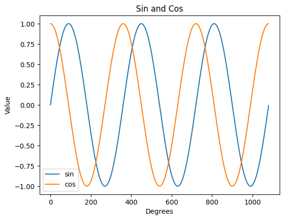

#  Reading: NumPy Library

---

# Pre-Class Reading Assignment

On the O'Reilly's website read part II: Intro to NumPy chapters 5, 6, and 11 in
Python Data Science Handbook, 2nd Edition. 
</br>Here is a direct link to the readings:

<a href="https://learning.oreilly.com/library/view/python-data-science/9781098121211/ch05.html#ch_0202-the-basics-of-numpy-arrays_numpy-array-attributes" target="_blank">Chapter 5: The Basics of NumPy Arrays</a><br>
<a href="https://learning.oreilly.com/library/view/python-data-science/9781098121211/ch06.html#ch_0203-computation-on-arrays-ufuncs_the-slowness-of-loops" target="_blank">Chapter 6: Computation on NumPy Arrays: Universal Functions</a>
<br>Note: For chapter 6, read up to but not including the section _Specialized Ufuncs_. Skip the rest.

The chapters we skip are about indexing and broadcasting, which we will not cover in this class. We will typically use NumPy arrays like a spreadsheet, where we just want to access the entire row or column of data. We will not be using the more advanced indexing features of NumPy.

Remember that you will have to sign in to your free account that you created earlier.

## Things to look out for
- What is the difference between a list and a NumPy array?
- How to turn a list into a NumPy array?
- How to append 2 NumPy arrays together?
- The different functions you can do with a NumPy array

---
# NumPy Vectorization
Vectorization is a powerful feature of NumPy that allows you to perform operations on entire arrays without the need for explicit loops. This can lead to more concise and efficient code.

```python
import numpy as np
# Create two NumPy arrays
a = np.array([1, 2, 3])
b = np.array([4, 5, 6])
# Perform element-wise addition
c = a + b
print(c)  # Output: [5 7 9]
```
In python, you would need to loop through the arrays to add them together. With NumPy, you can add the arrays together without a loop.

It also works with other math operations like multiplication, division, and subtraction. 
```python
# Perform element-wise multiplication
d = a * b
print(d)  # Output: [ 4 10 18]
# Perform element-wise division
e = a / b
print(e)  # Output: [0.25 0.4  0.5 ]
```
# NumPy Functions

NumPy also has a lot of built-in functions that you can use to perform operations on arrays. For example, you can find the mean of an array using the `np.mean()` function or more advanced things like taking the sin or cos of the numbers in an array using `np.sin()`. 

Normally you would need a loop to do this, but with NumPy, you can do it in one line of code.

```python
# Find the mean of an array
mean_a = np.mean(a)
print(mean_a)  # Output: 2.0
# Find the sin of an array
sin_a = np.sin(a)
print(sin_a)  # Output: [0.84147098 0.90929743 0.14112001]
```
Here is a link to the NumPy website that lists all the mathematical functions you can use with NumPy arrays: [NumPy Mathematical Functions](https://numpy.org/doc/stable/reference/routines.math.html)   
</br>
Here is a link to the NumPy website that lists all the statistical functions you can use with NumPy arrays: [NumPy Statistical Functions](https://numpy.org/doc/stable/reference/routines.statistics.html)
</br>
Here is a link to the NumPy website that lists all the linear algebra functions you can use with NumPy arrays: [NumPy Linear Algebra Functions](https://numpy.org/doc/stable/reference/routines.linalg.html)
</br>

# Create NumPy Sequences
You often need a list of numbers, such as a list of numbers from 0 to 10. You can use the `np.arange()` function to create a NumPy array with a sequence of numbers. 

```python
# Create a NumPy array with a sequence of numbers from 0 to 10
sequence = np.arange(0, 10, 2)
print(sequence)  # Output: [0 2 4 6 8]
```
In the code above you give the starting value, stopping value, and step size. The function will then create an array with that many values between the starting and stopping values. If the step size doesn't fit, you may not get the last number. 

You can also use the `np.linspace()` function to create a NumPy array with a specific number of numbers between two values. 

```python
# Create a NumPy array with a sequence of numbers between 0 and 1
sequence = np.linspace(0, 1, 5)
print(sequence)  # Output: [0.   0.25 0.5  0.75 1.  ]
```
In the code above you give the starting and stopping values and the number of values you want in the array. The function will then create an array with that many values between the starting and stopping values.

Here is a link to the NumPy website that lists all the functions you can use to create NumPy arrays: [NumPy Array Creation Functions](https://numpy.org/doc/stable/reference/routines.array-creation.html).

The section on Numeric Ranges is particularly useful for creating sequences of numbers. 

# Generate random numbers
You can also use the `np.random.rand()` function to create a NumPy array with random numbers. 

```python
# Create a NumPy array with random numbers
random_numbers = np.random.rand(5)
print(random_numbers)  # Output: [0.5488135  0.71518937 0.60276338 0.54488318 0.4236548 ]
```
You can also use the `np.random.randint()` function to create a NumPy array with random integers. If you run it again, you will get different numbers. 

```python
# Create a NumPy array with random integers
random_integers = np.random.randint(0, 10, 5)
print(random_integers)  # Output: [5 0 3 3 7]
```
And there are other functions you can use to create NumPy arrays with random numbers. Here is a link to the NumPy website that lists all the functions you can use to create NumPy arrays: [NumPy Random Functions](https://numpy.org/doc/stable/reference/random/index.html)

# NumPy with Matplotlib
We can use NumPy with Matplotlib to create plots. For example, we can use NumPy to create a list of numbers and then use Matplotlib to plot those numbers. We can use the numpy routines to easily create the data we want to plot. For example if we want to plot the sin, cos, and tan of a list of numbers, we can use NumPy to create the list of numbers and then use Matplotlib to plot the data. Say we want a list of number from 0 to 3*360 degrees every 0.5 degrees. We can use the `np.linspace()`  function to create the list of numbers. Then we can use the `np.sin()` and `np.cos()` functions to create the data we want to plot. Finally, we can use Matplotlib to plot the data. 
```python
import numpy as np
import matplotlib.pyplot as plt
# Create a list of numbers from 0 to 3*360 degrees with 1000 points.
x = np.linspace(0, 3*360, 1000)
# Or use arange to create a list with steps every 1/2 degree
x = np.arange(0, 3*360, 0.5)  # This will overwrite the previous x variable. Comment it out if you want to use the linspace version.

# Create the data we want to plot
y1 = np.sin(np.radians(x))
y2 = np.cos(np.radians(x))

# Plot the data
plt.plot(x, y1, label='sin')
plt.plot(x, y2, label='cos')

plt.xlabel('Degrees')
plt.ylabel('Value')
plt.title('Sin and Cos')
plt.legend()
plt.show()
```


In the code above we use the `np.radians()` function to convert the degrees to radians. This is because the `np.sin()` and `np.cos()` functions expect the input to be in radians. We then use Matplotlib to plot the data.

Here is a link to the Matplotlib website that lists all the functions you can use to create plots: [Matplotlib Pyplot](https://matplotlib.org/stable/api/pyplot_api.html)
</br>

 
# Pre-Class Quiz Challenge
Open the following notebook and complete the instructions in the comments:

<a href="https://colab.research.google.com/github/byu-cce270/content/blob/main/docs/unit3/00_numpy/(Starter_Notebook)_Pre_Numpy.ipynb" target="_blank"></a>

Rename it something like "(Your_Name)_Pre_Numpy.ipynb"

Save changes to your Google Drive and submit the link to the notebook in your Pre-Class Quiz.

---

## Turning in/Rubric

**_REMINDER_** - For this class, **you will only turn in the links to your colab notebooks**. You will get a 0 for this assignment if you turn in a python file or a link that is not correct, wrong assignment, or does not give editor permission.

**Rubric:**

|                      Item                      | Points Possible |
|:----------------------------------------------:|:---------------:|
| <div style="text-align: right">**Total**</div> |        3        |

---

The following is not a part of the rubric, but specifies how you can lose points. For example: if you fail to share your link correctly.

| **Reasons for Points Lost** |    **Amount**     |  
|:---------------------------:|:-----------------:|
|   Link shared incorrectly   |       -10%        | 