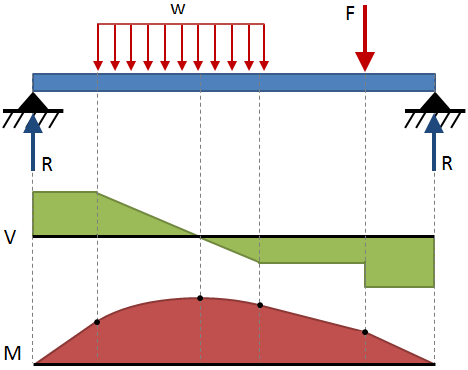

# HW: Matplotlib

**Purpose:** Learn how to make graphs with different kinds of data.

## Instructions

1. First, make a copy of the starter sheet here: <a href="https://colab.research.google.com/github/byu-cce270/content/blob/main/docs/unit3/01_matplotlib/(Starter_Notebook)_HW_Matplotlib.ipynb" target="_blank"></a>

2. Rename it something like "(Your_Name)_HW_Matplotlib.ipynb"

3. Download each CSV to be used in parts 2 through 5:

    * [2013-2014-Pasadena-Temperature-Data.csv](2013-2014-Pasadena-Temperature-Data.csv)
    * [June-2021-Provo-River-Streamflow-Rates.csv](June-2021-Provo-River-Streamflow-Rates.csv)
    * [Fremont-Bridge-Bicycle-Count.csv](Fremont-Bridge-Bicycle-Count.csv)
    * [2012-US-Birth-Rates.csv](2012-US-Birth-Rates.csv)

---

#### Part 1 - Shear and Moment Diagrams

For this exercise, we will be creating shear and moment diagrams for a simply supported beam. Such diagrams are used to better visualize the internal forces acting within the beam. The internal shear along the beam is represented by the variable $V$, while the internal moment along the beam is represented by the variable $M$. The shear diagram for the beam below is represented by the green graph while the moment diagram is represented by the red graph. 



(image from https://mechanicalc.com/reference/beam-analysis)

We will be graphing the diagrams for the cantilevered simply supported beam shown below:


Where:

  - $L$ is the full length of the beam
  - $x$ is any point taken along the beam measured from its left end
  - $A$ is the pin support of the beam located at $x=0 ft$  
  - $B$ is the roller support of the beam located at $x=4 ft$ 
  - $R_{A}$ is the reaction force of 170 $lb$ associated with the pin support
  - $R_{B}$ is the reaction force of 410 $lb$ associated with the roller support
  - $P_{1}$ is a point load of 100 $lb$ acting at $x=2 ft$
  - $q_{1}$ is a distributed load of 120 $lb/ft$ acting from $x=0 ft$ to $x=2 ft$
  - $q_{2}$ is a distributed load of 120 $lb/ft$ acting from $x=4 ft$ to $x=6 ft$

After making a cut within the beam at a point of interest, the internal shear and moment equations can be solved by plugging in the above external forces and lengths into the following equilibrium equations:

>>$\sum F_{y} = 0$<br>
$\sum M = 0$

The equations for the internal shear and moment forces have been solved for you and modeled as piecewise functions, which can then be used to create the shear and moment diagrams.

1. In the 'Part 1a - Shear Diagram' code block, define the following variables:

| Variable |    Value    |
|:--------:|:-----------:|
|   $L$    |   6 $ft$    |
|  $R_A$   |  170 $lb$   |
|  $R_B$   |  410 $lb$   |
|  $P_1$   |  100 $lb$   |
|  $q_1$   | 120 $lb/ft$ |
|  $q_2$   | 120 $lb/ft$ |

2. Define a variable ```x``` using ```np.linspace()``` with the following arguments:

  - start: 0
  - stop: $L$
  - num: 500

3. Define a variable ```V``` using ```np.zeros_like()``` with ```x``` as the argument. This will create a list of zeros with the same length as ```x```. 
4. Create a for loop that loops over the length of ```x``` and defines ```V``` to be the following piecewise function under the respective boundary conditions:

$$
V(x) =
\begin{cases}
R_A - (q_1 * x), & \text{if } x < 2 \\
R_A - (q_1 * 2) - P_1, & \text{if } 2 < x < 4 \\
R_A - (q_1 * 2) - P_1 + R_B - (q_2 * (x-4)), & \text{if } x > 4 
\end{cases}
$$

5. Using matplotlib, plot x against V and then replicate **every element** included in the graph below (the colors do not have to match exactly):

    

1. In the 'Part 1b - Moment Diagram' code block, copy and paste the variables defined in Part 1a.
2. Define a variable ```x``` using ```np.linspace()``` with the following arguments:

  - start: 0
  - stop: $L$
  - num: 500

3. Define a variable ```M``` using ```np.zeros_like()``` with ```x``` as the argument. 
4. Create a for loop that loops over the length of ```x``` and defines ```M``` to be the following piecewise function under the respective boundary conditions:

$$
M(x) =
\begin{cases}
(R_A * x) - (q_1 * \frac{x^2}{2}), & \text{if } x < 2 \\
(R_A * x) - (q_1 * 2 * (x-1)) - (P_1 * (x-2)), & \text{if } 2 < x < 4 \\
(R_A * x) - (q_1 * 2 * (x-1)) - (P_1 * (x-2)) + (R_B * (x-4)) - (q_2 * (x-4) * (\frac{x-4}{2})) , & \text{if } x > 4 
\end{cases}
$$

5. Using matplotlib, plot x against M and replicate **every element** included in the graph below (the colors do not have to match exactly):

    

#### Part 2 - Pasadena Precipitation Data

You will now graph the temperature data from Pasadena, CA from 2013-2014.

1. In the 'Numpy Array Creation & Slicing' code block, create a numpy array from the CSV containing the temperature data. Then, slice the array to create the x and y-axis values. These will correspond to the following columns in the CSV linked on readthedocs:

  - x - Date 
  - y_1 - High Temperature 
  - y_2 - Low Temperature

2. In the 'Graphing the Data' code block, plot the data and replicate **every element** included in the graph below (the colors do not have to match exactly):

    

#### Part 3 - Provo River Streamflow Data

You will now graph the streamflow data of Provo River in June 2021.

1. In the 'Numpy Array Creation & Slicing' code block, create a numpy array from the CSV containing the streamflow data. Then, slice the array to create the x and y-axis values. These will correspond to the following columns in the CSV linked on readthedocs:

  - x - Date 
  - y_1 - Site 10163000
  - y_2 - Site 10155200
  - y_3 - Site 10155500
  - y_4 - Site 10154200 
  - y_5 - Site 10155000

2. In the 'Graphing the Data' code block, plot the data and replicate **every element** included in the graph below (the colors do not have to match exactly):

    

#### Part 4 - Fremont Bridge Bicycle Count Data

You will now graph bicycle count data over a bridge in Fremont, Seattle taken from 2013 to 2022.

1. In the 'Numpy Array Creation & Slicing' code block, create a numpy array from the CSV containing the Fremont bridge count data. Then, slice the array to create the x and y-axis values. These will correspond to the following columns in the CSV linked on readthedocs:

  - x - Date 
  - y_1 - Fremont Bridge Total
  - y_2 - Fremont Bridge East Sidewalk
  - y_3 - Fremont Bridge West Sidewalk

2. In the 'Graphing the Data' code block, plot the data and replicate **every element** included in the graph below (the colors do not have to match exactly):

    

3. Write a comment in your code explaining why you think the bike count drops so dramatically.

#### Part 5 - Average U.S. Daily Birth Data

You will now graph the average U.S. daily birth data taken from 2012 to 2013.

1. In the 'Numpy Array Creation & Slicing' code block, create a numpy array from the CSV containing the U.S. birth data. Then, slice the array to create the x and y-axis values. These will correspond to the following columns in the CSV linked on readthedocs:

  - x - Date 
  - y_1 - Births

2. In the 'Graphing the Data' code block, plot the data and replicate **every element** included in the graph below (the colors do not have to match exactly):

!!! Hint
    In your first line, enter `plt.figure(figsize=(12, 4))` to create the correct size for your plot.


3. Write a comment explaining why you think the birth rate drops during those days

---

## Turning in/Rubric

**_REMINDER_** - For this class, **you will only turn in the links to your colab notebooks**. You will get a 0 for this assignment if you turn in a python file or a link that is not correct, wrong assignment, or does not give editor permission.

**Rubric:**

|                                           **Item**                                           | **Amount** |  
|:--------------------------------------------------------------------------------------------:|:----------:|
|                             All CSV files are correctly read in                              |     4      |
|                             Part 1 - Variables defined correctly                             |     2      |
|                           Part 1 - Diagrams display data correctly                           |     8      |
| Part 1 - Diagrams have correct titles, axis titles, x-axes, filled area, and similar colors  |     10     |
|                            Part 2 - Graph displays data correctly                            |     4      |
|     Part 2 - Graph has correct title, axis titles, legend, gridlines and similar colors      |     5      |
|                            Part 3 - Graph displays data correctly                            |     4      |
| Part 3 - Graph has correct title, axis titles, rotated labels, gridlines, and similar colors |     5      |
|                            Part 4 - Graph displays data correctly                            |     4      |
|     Part 4 - Graph has correct title, axis titles, legend, gridlines, and similar colors     |     5      |
|                            Part 5 - Graph displays data correctly                            |     4      |
|  Part 5 - Graph has correct title, axis titles, gridlines, annotations, and similar colors   |     5      |
|                        <div style="text-align: right">**Total**</div>                        |   **60**   |

---

The following is not a part of the rubric, but specifies how you can lose points. For example: if you do not explain your code when using AI to help you create it or fail to share your link correctly.

|                       **Reasons for Points Lost**                       |    **Amount**     |  
|:-----------------------------------------------------------------------:|:-----------------:|
|                         Link shared incorrectly                         |       -10%        |
|                        Turned in late (per week)                        | -10% (up to -50%) |
| No comments explaining where AI is used and what its provided code does |       -10%        |