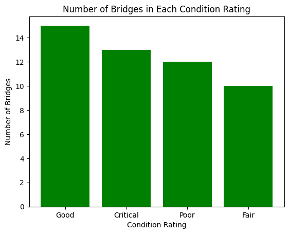
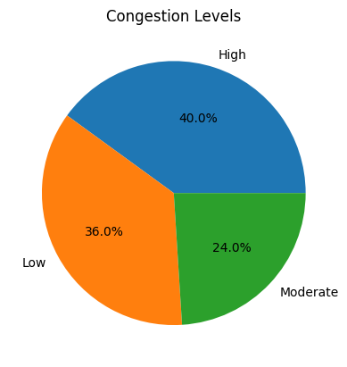
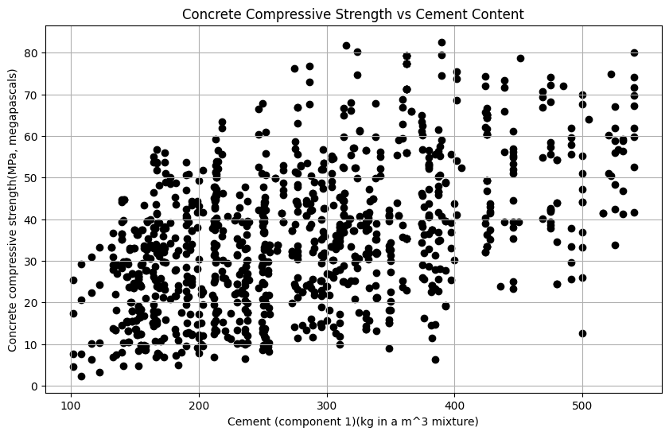
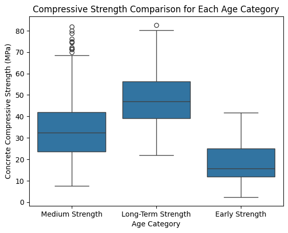

#  HW: Pandas DataFrame

**Purpose:** In this assignment you are given an Excel file with three data sets. You will import the sheets in the Excel workbook into your python code to create pandas dataframes. You will then analyze and graph information from the different dataframes. You can download the Exel file from the following link:

[highway_data.xlsx](highway_data.xlsx)

## Getting Started

1. First, make a copy of the starter sheet here: <a href="https://colab.research.google.com/github/byu-cce270/content/blob/main/docs/unit3/02_intro_to_pandas/(Starter_Notebook)_HW_Intro_to_Pandas.ipynb" target="_blank"></a>
2. Rename it something like "[Your Name] 3_4_Pandas-Part1_HW"
3. In the code block titled "Import Required Packages" input the correct import statements. One import statement is already provided for you. You should also import:
    - matplotlib.pylot as plt
    - numpy as np
    - pandas as pd
    - seaborn as sns

---

## Creating and Formatting the DataFrames

1. Under the code block titled "Create DataFrames", write the appropriate code to import each of the three sheets of the Excel file into dataframes. When you are done you should have three dataframes: **bridge_df**, **traffic_df**, and **concrete_df**. You will need to open the Excel file and note the names of the sheets to formulate your code correctly. Refer  to the pre-class reading to see how to import a sheet from an Excel file.

## Bridge DataFrame

1. Under the text block titled "BRIDGE DATAFRAME", display the first few lines of the bridge_df dataframe.
2. Filter the bridge dataframe into a new dataframe that only includes bridges in critical condition.
3. Display the first few rows of the dataframe you just created.
4. In the next code block, make a new column called 'Bridge Age' that is the number of years since the bridge was built. Hint: you can use `datetime.now().year` to get the current year. 
5. Display the first few rows of the dataframe to see your new column.
6. In the next cell, use the `.describe()` method to display the statistics of the 'Bridge Age' column.
7. Use the `.value_counts()` method to create and display a series containing the number of bridges in each condition rating.
8. Make a bar graph that displays the number of bridges in each condition rating. Include:
    - x and y labels
    - a title
    - change the default color scheme

    When you are finished your bar graph should look something like this:
   


## Traffic DataFrame

1. Under the text block titled "TRAFFIC DATAFRAME", display the first few lines of the traffic_df dataframe.
2. Filter the traffic dataframe into a new dataframe that only includes intersections with more than 1500 vehicles and congestion level = 'High'. 
3. Display the first few rows of the dataframe you just created.
4. Create a series that contains the count of congestion levels throughout the day.
5. Create a pie chart that displays the count of congestion levels throughout the day. Include:
    - a title
    - change the default color scheme

    When you are finished your pie chart should look something like this:



## Concrete DataFrame

1. Under the text block titled "CONCRETE DATAFRAME", display the first few lines of the concrete_df dataframe.
2. Use describe to display the statistics of the the entire dataframe.
3. Write code to sort the dataframe by the 'Age (day)' column.
9. Display the sorted dataframe.
10. In a new code block, write a function called 'categorize_age' that takes one integer parameter called 'days' that returns "Early Strength" if it has been less than 7 days, "Medium Strength" if it has been less than or equal to 28 days, and "Long-Term Strength" if it has been longer than 28 days.
11. Using the `.apply()` method on the 'Age (day)' column and pass it the function you just created to create a new column to your dataframe called "Age Category" that includes whether the concrete measurement is early, medium, or long-term strength.
12. Display the first few rows of the dataframe to see your new column.
14. In a new codeblock, write code to display a scatter plot that compares the compressive strength of the concrete with its cement content. Include:
     - a title
     - x and y labels
     - change the default color
     - change the marker from the default circle marker
   
    When you are finished your scatter plot should look something like this:



15. In a new codeblock, write code to display a boxplot that compares the compressive strength for each age category. Include:
     - a title
     - x and y labels

    When you are finished your boxplot should look something like this:
    


To do this, you will need to use the seaborn library that you imported earlier. You can find more information on how to create a boxplot using seaborn [here](https://seaborn.pydata.org/generated/seaborn.boxplot.html). For this assignment, you will need to use the 'Age Category' column as the x-axis and the 'Compressive Strength' column as the y-axis. Include this line:

```python
sns.boxplot(x='Strength Category', y='Concrete compressive strength(MPa, megapascals)', data=concrete_df)
```
And then include the normal matplotlib commands to alter the title and labels.

16. For extra credit, create a heatmap that looks like the following:

    

17. Turn sharing, and editing on. Then turn in your link to Learning Suite.

---

# Turning In/Rubric

Turn on sharing and editing. Turn in the link to the Learning Suite feedback box. 
**

|                                **Item**                                | **Amount** |
|:----------------------------------------------------------------------:|:----------:|
|               Import statements and file uploaded correctly            |     3      |
|         dataframes are appropriately named and created correctly       |     2      |
|            "Bridge Age" data frame created and displayed               |     2      |
| "Bridge Age" dataframe described and .value_counts() used correctly    |     2      |                              
|      Bridge bar graph created w/all requirements per instructions      |     3      |
|         Traffic dataframe filtered by congestion level                 |     2      |
|         Traffic pie chart displaying correctly w/all requirements      |     3      |
|                 Concrete dataframe filtered                            |     2      |
|             'categorize_age' function properly written                 |     3      |
|             'Age Category' column created in concrete dataframe        |     2      |
|  compressive strength v. cement content scatter plot is correct        |     3      |
|             box plot for compressive strength w/age is correct         |     3      |
|             heatmat of correlation displaying correctly                |   +5      |
|             <div style="text-align: right">**Total**</div>             |   **30**   |

The following is not apart of the rubric, but specifies how you can lose points. For example: if you do not explain your code when using AI to help you create it or fail to share your link correctly.

|                      **Reasons for Points Lost**                      | **Amount** |  
|:---------------------------------------------------------------------:|:----------:|
| No comments explaining why AI is used and what its provided code does |    2-3     |
|                        Link shared incorrectly                        |     3      |
|       Turned in late. 10% or 3 points for every week it's late.       |    3-15    |

