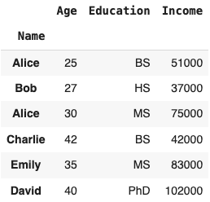

#  Reading: Pandas Series and DataFrame

---

## Pre-Class Reading Assignment

Read the following chapters and sections in the
Python Data Science Handbook, 2nd Edition:

[Chapter 13: Introducing Pandas Objects](https://learning.oreilly.
com/library/view/python-data-science/9781098121211/ch13.html){:target="_blank"} (up to the Pandas Index Object subheading)
</br>
[Chapter 14: Data Indexing and Selection](https://learning.oreilly.
com/library/view/python-data-science/9781098121211/ch14.html){:target="_blank"} (just the Data Selection in 
DataFrames section)

!!! Note
    Remember that you may have to sign in with your byu netid to access the reading content.

### Things to look out for
- What is a Pandas Series and a Pandas DataFrame?
- How do you create a Pandas Series and a Pandas DataFrame?
- What does it mean to index in a Pandas DataFrame and how do you index?

## DataFrames and Series

Pandas is a powerful data manipulation library in Python. It is built on top of NumPy and provides an easy-to-use 
data structure called a DataFrame. A DataFrame is a two-dimensional labeled data structure with columns of potentially different types. You can think of it like a spreadsheet or SQL table, or a dictionary of Series objects. It can be more than two-dimensional just like a Excel file can have multiple sheets, a dataframe can have multiple levels. A single two-dimenionsal sheet is the most commonly used pandas object. 

As noted in the reading, a DataFrame is made up of Series objects. A Series is a one-dimensional array-like object containing an array of data and an associated array of data labels, called its index. The data can be any NumPy data type, and the labels are called the index. When combinged into a dataframe, the index of the series becomes the row index of the dataframe.

While you can create a DataFrame from scratch, it is more common to read data from a CSV or Excel file directly into a DataFrame.

## Reading CSV files into Pandas DataFrames

Pandas can read data from a variety of file formats, including CSV files. The `read_csv()` function in pandas is 
used to read data from a CSV file and create a DataFrame object. When working in Google Colab, you can upload a CSV file to your Colab 
file folder and then read it into a DataFrame using the following code:

```python
import pandas as pd

df = pd.read_csv('filename.csv')
```

Each of the columns in the CSV file will be read into a Series object in the DataFrame. 

## Reading Excel files into Pandas DataFrames

Pandas can also read data from Excel files. The `read_excel()` function in pandas is used to read data from an Excel file and create a DataFrame object. The `read_excel()` function has many parameters that allow you to specify how to read the data. When working in Google Colab, you can upload an Excel file to your Colab file folder and then read it into a DataFrame using the following code:

```python
import pandas as pd

df = pd.read_excel('filename.xlsx')
```

If you have multiple sheets in the Excel file, you can specify the sheet name or index using the `sheet_name` 
parameter as follows:

```python
df = pd.read_excel('filename.xlsx', sheet_name='data')
```

Once again, each of the columns in the Excel file will be read into a Series object in the DataFrame. 

You can use the `header` parameter to specify which row to use as the column labels. By default, the first row (0 index) is used as the column labels. So if your column names are on the second row, you can use the following code:

```python   
df = pd.read_excel('filename.xlsx', header=1)
```
---

There are a number of other parameters you can use, for example which columsn to read, how many rows to read, and many others. For more information on the `read_excel()` function and its parameters, you can refer to the [pandas documentation](https://pandas.pydata.org/pandas-docs/stable/reference/api/pandas.read_excel.html){:target="_blank"}.

## Columns and Indexes in DataFrames

In a DataFrame, the columns are the variables or features, and the rows are the observations or samples. Each column in a DataFrame is a Series object, and each row is a collection of values corresponding to the columns. You can access the columns of a DataFrame using the column labels, and you can access the rows using the row index.

You can use the columns() method to get the column labels of a DataFrame and the index() method to get the row labels. You can also set the index of a DataFrame using the set_index() method. Here are some examples. First, we create a DataFrame:

```python
import pandas as pd

# Create a DataFrame
data = {'Name': ['Alice', 'Bob', 'Alice', 'Charlie', 'Emily', 'David'],
        'Age': [25, 27, 30, 42, 35, 40],
        'Education': ['BS', 'HS', 'MS', 'BS', 'MS', 'PhD'],
        'Income': [51000, 37000, 75000, 42000, 83000, 102000]}
df = pd.DataFrame(data)
df
```
The output will be:


Next, we will print the column labels and row labels of the DataFrame:

```python
print(df.columns)
print(df.index)
```

The output will be:

```python
Index(['Name', 'Age', 'Education', 'Income'], dtype='object')
RangeIndex(start=0, stop=6, step=1)
```

!!! Note
    The index of the DataFrame is shown on the left of the image above (0, 1, 2, ..) and it is a RangeIndex starting from 0. This is the default index when you create a DataFrame without specifying an index. The column labels are shown at the top of the image above ('Name', 'Age', 'Education', 'Income').

If you want to set the index of the DataFrame to a specific column, you can use the set_index() method as follows:

```python
df.set_index('Name', inplace=True)
df
```


Notice the difference? Now the names are the index. This can be useful if you want to access rows by name instead of by index. For example, you can now access the row for 'Bob' as follows:

```python
print(df.loc['Bob'])
```
The output will be:

```python
Age             27
Education       HS
Income       37000
Name: Bob, dtype: object
```

Note that the `.loc[]` method is used to access a group of rows and columns by label(s) or a boolean array. In this case, we are accessing the row with the label 'Bob'. To access a row by index (0, 1, 2, etc.), you can use the `.iloc[]` method. For example, to access the row at index 1, you can use the following code:

```python
print(df.iloc[1])
```
This corresponds to Bob. The output will be:

```python
Age             27
```

You can also reference columns by name. For example, to access the 'Age' column, you can use the following code:

```python
print(df['Age'])
```
The output will be:

```python
Name
Alice      25
Bob        27
Alice      30
Charlie    42
Emily      35
David      40
Name: Age, dtype: int64
```

## Creating new columns in DataFrames

You can create new columns in a DataFrame by assigning values to a new column label. For example, suppose everyone got a 10% raise in their income. You can create a new column called 'New Income' as follows:

```python
df['New Income'] = df['Income'] * 1.10
df
```
The output will be:


You can also create new columns based on conditions. For example, you can create a new column called 'Income Level' based on the 'Income' column as follows:

```python
df['Income Level'] = pd.cut(df['Income'], bins=[0, 50000, 100000, 150000], labels=['Low', 'Medium', 'High'])
df
```

The `pd.cut()` function is used to segment and sort data values into bins. The `bins` parameter specifies the intervals to use for the bins, and the `labels` parameter specifies the labels for the resulting bins. The output will be:


Another way to create a new column based on conditions is to use the `.apply()` method to apply a `function` to create a new column. For example, you can create a new column called 'Income Level' based on the 'Income' column by 1st creating a function, then applying it as follows:

```python
def categorize_income(income):
    if income < 50000:
        return 'Low'
    elif income < 100000:
        return 'Medium'
    else:
        return 'High'
```

You can then apply this function to the 'Income' column to create the 'Income Level' column as follows:

```python
df['Income Level'] = df['Income'].apply(categorize_income)
```

The output will be the same as above. The `apply()` method is useful when you want to apply a function to each element in a column to create a new column based on the results.

## Filtering DataFrames

You can filter a DataFrame based on conditions using boolean indexing. For example, to filter the DataFrame to include only rows where the 'Age' column is greater than 30, you can use the following code:

```python
df_filtered = df[df['Age'] > 30]
df_filtered
```

The output will be:


## Adding and Removing Rows and Columns

You can add new rows to a DataFrame using the `loc[]` method. For example, to add a new row for 'Frank' and 'Janes', you can use the following code:

```python
df.loc['Frank'] = [35, 'MS', 60000, 66000, 'Medium']
df.loc['Jane'] = [28, 'BS', 45000, 49500, 'Low']
df
```
Now it looks like this:


You can remove rows from a DataFrame using the `drop()` method. For example, to remove the row for 'Alice', you can use the following code:

```python
df.drop('Alice', inplace=True)
df
```
Now it looks like this:


## Head, Tail, Info, and Describe Methods

The `head()` method returns the first n rows of the DataFrame. By default, it returns the first 5 rows. The `tail()` method returns the last n rows of the DataFrame. By default, it returns the last 5 rows. For example:

```python
print(df.head(3))
```

produces:


and 

```python
print(df.tail(3))
```

produces:


The `describe()` method generates descriptive statistics of the DataFrame, including count, mean, standard deviation, minimum, maximum, and quartiles. For example:

```python
print(df.describe())
```

produces:


The `info()` method provides a concise summary of the DataFrame, including the number of non-null values in each column and the data type of each column. For example:

```python
print(df.info())
```

produces:

```
<class 'pandas.core.frame.DataFrame'>
Index: 6 entries, Alice to David
Data columns (total 5 columns):
 #   Column        Non-Null Count  Dtype   
---  ------        --------------  -----   
 0   Age           6 non-null      int64   
 1   Education     6 non-null      object  
 2   Income        6 non-null      int64   
 3   New Income    6 non-null      float64 
 4   Income Level  6 non-null      category
dtypes: category(1), float64(1), int64(2), object(1)
memory usage: 550.0+ bytes
```

# Sorting DataFrames

Sometimes it is useful to sort the DataFrame by the values along the specified axis. You can use the `sort_values()` method to sort the DataFrame by one or more columns. For example, to sort the DataFrame by the 'Income' column in descending order, you can use the following code:

```python
df_sorted = df.sort_values(by='Income', ascending=False)
df_sorted
```

The output will be:


# Exporting DataFrames to CSV and Excel

You can write the DataFrame to a CSV file using the `to_csv()` method. For example, to write the DataFrame to a CSV file called 'data.csv', you can use the following code:

```python
df.to_csv('data.csv')
```

You can also write the DataFrame to an Excel file using the `to_excel()` method. For example, to write the DataFrame to an Excel file called 'data.xlsx', you can use the following code:

```python
df.to_excel('data.xlsx')
```

These methods allow you to export the DataFrame to a file for further analysis or sharing with others.

---

# Plotting DataFrames with the `plot()` Method


!!! Hint
    Here is some additional reading on plotting with pandas and matplotlib:
    [Pandas Cookbook, Chapter 6](https://learning.oreilly.com/library/view/pandas-cookbook/9781836205876/Text/Chapter_6.xhtml#_idParaDest-194) <br>
    It provides some good examples and different types of plots you can create with pandas.


Pandas provides a convenient way to plot data in a DataFrame using the `plot()` method. You can create various types of plots, such as line plots, bar plots, scatter plots, and histograms. For example, to create a line plot of the 'Income' column, you can use the following code:

```python
df['Income'].plot()
```

This will create a line plot of the 'Income' column. You can also create other types of plots by specifying the `kind` parameter. For example, to create a bar plot of the 'Income' column, you can use the following code:

```python
df['Income'].plot(kind='bar')
```

This will create a bar plot of the 'Income' column. You can customize the plot by specifying additional parameters, such as `title`, `xlabel`, `ylabel`, `color`, and `legend`. For example, to create a bar plot with a title, x-axis label, y-axis label, and custom colors, you can use the following code:

```python
df['Income'].plot(kind='bar', title='Income Distribution', xlabel='Name', ylabel='Income', color='green', legend=False)
```

This will create a bar plot of the 'Income' column with a title, x-axis label, y-axis label, and custom colors. You can also create other types of plots, such as scatter plots and histograms, by specifying the `kind` parameter. It will loook like this:


## Plotting DataFrames with Matplotlib


You can also use matplotlib to plot data in a DataFrame. For example, to create a scatter plot of the 'Age' and 'Income' columns, you can use the following code:

```python
import matplotlib.pyplot as plt

plt.scatter(df['Age'], df['Income'])
plt.xlabel('Age')
plt.ylabel('Income')
plt.title('Age vs. Income')
plt.show()
```
Which produces the following scatter plot:


# Pre-Class Quiz Challenge
Open the following notebook and complete the instructions in the markdown:

<a href="https://colab.research.google.com/github/byu-cce270/content/blob/main/docs/unit3/02_intro_to_pandas/(Starter_Notebook)_Pre_Intro_to_Pandas.ipynb" target="_blank"></a>

Rename it something like "(Your_Name)_Pre_Intro_to_Pandas.ipynb"

Save changes to your Google Drive and submit the link to the notebook in your Pre-Class Quiz.

---

## Turning in/Rubric

**_REMINDER_** - For this class, **you will only turn in the links to your colab notebooks**. You will get a 0 for this assignment if you turn in a python file or a link that is not correct, wrong assignment, or does not give editor permission.

**Rubric:**

|                      Item                      | Points Possible |
|:----------------------------------------------:|:---------------:|
| <div style="text-align: right">**Total**</div> |        3        |

---

The following is not a part of the rubric, but specifies how you can lose points. For example: if you fail to share your link correctly.

| **Reasons for Points Lost** |    **Amount**     |  
|:---------------------------:|:-----------------:|
|   Link shared incorrectly   |       -10%        | 