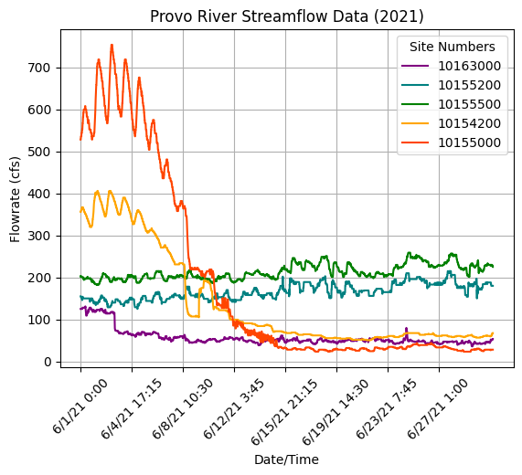

# HW: Matplotlib

**Purpose:** Learn how to read in data from Google Sheets and make graphs from it

## Instructions

1. First, make a copy of the starter sheet here: 

2. Rename it something like "[Your Name] HW 3.1 - Matplotlib"

3. Open the Google Sheet used for this homework here:

[HW Matplotlib Data Sheet](https://docs.google.com/spreadsheets/d/1byVuW2RiFN-AOvD6cf4oMuJk2NeHpZ7eQd9x-Xven-s/edit?usp=sharing){:target="_blank"}

In this assignment, you will be creating graphs of historical weather data in Pasadena, CA, Provo River flowrate data, and U.S. Birth Rates.

---

#### Connecting to Google Sheets

1. Connect the Google Sheets workbook to the Colab notebook
2. Create three separate variables **temp_data**, **stream_data**, and **birth_data** that connect to their related worksheets. For example, the **temp_data** variable should connect to the worksheet titled "Pasadena Precipitation Data", the **stream_data** variable should connect to the worksheet titled "Provo River Streamflow Data," etc.
   
#### Part 1 - Pasadena Precipitation Data

1. In the 'Graphing the Data' code block, three lists are referenced from the 'Numpy Array Creation & Slicing' block above. These are 'x', 'y_1', and 'y_2'
2. Plot y_1, label it "High Temperature", and color it orange or red
3. Plot y_2, label is "Low Temperature", and color it teal or blue
4. Title the graph "Pasadena Temperature Data 2013-2014"
5. Label the x-axis as "Date"
6. Label the y-axis as "Degrees (Fahrenheit)"
7. Using the xticks function, rotate the ticks by 45 degrees
8. Create a legend and put it in the lower left corner. Make the font size 10
9. Give the graph grid lines
10. Show the graph - it should look something like this:

    

#### Part 2 - Provo River Streamflow Data

1. In the 'Graphing the Data' code block, three lists are referenced from the 'Numpy Array Creation & Slicing' block above. These are 'x', 'y_1', 'y_2', 'y_3', 'y_4', and 'y_5'
2. Plot y_1, label it "10163000" and color it purple
3. Plot y_2, label it "10155200" and color it teal or blue
4. Plot y_3, label it "10155500" and color it green
5. Plot y_4, label it "10154200" and color it orange
6. Plot y_5, label it "10155000" and color it orange-red or red
7. Title the graph "Provo River Streamflow Data (2021)"
8. Label the x-axis as "Date/Time"
9. Label the y-axis as "Flowrate (cfs)"
10. Using the xticks function, rotate the ticks by 45 degrees
11. Create a legend in the top right corner, make the font size 10, and title it "Site Numbers"
12. Give the graph grid lines
13. Show the graph - it should look something like this:

    

#### Part 3 - Average U.S. Daily Birth Data

1. In the 'Graphing the Data' code block, three lists are referenced from the 'Numpy Array Creation & Slicing' block above. These are 'x' and 'y_1'.
2. Plot y_1 and give it a color of your choice
3. Title the graph "Average U.S. Daily Birth Data"
4. Label the x-axis as "Date"
5. Label the y-axis as "Births"
6. Using the xticks function, rotate the ticks by 45 degrees
7. Give the graph gridlines
8. Annotate the chart with arrows that point to and label the following holidays:

&nbsp;&nbsp;&nbsp;&nbsp;New Year’s Day (2012-01-01)

&nbsp;&nbsp;&nbsp;&nbsp;Independence Day (2012-07-04)

&nbsp;&nbsp;&nbsp;&nbsp;Halloween (2012-10-31)

&nbsp;&nbsp;&nbsp;&nbsp;Thanksgiving (2012-11-27)

&nbsp;&nbsp;&nbsp;&nbsp;Christmas (2012-12-25)

10. Show the graph - it should look something like this:

    

11. Write a comment explaining why you think the birth rate drops during those days

---

# Turning In/Rubric

Turn on sharing and editing. Turn in the link to the Learning Suite feedback box

|                **Item**                              | **Amount** |  
|:----------------------------------------------------:|:----------:|
|         Google Sheets is connected correctly         |     3      |
|  The temperature data graph has all listed elements  |     8      |
|   The streamflow data graph has all listed elements  |     8      |
|     The birth data graph has all listed elements     |     8      |
|        The annotations are created correctly         |     3      |
|     
**Total**
   |   **30**   |

The following is not a part of the rubric, but specifies how you can lose points. For example: if you do not explain your code when using AI to help you create it or fail to share your link correctly.

|                      **Reasons for Points Lost**                      | **Amount** |  
|:---------------------------------------------------------------------:|:----------:|
| No comments explaining why AI is used and what its provided code does |    2-3     |
|                        Link shared incorrectly                        |     3      |
|       Turned in late. 10% or 3 points for every week it's late.       |    3-15    |
