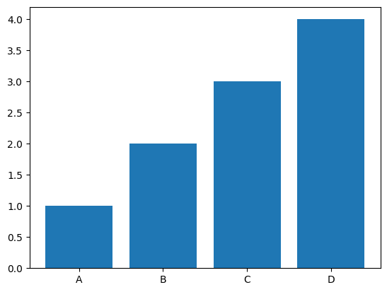
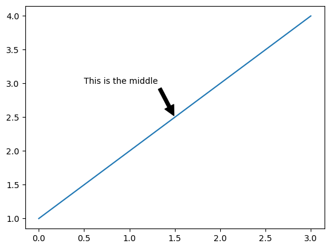

#  Reading: Matplotlib

---

# Pre Class Reading Assignment

In the Python Data Science Handbook, read the following chapters:

[Chapter 25: General Matplot Tips](https://learning.oreilly.com/library/view/python-data-science/9781098121211/ch25.html){:target="_blank"}<br>
[Chapter 26: Simple Line Plots](https://learning.oreilly.com/library/view/python-data-science/9781098121211/ch26.html){:target="_blank"}<br>
[Chapter 27: Simple Scatter Plots](https://learning.oreilly.com/library/view/python-data-science/9781098121211/ch27.html){:target="_blank"}<br>
[Chapter 29: Customizing Plot Legends](https://learning.oreilly.com/library/view/python-data-science/9781098121211/ch29.html){:target="_blank"}<br>
[Chapter 32: Text and Annotation](https://learning.oreilly.com/library/view/python-data-science/9781098121211/ch32.html){:target="_blank"}

There is also a chapter in the Python Crash Course book that you should read:

[Chapter 15: Generating Data](https://learning.oreilly.com/library/view/python-crash-course/9781098156664/c15.xhtml){:target="_blank"}

Remember that you will have to sign in to you free account that you created earlier.

## Thing to Look Out For
 - How to create line, scatter, and histogram plots.
 - How to add titles and axes.
 - How to style plots.

## Two Interfaces to Matplotlib

As noted in Chapter 25 of the Python Data Science book, Matplotlib provides two interfaces to plotting data:

1. A simple MATLAB-style interface that is provided by the `pyplot` module.
2. An object-oriented interface that is provided by the `Figure` and `Axes` classes.

The `pyplot` interface is a state-based interface that is designed to be familiar to users of MATLAB. It is 
convenient for simple plots, but it is somewhat limited in its flexibility. The object-oriented interface is more 
powerful and flexible, and it is recommended for more complex plots, especially those involving multiple subplots. In this course, we will primarily use the `pyplot` interface because it is simpler and works great for most plots. In 
the reading, 
you will see examples of both interfaces.

## Bar Charts

The reading above mainly describes line plots that you generated with the `plot` function. However, you can 
also create bar charts with the `bar` function. Bar charts are useful for comparing quantities across different categories. You can create a bar chart by calling the `bar` function with two arguments: a list of x-values and a list of y-values. The x-values are the categories, and the y-values are the quantities.

Here is an example of how to create a bar chart:

```python
import matplotlib.pyplot as plt

plt.bar(['A', 'B', 'C', 'D'], [1, 2, 3, 4])
plt.show()
```


To do a horizontal bar chart, you can use the `barh` function instead of the `bar` function. You will be asked to do both types of bar charts in the in-class exercise.

## Annotations

Annotations are described in Chapter 32 of the Python Data Science book. Annotations are text or arrows that you can 
add to a plot to provide additional information. In Chapter 32, all of the examples are based on the object-oriented 
interface, but you can also add annotations with the `pyplot` interface as follows:

```python
import matplotlib.pyplot as plt

plt.plot([1, 2, 3, 4])
plt.annotate('This is the middle', xy=(1.5, 2.5), xytext=(0.5, 3),
             arrowprops=dict(facecolor='black', shrink=0.05))
plt.show()
```


Note that the `annotate` function takes three arguments: the text of the annotation, the position of the annotation, 
and the position of the text. The `arrowprops` argument is optional and specifies the properties of the arrow that 
points to the annotation. The xy argument specifies the position of the annotation, and the xytext argument 
specifies the position of the text. Both arguments are in data coordinates.

# Pre-Class Quiz Challenge

Open this starter sheet and follow the instructions on the notebook to complete the challenge. Submit a link to the completed problem in your Pre-Class Quiz.

<a href="https://colab.research.google.com/github/byu-cce270/content/blob/main/docs/unit3/02_matplotlib/matplotlib_pre_class.ipynb" target="_blank"></a>
