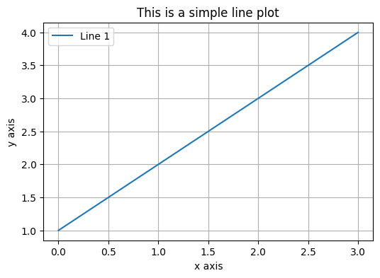
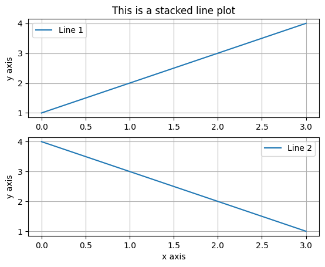
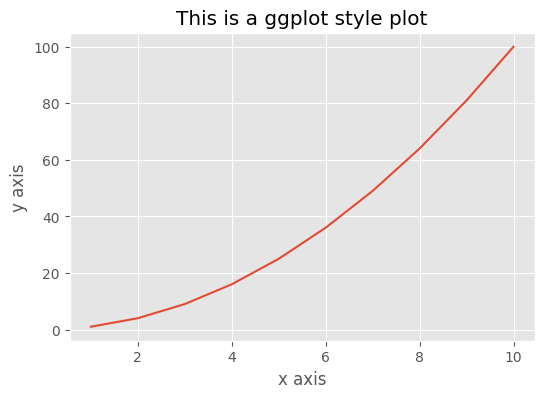
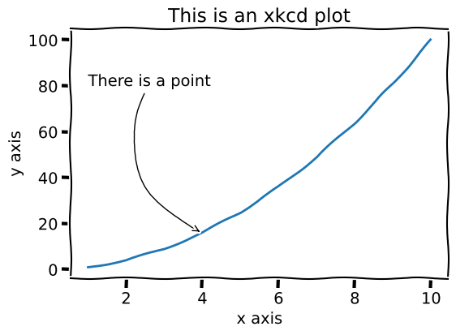

#  Reading: Matplotlib

---

# Pre Class Reading Assignment

In the Python Data Science Handbook, read the following chapters:

[Chapter 25: General Matplot Tips](https://learning.oreilly.com/library/view/python-data-science/9781098121211/ch25.html){:target="_blank"}<br>
[Chapter 26: Simple Line Plots](https://learning.oreilly.com/library/view/python-data-science/9781098121211/ch26.html){:target="_blank"}<br>
[Chapter 27: Simple Scatter Plots](https://learning.oreilly.com/library/view/python-data-science/9781098121211/ch27.html){:target="_blank"}<br>
[Chapter 29: Customizing Plot Legends](https://learning.oreilly.com/library/view/python-data-science/9781098121211/ch29.html){:target="_blank"}<br>
[Chapter 32: Text and Annotation](https://learning.oreilly.com/library/view/python-data-science/9781098121211/ch32.html){:target="_blank"}

There is also a chapter in the Python Crash Course book that you should read:

[Chapter 15: Generating Data](https://learning.oreilly.com/library/view/python-crash-course/9781098156664/c15.xhtml){:target="_blank"}

Remember that you will have to sign in to you free account that you created earlier.

## Thing to Look Out For
 - How to create line, scatter, and histogram plots.
 - How to add titles and axes.
 - How to style plots.

## Two Interfaces to Matplotlib

As noted in Chapter 25 of the Python Data Science book, Matplotlib provides two interfaces to plotting data:

1. A simple MATLAB-style interface that is provided by the `pyplot` module.
2. An object-oriented interface that is provided by the `Figure` and `Axes` classes.

The `pyplot` interface is a state-based interface that is designed to be familiar to users of MATLAB. It is 
convenient for simple plots, but it is somewhat limited in its flexibility. The object-oriented interface is more 
powerful and flexible, and it is recommended for more complex plots, especially those involving multiple subplots. In this course, we will primarily use the `pyplot` interface because it is simpler and works great for most plots. In 
the reading, 
you will see examples of both interfaces. You are welcome to use the object-oriented interface if you prefer.

Here is an example of how to use the object-oriented interface to create a simple line plot:

```python
import matplotlib.pyplot as plt

ax = plt.axes()
ax.size = (6, 4)
ax.plot([1, 2, 3, 4], label='Line 1')   
ax.set_xlabel('x axis')
ax.set_ylabel('y axis')
ax.set_title('This is a simple line plot')
ax.grid(True)
ax.legend()

```

This is how you would create the same plot with the `pyplot` interface:

```python
import matplotlib.pyplot as plt

plt.figure(figsize=(6, 4))
plt.plot([1, 2, 3, 4], label = 'Line 1')
plt.xlabel('x axis')
plt.ylabel('y axis')
plt.title('This is a simple line plot')
plt.grid(True)
plt.legend()
plt.show()
```

Note the similarities between the two examples. Both examples result in the following plot:



One of the advantages of the object-oriented interface is that it allows you to create multiple subplots in a single figure. Here is an example of how to create a figure with two subplots:

```python
import matplotlib.pyplot as plt

fig, ax = plt.subplots(2)
ax[0].plot([1, 2, 3, 4], label='Line 1')
ax[0].set_ylabel('y axis')
ax[0].set_title('This is a stacked line plot')
ax[0].grid(True)
ax[0].legend()
ax[1].plot([4, 3, 2, 1], label='Line 2')
ax[1].set_xlabel('x axis')
ax[1].set_ylabel('y axis')
ax[1].grid(True)
ax[1].legend()
```

Which results in the following plot:



There is a way to do the same thing with the pyplot interface, but it is a little more complicated. The object-oriented 
interface is more straightforward for creating multiple subplots.

## Bar Charts

The reading above mainly describes line plots that you generated with the `plot` function. However, you can 
also create bar charts with the `bar` function. Bar charts are useful for comparing quantities across different categories. You can create a bar chart by calling the `bar` function with two arguments: a list of x-values and a list of y-values. The x-values are the categories, and the y-values are the quantities.

Here is an example of how to create a bar chart:

```python
import matplotlib.pyplot as plt

plt.bar(['A', 'B', 'C', 'D'], [1, 2, 3, 4])
plt.show()
```


To do a horizontal bar chart, you can use the `barh` function instead of the `bar` function. You will be asked to do both types of bar charts in the in-class exercise.

## Annotations

Annotations are described in Chapter 32 of the Python Data Science book. Annotations are text or arrows that you can 
add to a plot to provide additional information. In Chapter 32, all of the examples are based on the object-oriented 
interface, but you can also add annotations with the `pyplot` interface as follows:

```python
import matplotlib.pyplot as plt

plt.plot([1, 2, 3, 4])
plt.annotate('This is the middle', xy=(1.5, 2.5), xytext=(0.5, 3),
             arrowprops=dict(facecolor='black', shrink=0.05))
plt.show()
```


Note that the `annotate` function takes three arguments: the text of the annotation, the position of the annotation, 
and the position of the text. The `arrowprops` argument is optional and specifies the properties of the arrow that 
points to the annotation. The xy argument specifies the position of the annotation, and the xytext argument 
specifies the position of the text. Both arguments are in data coordinates.

The function parameters are:
```
text   : The text of the annotation
xy     : The point (x,y) to annotate
xytext : The position (x,y) to place the text at (If None, defaults to xy)
arrowprops : The properties used to draw an arrow between the positions xy and xytext
```

## Styles (Optional)


The ```with``` construction makes it a temporary style, rather than a permanent one. You can also use the `plt.
style.use('ggplot')` command to set the style for all plots in the notebook. 

This command will list the styles available in your version of matplotlib:
```python
print(plt.style.available)
``` 

Here is an example that temporally sets the plot style to ```ggplot``` using the ```with``` construction:
```python
import matplotlib.pyplot as plt
import numpy as np

x = np.arange(1, 11)
y = x**2

with plt.style.context('ggplot'):
    plt.plot(x, y)
    plt.title('This is a ggplot style plot')
    plt.xlabel('x axis')
    plt.ylabel('y axis')
    plt.show()
```

The plot will look something like this:



## Just for Fun (Optional)
One fun style you might want to try is the `xkcd` function which sets a number of matplotlib defaults. 

This "style" makes the plot look like it was drawn by hand. Here is an example of how to use the `xkcd` style. 
It is different from other styles as you use  the ```plt.xkcd()``` function to set things up. You probably want to 
use the ```with``` construction to make sure that the style is temporary. 

```python
import matplotlib.pyplot as plt
x = np.arange(1, 11)
y = x**2 
with plt.xkcd():
    plt.figure(figsize=(6, 4))
    plt.plot(x, y)
    plt.title('This is an xkcd plot')
    plt.xlabel('x axis')
    plt.ylabel('y axis')
    # Define the arrow properties, this is a curved arrow
    # we make the dictionary first, the provide it in the annotate command
    arrow_prop = dict(arrowstyle="->", connectionstyle="arc3,rad=.5",     color="black")

    plt.annotate('There is a point', xy=(4, 16), xytext=(1, 80), 
                arrowprops=arrow_prop)
    plt.show()
```

The plot will look something like this:



If you try this, you will get a lot of error messages because the `xkcd` function requires fonts that are not 
installed on the Colab server. 

Try some of your other plots using the `xkcd` function. You can indent your plot commands as shown above, or just run 
```plt.xkcd()``` then replot any of your plots. 
However, if you run ```plt.xkcd()``` without the ```with``` to make it temporary, it sets the style for all plots done 
afterwards.
To reset to the default settings use
```python
plt.rcdefaults()
```

# Pre-Class Quiz Challenge

Open this starter sheet and follow the instructions on the notebook to complete the challenge. Submit a link to the completed problem in your Pre-Class Quiz.

<a href="https://colab.research.google.com/github/byu-cce270/content/blob/main/docs/unit3/02_matplotlib/matplotlib_pre_class.ipynb" target="_blank"></a>
