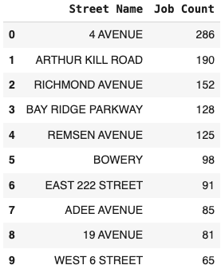
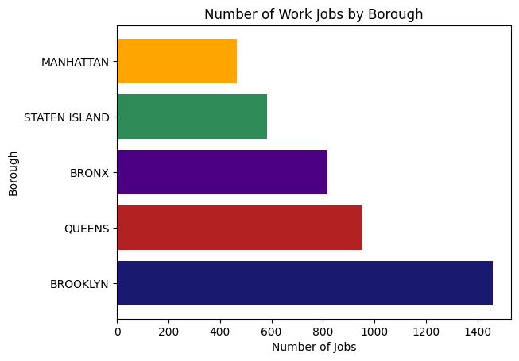
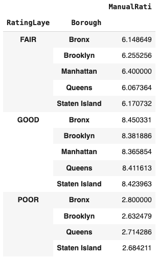
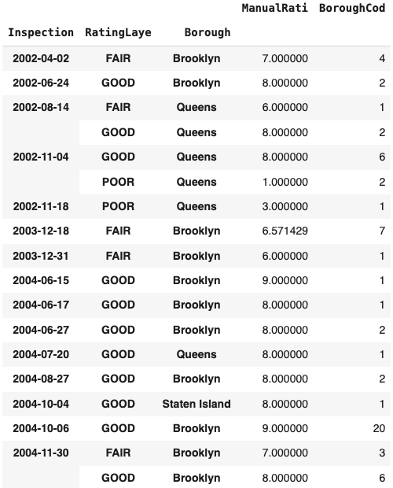
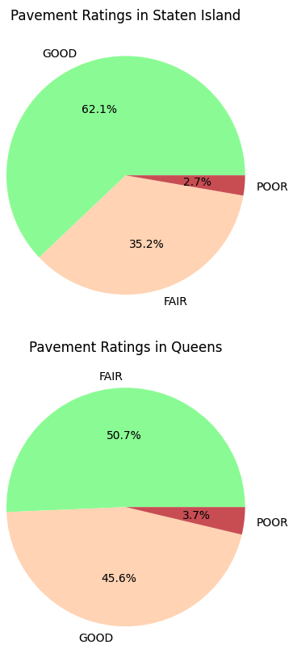

#  HW: Manipulating and Grouping Pandas DataFrames

**Purpose:** In this assignment you are given an Excel file for different road resurfacing work done on New York City streets along with pavement ratings over a few years. You will upload the provided Excel file to your Colab notebook, create dataframes from the two sheets in the Excel file, and practice merging, grouping, and manipulating the data in pandas. 

## Overview
The Excel file has two sheets: `NY Street Resurfacing Schedule` and `NY Street Pavement Rating`. 
You will be using the data in these sheets to complete the exercises below.

You will need to download the Excel file from this page, and upload it to your Colab notebook. You will need to 
read the data from the two sheets into two different panda data frames and convert the `date` columns into 
a pandas  date-time format and make these the dataframe indexes. You will need to add a new column to the first dataframe that 
specifies the day of the week.  In the second dataframe, you will need to add a column to covert the shorthand names for the boroughs into their full names.

## Part 1: Setup

1. Make a copy of the starter sheet here: 
2. Rename it something like "(Your_Name)_HW_Continuing_with_Pandas.ipynb"
3. In the code block titled "Import Required Packages" input the correct import statements for the libraries you will use:
    - matplotlib.pyplot as plt
    - pandas as pd
    - seaborn as sns
4. Download this Excel spreadsheet:
[pavingdata.xlsx](data/pavingdata.xlsx)
5. Upload the file to your Colab notebook by dragging and dropping it into the file explorer on the left side of the notebook.
6. In a new code block, write code to open the two different sheets and read the data into two separate pandas dataframes.
    * Note: You can name the dataframes whatever you would like. For the purposes of these instructions the first sheet will be referred to as the **resurface_df** and the second sheet will be referred to as the **pavement_df**.

## Part 2: Pavement Resurfacing Jobs

Now that we have our data loaded and updated the dataframes, we can start to manipulate and analyze the data. We 
will first explore the data in the **resurface_df** dataframe. We are going to use the `.groupby()` method to group our 
data by 
different columns 
and put those data 
into new 
dataframes. 

1. Display the first few rows of the resurface_df dataframe to review its contents.
2. Note that the 'Community Board' column has a numeric code for each board, but it was converted from an integer to 
   a float. Convert the 'Community Board' column back to an integer by running the code provided. Note that the 
   columns contains some NaN values, so you will need to fill those are skipped by using the `errors='coerce'` 
   argument.
2. In a new code block, convert the "Date" column in resurface_df to a date/time format.
3. Use the `.dt.day_name()` method in pandas to add a new column to the resurface_df that specifies what day of the 
   week the resurfacing took place on.
4. Display the dataframe with the new column added.
5. In a new code block, count the number of jobs under each borough for each work type (milling and paving). Put 
   your results in a 
   variable called `borough_work_counts` and display the results. 

    **Hint:** 
    You can do this using either the `.groupby()` method or the `.value_counts()` method. 

### Common Names

Now we want to look at the most common street names for paving jobs and create a dataframe that shows the most 
common street names for paving jobs. The current column names are a little long, so after you create the dataframe, 
rename the column. You will need to sort the data to get the most common street names at the top of the dataframe.

1. In the next block, create a new dataframe using the `.groupby()` method that finds that most common street names 
    for paving jobs. Reset the index to be 'Job Count'.
2. With resulting dataframe, sort the data to get the most common street names at the top of the dataframe.
3. Rename the 'On Street Name' columns in your new dataframe to be 'Street Name'.
4. Reset the index to preserve the order of "Job Count" and "Street Name" columns. Use `reset_index(drop=True)` method.'
4. Display the first 10 rows of the resulting dataframe.

    When you are done, the dataframe that displays should look like this:

5. In the next code block, do the same thing, but this time use the `.value_counts()` method to find the most common 
    street names for paving jobs. Reset the index and rename the columns as you did in the previous step.

Which of these methods do you prefer? Why?

### Work Hours

Now we want to see when the work was done and how long it took. We will assume each shift is 8 hours, so we can use 
some math to add a new column to the dataframe that shows how long each job took called `duration`. Once we know the 
duration of each job, we can start to group the data by each community board and put that data 
into a new dataframe. 
    
12. Starting in a new codeblock, assume that each shift for resurfacing last 8 hours. Add a work duration column to the resurface_df that has the value of 8 for each row.
13. Use the .groupby() method to determine the number of work hours completed by each community board.

    When you are done, the dataframe that displays should look like this:

    

## Work Jobs by Borough

Now we want to visualize the data we have been working with. We will create a bar graph that displays the 
number of work jobs by borough. 

14. Use either the `.value_counts()` or `.groupby()` method to count the number of work jobs by borough. Remember 
    that each row represents a job, so you just need to count the number of rows for each borough.
15. Create a horizontal bar graph that displays the number of work jobs by borough. Include:
     - a title
     - x and y labels
     - horizontal gridlines
     - change the default colors

    When you are done, the graph should look something like this:

## Part 3 - Pavement Ratings

Now we will work with the **pavement_df** dataframe. 
The pavement_df dataframe doesn't have the full name of the boroughs, so we will need to create a dictionary to map 
the values in the dataframe to the full names. Once we have that dictionary, we can map the values in the dataframe to the 
full names and add a new column with the full names. 

1. Display the first few rows of the pavement_df dataframe to review its contents.

### Borough Name Mapping

15. In 'Borough Mapping' cell create a dictionary to map the pavement_df boroughs.
     - X : Bronx
     - B : Brooklyn
     - M : Manhattan
     - Q : Queens
     - S : Staten Island
   
16. Map the BoroughCod column of the pavement_df to insert a new column titled "Borough" that includes the full name 
    of the boroughs. Use the `.map()` method to do this and pass it the dictionary you created in the previous step 
    as an argument. Display the first few rows of the dataframe to verify the new column was added correctly.

### Average Ratings

17. In the next code block, use the `.groupby()` method to calculate the average value of the manual rating 
    ('ManualRati')
    in each 
    rating 
    category ('RatingLaye') by borough.

    When you are done, the data frame that displays should look like this:

### Multiple Grouping and Aggregation

18. In the next code block, use the `.groupby()` method to display the average of the manual rating and count of the 
    borough measurements by their inspection date, rating, and borough name. To do this, you will need to pass a 
    list of columns to the `.groupby()` method and you will need to use the `.agg()` method to apply multiple 
    aggreations to the data. The aggregation functions you will use are 'mean' and 'count' and you will need to pass 
    them as a dictionary to the `.agg()` method. Display the results.

    When you are done, the data frame that displays should look like this:

### Pie Charts for Each Borough

In our final section, we are going to create a pie chart that displays the pavement conditions by ratings for each 
of the boroughs. To do this, you will need to create a list of unique borough names and then you will use a for loop 
to loop through each borough and create a pie chart for each borough showing the pavement conditions by ratings 
('good', 'fair', 'poor').

1. In a new code block, create a list of unique borough names from the 'Borough' column in the pavement_df dataframe 
   using the `.unique()` method.
2. In a new code block, create a for loop that loops through each borough in the list of unique borough names.
3. Inside each loop, filter the pavement_df dataframe to only include the rows for the current borough. Store the 
   results in a new dataframe called `borough_df`.
4. On the next line, use the `.value_counts()` method to count the number of pavement ratings for each rating 
   category ('RatingLaye') in the `borough_df` dataframe. Store the results in a variable called `rating_counts`.
5. Now create a pie chart that displays the pavement conditions by ratings for the current borough. Include:
     - a title
     - change the default colors

    When you are done, you should see five pie charts. The first part of the charts will look something like this:

    
---

## Turning in/Rubric

**_REMINDER_** - For this class, **you will only turn in the links to your colab notebooks**. You will get a 0 for this assignment if you turn in a python file or a link that is not correct, wrong assignment, or does not give editor permission.

**Rubric:**

|                                    **Item**                                     | **Amount** |
|:-------------------------------------------------------------------------------:|:----------:|
|           Correct import statements used and file uploaded correctly            |     5      |
|            Tabs in the Excel file are loaded in separate data frames            |     3      |
|              Correct column names created with duplicates removed               |     3      |
|                       Equipment age calculated correctly                        |     3      |
| Equipment and Productivity dataframes are merged into a new dataframe correctly |     2      |
|   Correct columns with correct calculations are added to the merged dataframe   |     8      |
|                     .groupby() is used to filter correctly                      |     3      |
|          Bar graph displays correctly with titles, labels, and colors           |     3      |
|                 
**Total**
                  |   **30**   |

---

The following is not a part of the rubric, but specifies how you can lose points. For example: if you do not explain your code when using AI to help you create it or fail to share your link correctly.

|                       **Reasons for Points Lost**                       |    **Amount**     |  
|:-----------------------------------------------------------------------:|:-----------------:|
|                         Link shared incorrectly                         |       -10%        |
|                        Turned in late (per week)                        | -10% (up to -50%) |
| No comments explaining where AI is used and what its provided code does |       -10%        |
