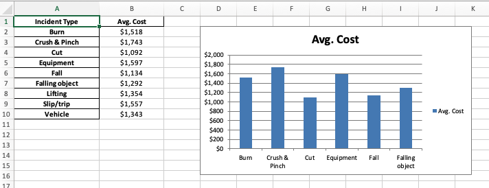

# In Class Excersise: Working with Excel Files in Python

In this class exercise, we will learn how to work with Excel files in Python. We will read Excel files into pandas dataframes, write dataframes to Excel files, and perform some basic data manipulation tasks. To begin, download the starter notebook here.

Rename it '**(Your_Name)_Class_Python_and_Excel.ipynb'**. Then follow the instructions below. Create and organize your code in cells in the notebook as you go.

## Part 1: Provo River Streamflow Data

In Unit 1, we worked with a set of streamflow data from gauges on the Provo River. In this exercise, we will import a copy of that data in Excel format, perform some data analysis, and write the results back to a new Excel file.

1. Download the Excel file from [streamflow_data.xlsx](streamflow_data.xlsx).
2. Follow the instructions for Part 1 in the notebook.

When finished, Your Excel file should look similar to the one below:

## Part 2: Accident Database Analysis

In this part of the exercise, we will work with a dataset of workplace accidents that we used in Unit 1. We will read the data from an Excel file, perform some data analysis, and write the results back to a new Excel file along with some column charts.

1. Download the Excel file from [accident_database.xlsx](accident_database.xlsx)
2. Follow the instructions for Part 2 in the notebook.

When finished, Your Excel file should look similar to the one below:

---
			
## Turning in/Rubric

**_REMINDER_** - For this class, **you will only turn in the links to your colab notebooks**. You will get a 0 for this assignment if you turn in a python file or a link that is not correct, wrong assignment, or does not give editor permission.

**Rubric:**

|                      Item                      | Points Possible |
|:----------------------------------------------:|:---------------:|
| 
**Total**
 |        5        |

---

The following is not a part of the rubric, but specifies how you can lose points. For example: if you fail to share your link correctly.

| **Reasons for Points Lost** |    **Amount**     |  
|:---------------------------:|:-----------------:|
|   Link shared incorrectly   |       -10%        |
|  Turned in late (per week)  | -10% (up to -50%) |