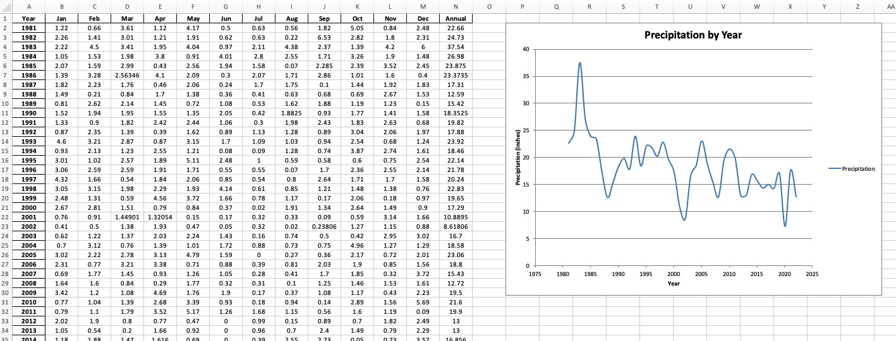
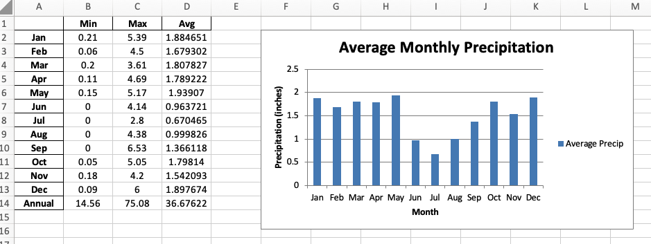

# Homework: Working with Excel Files in Python

**Objective:** Learn how to export data and charts to an Excel file.

In this homework assignment, you will import an Excel file containing monthly precipitation data for a set of weather stations in Utah. You will read the data into a pandas dataframe, perform some data analysis, and write the results back to a new Excel file. You will also create a chart of the data and include it in the Excel file.

## Instructions

To begin, create a new Colab notebook and name it '**(Your_Name)_HW_xlswriter.ipynb'**. Then follow the instructions below. Create and organize your code in cells in the notebook as you go.

### Part 1: Import your data

Do the following to import the data:

1. Install the **xlsxwriter** package and import the required packages (**xlsxwriter**, **pandas**, and **matplotlib.pyplot**).
2. Download the Excel file with the precip data from [precip_data.xlsx](precip_data.xlsx). Open the file in Excel to 
   see what the data looks like. You will see that there are three sheets, one for Salt Lake City, one for Utah 
   State, and one for BYU. Each sheet contains monthly precipitation data going back several years. For this 
   exercise, we will focus on the BYU data.
3. Upload the file to your Colab environment. You can do this by clicking on the folder icon on the left sidebar, then clicking on the upload icon. Or you can drag and drop the file into the file browser.
4. Read the data into a pandas dataframe called **precip_df**. Use the `read_excel` method and read the sheet named **BYU**.
5. Display the first few rows of the dataframe to see what the data looks like.

### Part 2: Data Analysis

Do the following to analyze the data. Note that some of the monthly precip measurements are missing and are marked in the dataframe with **NaN**. You will need to handle these missing values before we can proceed with the analysis. The best way to handle missing values will depend on the analysis you want to perform. In this case we will use the pandas `PCHIP` interpolation method to fill in the missing values. This method is a piecewise cubic hermite interpolating polynomial.

1. Make the **Year** column the index of the dataframe.
2. Use the `PCHIP` method to interpolate the missing values in the dataframe. 
3. Display the dataframe to see the interpolated values.
4. Add a new column called **'Annual'** which is the sum of each row in the dataframe.
5. Display the first few rows of the dataframe to see the new column.
6. Finally, create a line plot using `matplotlib` of the annual precipitation data.

Next, we will create a new dataframe with some summary statistics. Do the following:

1. Create three new dataframes (**min_rain_df**, **max_rain_df**, **avg_rain_df**) that contain the minimum, maximum, and average annual precipitation for each month over the entire dataset.
2. Combine the three dataframes into a single dataframe called **stats_df**. Change the column names to 'Min', 'Max', and 'Avg'.
3. Display the dataframe to see the results. You should have one row for each month and three columns (Min, Max, Avg).
4. Plot the **Avg** column of the stats_df dataframe using a bar or a line chart using `matplotlib`. 
 
!!! Hint
    The 'Annual' row at the bottom will mess up your plot. To display all of the rows except the last one, you can use the following code:   
    ```python   
    stats_df.iloc[:-1].plot(kind='bar')
    ```   
    This will select all rows except the last one for plotting.


### Part 3: Export the Precip Data to Excel

Now we will create a new Excel file and write the main precip data to a sheet and create a scatter chart of the data. Do the following:

1. Create a new Excel file called 'precip_summary.xlsx' using the **xlsxwriter** package.
2. Export the precip_df dataframe to a sheet called **'Data'** in the Excel file. Make a workbook and worksheet object.
3. Create a format called '**data_format**' that center aligns content. Apply it to the entire table in the Excel sheet using the `set_column` method. Use a column width of **8**.
4. Create a chart of the annual precipitation data and insert it into the Excel file. Call the chart object '**chart1**'. The chart should be a scatter chart (smooth) with the years on the x-axis and the annual precipitation on the y-axis. Insert the chart and position it at cell **'P2'**.

5. Export the **stats_df** dataframe to a new sheet called **'Stats'** in the Excel file. **Hint**: Use the same writer 
   object and just call the `to_excel` method again with the new sheet name. Update the worksheet object to point to 
   the new sheet.
6. Again, use the data_format object created above to format the table in the Stats sheet using the `set_column` 
   method. Use a column width of **8**.
7. Add an XY column chart of the monthly average precip data. Call the chart object 'chart2'. Include all of the month rows, but not the annual row at the end.
8. Insert the chart and position it at cell **'F2'**.

### Part 4: Save the Excel File

1. Use the `workbook.set_size()` method to set the size of the Excel file to 2400 x 1400 pixels.
2. Close the workbook.
3. Run your code to create the Excel file. You will see the file appear in the file browser on the left sidebar. Click on the three dots to the right of the filename and select '**Download**' to save it to your local machine.
4. Open the file and verify that the data and charts are correct. Iterate as needed to make sure the data and charts are formatted correctly.

In the end, it should look something like this:




---

## Turning in/Rubric

**_REMINDER_** - For this class, **you will only turn in the links to your Colab notebooks**. You will get a 0 for this assignment if you turn in a python file or a link that is not correct, wrong assignment, or does not give editor permission.

**Rubric:**

|                      **Item**                      | **Amount** |
|:--------------------------------------------------:|:----------:|
|             Data is imported correctly             |     2      |
|     Missing values are interpolated correctly      |     3      |
|   Annual precipitation data is plotted correctly   |     3      |
|    Summary statistics are calculated correctly     |     2      |
|      Summary statistics is plotted correctly       |     3      |
|  Main precip data is exported to Excel correctly   |     3      |
|    Main precip data charted correctly in Excel     |     4      |
| Summary precip data is exported to Excel correctly |     3      |
|   Summary precip data created correctly in Excel   |     4      |
|           Excel file is saved correctly            |     3      |
|   <div style="text-align: right">**Total**</div>   |   **30**   |

---

The following is not a part of the rubric, but specifies how you can lose points. For example: if you do not explain your code when using AI to help you create it or fail to share your link correctly.

|                       **Reasons for Points Lost**                       |    **Amount**     |  
|:-----------------------------------------------------------------------:|:-----------------:|
|                         Link shared incorrectly                         |       -10%        |
|                        Turned in late (per week)                        | -10% (up to -50%) |
| No comments explaining where AI is used and what its provided code does |       -10%        |
