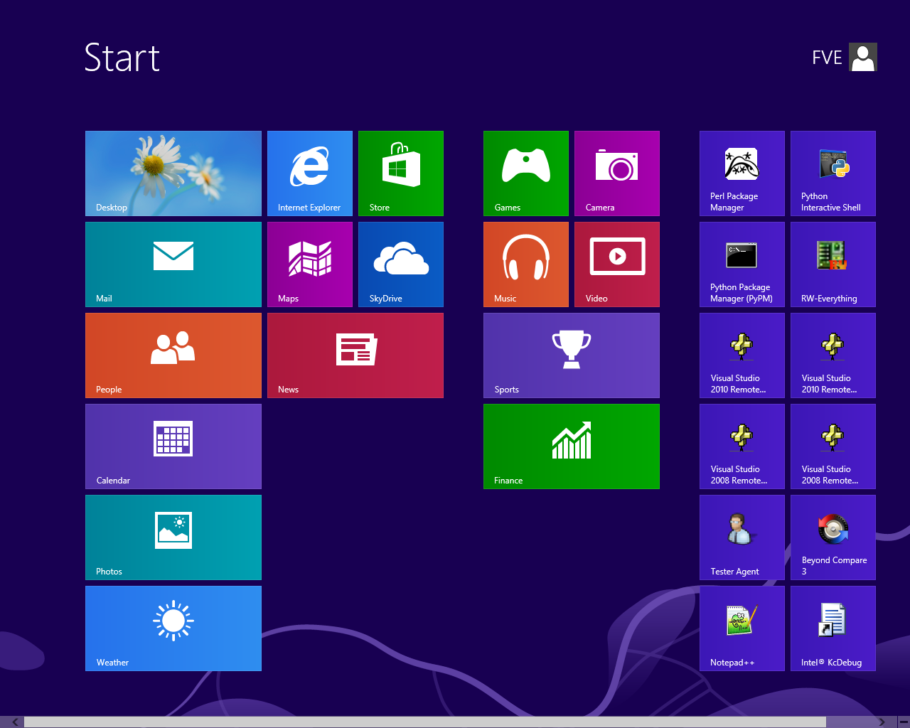
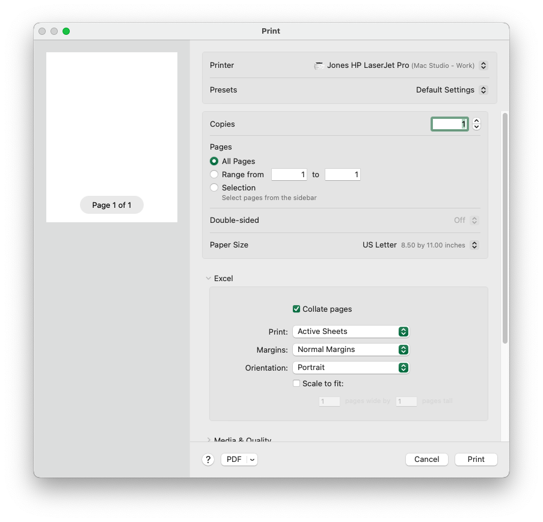
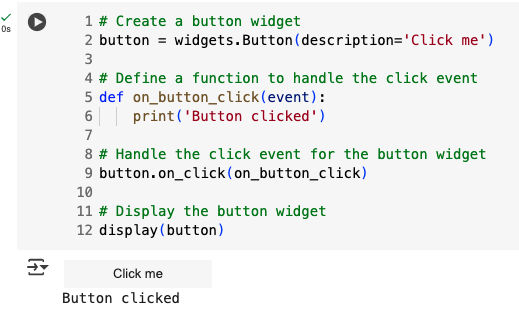

# Reading: ipywidgets

A graphical user interface , or GUI (pronounced “GOOEY”) is the buttons, text boxes, pictures, and stuff that a user of a computer program interacts with. For example, when you start Instagram on your phone, or print a document from Word, or even when you open Learning Suite, you are looking at and interacting with a graphical user interface. Look at this image and consider the various types of interactive components in each of these GUI’s. Here are a couple of examples of GUI’s:

{width=500}

{width=700}

One of the ways we can make our Python code more user-friendly is by adding a GUI to it. Early in the semester, you learned how to use the Python `input()` statement to prompt the user to enter a text string or number. That is a simple type of GUI. Another popular GUI that is designed especially for use in notebooks is **Jupyter Widgets**. Jupyter widgets are implemented through a Python library called **ipywidgets**. These widgets allow the user to interact with your code in a more intuitive way, rather than just typing in commands and reading the output. 

You can access the full documentation for ipywidgets [here](https://ipywidgets.readthedocs.io/en/latest/index.html){target='blank'}. In the following sections, we will learn how to use ipywidgets to create interactive widgets in Colab notebooks.

You can also add formated text to your notebook and widgets using html. 

## Importing

To use ipywidgets, you first need to import it. You can do this by using the following command:

```python
import ipywidgets as widgets
```

Note that ipywidgets comes pre-installed on Google Colab. If you are running in another environment, you may need to install it first.

## Overview

Widgets are a graphical way for a user to interact with your code. In general, when a user interacts with a widget, an event is triggered. For example, when a user clicks a button, a click event is triggered. Events can be quite detailed, for example one action when a button is pressed and another when released. These are called "events". Because of this you need to specific which event you are working with.  You can handle these events in your code to perform actions based on the user's input. When using widgets, you need to structure your code in a way that allows you to handle these events.

To use ipywidgets, you need to follow these steps:

1. Create a widget
2. Set the properties of the widget
3. Handle events for the widget
4. Display the widget

In the following sections, we will learn how to create widgets, set widget properties, handle widget events, and display widgets.

## Creating Widgets

There are many different types of widgets that you can create using ipywidgets. Some of the most common widgets include:

 - Button
 - Checkbox
 - Dropdown
 - FloatSlider and IntSlider (for sliders)
 - RadioButtons and Select (for dropdowns)
 - SelectMultiple (for dropdowns that allow multiple selections)
 - Text and Textarea (for text inputs)
 - ToggleButton and ToggleButtons (for buttons that can be toggled on and off)
 - HBox and VBox (to arrange widgets horizontally or vertically) this is how you can group widgets together
 - HTML (to display HTML) usually used to place text above or below widgets with instructions or information
 - Image (to display images)
 - DatePicker (to select dates)
 - And many more

To create a widget, you can use the following command:
    
```python
widget = widgets.WidgetName() # create a widget object
```

For example, to create a button widget, you can use the following command:
    
```python
button = widgets.Button(description='Click me') # this creates a button object with the name "button" and  the text 'Click me'
```

For a full list of widgets, you can refer to the [ipywidgets documentation - Widget List](https://ipywidgets.readthedocs.io/en/latest/examples/Widget%20List.html){target='blank'}.


## Setting Widget Properties

You can set the properties of a widget by using the following command:

```python
widget.property = value
```

For example, to set the description of a button widget, you can use the following command:

```python
button.style = 'warning' # this is the buttion object created earlier (called "button") and we are setting the style property to 'warning' (which makes the button yellow)
```

For a full list of properties, please refer to: [ipywidgets documentation - Widget List](https://ipywidgets.readthedocs.io/en/latest/examples/Widget%20List.html){target='blank'}<br>
To learn more about styling widgets, see: [ipywidgets documentation - Styling of Jupyter widgets](https://ipywidgets.readthedocs.io/en/latest/examples/Widget%20Styling.html){target='blank'}

## Handling Widget Events

You can handle events for a widget by using the following command:

```python
def on_event_name(event):
    # code to handle event
    # do something when the event is triggered
    # this fuction will be called when the event is triggered
    # it can be named anything you want

widget.on_event_name(on_event_name) # the name in the () is the function to be called when the event is triggered
```

For example, to handle the click event for a button widget, you can use the following command:

```python
def on_button_click(event): # the function called when the button object we created is clicked
    print('Button clicked')
    
button.on_click(on_button_click) # this associates the on_button_click function with the click event of the button widget
```

The function controls what happens when the button is clicked. The `event` parameter is passed to the function and contains information about the event (which may be useful in some cases). The `button.on_click` method in the code above associates the `on_button_click` function with the click event of the button widget.

For more details about widget events, you can refer to the [ipywidgets documentation - Widget Events](https://ipywidgets.readthedocs.io/en/latest/examples/Widget%20Events.html){target='blank'}.

## Displaying Widgets

To display a widget, after you created it, you can use the following command with the name of the widget you created:

```python
display(widget)
```

For example, to display a button widget, you can use the following command:

```python
display(button)  # here "button" is the button object we created earlier
```

You can also use the `widgets.VBox` and `widgets.HBox` widgets to arrange widgets vertically or horizontally. For example, to arrange two widgets vertically. For example, if you created two widgets called "widget1" and "widget2" you can use the following command to place them in a vertical box, which means they will be arranged one on top of the other:

```python
vbox = widgets.VBox([widget1, widget2])
display(vbox)
```

For more details about widget layout, you can refer to the [ipywidgets documentation - Widget Layout](https://ipywidgets.readthedocs.io/en/latest/examples/Widget%20Layout.html){target='blank'}.

## Sample Use Cases

Let's create a simple example to demonstrate how to use ipywidgets. In this example, we will create a button widget that displays a message when clicked.

```python
import ipywidgets as widgets

# Create a button widget called "button"
button = widgets.Button(description='Click me')

# Define a function to handle the click event
def on_button_click(event):
    print('Button clicked')

# Handle the click event for the button widget
button.on_click(on_button_click) 
# this is the widget object we created, called "button", 
# which event to use (button click), 
# and the function to call when the event is triggered (on_button_click)

# Display the button widget
display(button)  # this is the widget object we created, called "button" and the code to make it appear in the output cell
```
When you run this code, you will see a button widget displayed in the output cell. When you click the button, the message "Button clicked" will be printed in the output cell, like this:



Here is another example where we create a slider widget that displays the value of the slider when it is changed.

```python
import ipywidgets as widgets

# Create a slider widget called "slider"
slider = widgets.IntSlider(value=0, min=0, max=100, description='Value')

# Define a function to handle the change event
def on_slider_change(event):
    print('Slider value:', event['new'])
    
# Handle the change event for the slider widget
slider.observe(on_slider_change, names='value')

# Display the slider widget
display(slider)
```
Here is another example where we create a dropdown widget that displays the selected value when it is changed.

```python
import ipywidgets as widgets

# Create a dropdown widget called "dropdown"
dropdown = widgets.Dropdown(options=['Option 1', 'Option 2', 'Option 3'], value='Option 1', description='Value')

# Define a function to handle the change event
def on_dropdown_change(event):
    print('Selected value:', event['new'])

# Handle the change event for the dropdown widget
dropdown.observe(on_dropdown_change, names='value')

# Display the dropdown widget
display(dropdown)
```

## Getting values from widgets
You can get the current value of a widget by accessing its `value` property. For example, to get the value of a slider widget, you can use the following command:

```python
current_value = slider.value # this puts the current value of the slider widget into the variable "current_value"
```

For example, if we create a text box widget and a button widget, we can get the value of the text box when the button is clicked:

```python
import ipywidgets as widgets
from IPython.display import display

# List to store captured texts
captured_texts = []

# Create a text box widget
text_box = widgets.Text(value='', description='Enter text:')
# Create a button widget
button = widgets.Button(description='Submit')

# Define a function to handle the click event
def on_button_click(event):
    entered_text = text_box.value
    captured_texts.append(entered_text)  # Store the entered text
    print('You entered:', entered_text)
    print('All captured texts:', captured_texts)

# Handle the click event for the button widget
button.on_click(on_button_click)

# Display the text box and button widgets
display(text_box)
display(button)
```

When you run this code, you will see a text box and a button displayed in the output cell. When you enter text into the text box and click the button, the message "You entered: [entered text]" will be printed in the output cell.

In the next cell, you could add code to process the `captured_texts` list further, such as analyzing the input or storing it for later use.
```python
# code to process the captured_texts list further
print ("All caputured texts:", captured_texts)
# since the "captured_texts" list is defined outside the function,# you can access it here to do further processing
# if it was defined inside the function, you would not be able to access it here
```

For widgets like sliders or dropdowns, you can get their current value in a similar way by accessing their `value` property. You can then use this value in your code as needed.

For example, here we create a slider widget with a button that, when clicked, prints the current value of the slider:

```python
import ipywidgets as widgets
from IPython.display import display
# Create a slider widget
slider = widgets.IntSlider(value=50, min=0, max=100, description='Select value:')
# Create a button widget
button = widgets.Button(description='Get Slider Value')
# Define a function to handle the click event
def on_button_click(event):
    current_value = slider.value
    print('Current slider value:', current_value)
# Handle the click event for the button widget
button.on_click(on_button_click)
# Display the slider and button widgets
display(slider)
display(button)
```

When you run this code, you will see a slider and a button displayed in the output cell. When you adjust the slider and click the button, the message "Current slider value: [slider value]" will be printed in the output cell.

In the next cell you can assign this value to a variable or use it in further calculations as needed.

```python
# code to use the current_value variable further
print("You can now use the current_value variable in your code.")
my_value = slider.value  # set from the function above
print("The value you selected is:", my_value)
```

Here is how to access the slider value without a button widget - it will update every time the slider is changed:

```python
import ipywidgets as widgets
from IPython.display import display
# Create a slider widget
slider = widgets.IntSlider(value=50, min=0, max=100, description='Select value:')
# Define a function to handle the change event
def on_slider_change(event):
    current_value = slider.value
    print('Current slider value:', current_value)
# Handle the change event for the slider widget
slider.observe(on_slider_change, names='value')
# Display the slider widget
display(slider)
```

When you run this code, you will see a slider displayed in the output cell. When you adjust the slider, the message "Current slider value: [slider value]" will be printed in the output cell every time the slider is changed.

In the next cell you can use the "current_value" variable in further calculations as needed.

```python
# code to use the current_value variable further
print("You can now use the current_value variable in your code.")
my_value = slider.value  # set from the slider
print("The value you selected is:", my_value)
```


## Conclusion

Widgets are a fun way to make your code more interactive and user-friendly. It can also make your code more visually appealing and engaging. You may find some ways to add widgets to your final project in this class.

For more information, you can refer to the [ipywidgets documentation](https://ipywidgets.readthedocs.io/en/latest/index.html){target='blank'}.

# Pre-Class Quiz Challenge

Open a new Colab notebook and do the following:

1. Rename the notebook to "(Your_Name)_HW_ipywidgets.ipynb".
2. Create two different widgets:
      - One should be a button. Try to change the description, style (color), and tooltip of the button. 
      - The other can be any widget of your choice. Try to changing some properties of the widget.
2. Display the widgets.
3. Try adding an event to one of the widgets. For example, you can add an event to the button that prints a message when the button is clicked.
4. Arrange the widgets vertically using `widgets.VBox` and display them.
5. Run the code and test the widgets to make sure they work as expected.
6. As a challenge, try adding making it so that when the button is clicked, the other widget changes its properties. For example, if you have a slider, try changing the value of the slider when the button is clicked. You could even have the Button disable the other widget when clicked or print the value of the other widget when clicked.
7. Share the link to your Colab notebook via Learning Suite when you take the Pre Class Quiz.

---

## Turning in/Rubric

**_REMINDER_** - For this class, **you will only turn in the links to your colab notebooks**. You will get a 0 for this assignment if you turn in a python file or a link that is not correct, wrong assignment, or does not give editor permission.

**Rubric:**

|                      Item                      | Points Possible |
|:----------------------------------------------:|:---------------:|
| <div style="text-align: right">**Total**</div> |        3        |

---

The following is not a part of the rubric, but specifies how you can lose points. For example: if you fail to share your link correctly.

| **Reasons for Points Lost** |    **Amount**     |  
|:---------------------------:|:-----------------:|
|   Link shared incorrectly   |       -10%        | 