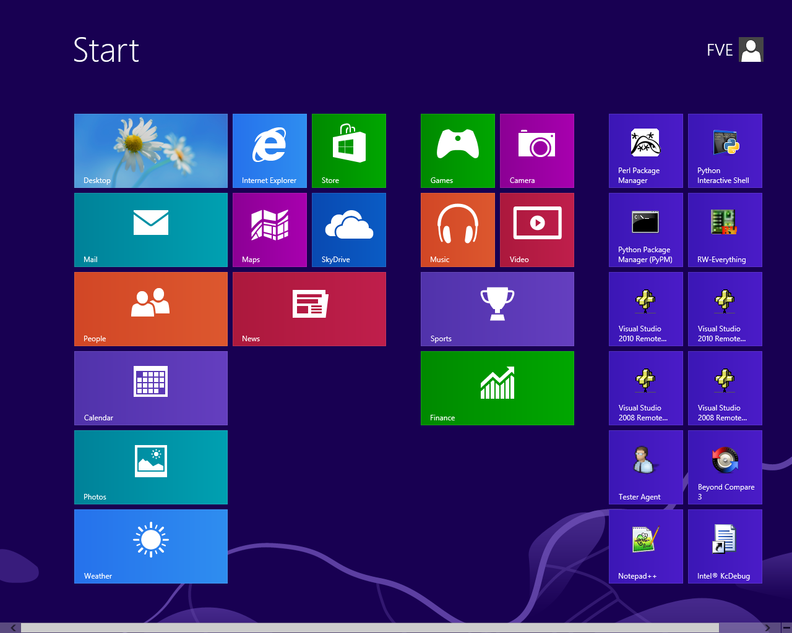
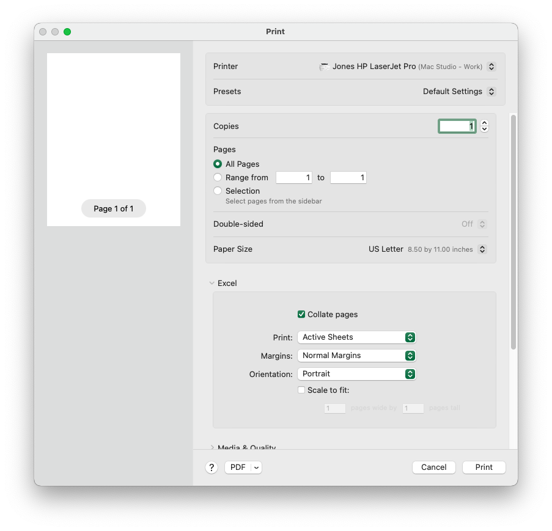
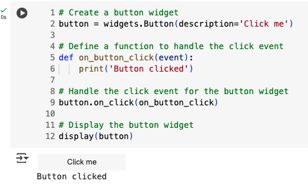

# Reading: ipywidgets

---

A graphical user interface, or GUI (pronounced “GOOEY”), includes the buttons, text boxes, images, and other components that a user interacts with in a computer program. For example, when you start Instagram on your phone, print a document from Word, or open Learning Suite, you are interacting with a graphical user interface. Look at these images and consider the various types of interactive components in each of these GUIs:

{width=500}

{width=700}

One of the ways we can make our Python code more user-friendly is by adding a GUI to it. Early in the semester, you learned how to use the Python `input()` statement to prompt the user to enter a text string or number. You also worked with Google Colab "forms" to create input boxes. These are simple types of GUIs. 

Another popular GUI that is designed especially for use in notebooks is **Jupyter Widgets**. These work in both Google Colab notebooks and the more common Jupyter Notebooks.

Jupyter widgets are implemented through a Python library called **ipywidgets**. These widgets allow the user to interact with your code in a more intuitive way, rather than just typing in commands and reading the output. You can build buttons, forms, sliders, and other ways to interact with your code.

You can also add formatted text to your notebook and widgets using HTML to make your notebook more visually appealing and professional. 

You can access the full documentation for ipywidgets [here](https://ipywidgets.readthedocs.io/en/latest/index.html){target='_blank'}. In the following sections, we will learn how to use ipywidgets to create interactive widgets in Colab notebooks.


## Importing

To use ipywidgets, you first need to import it. You can do this by using the following command:

```python
import ipywidgets as widgets
```

Note that ipywidgets comes pre-installed on Google Colab. If you are running in another environment, you may need to install it first.

## Overview

In general, when a user interacts with a widget, they trigger an **event**, such as clicking a button or moving a slider. These events can be very specific; for instance, a button might trigger one event when pressed and another when released. To make your code interactive, you must specify which event you want to monitor and define what should happen when it occurs. By handling these events, your code can perform actions based on user input, which requires structuring your program to listen for and respond to these triggers.

To use ipywidgets, you need to follow these steps:

1. **Create the widget** (e.g., a button, slider, or dropdown).
2. **Configure its properties**, such as its label (description), initial value, or appearance.
3. **Handle widget events** by defining a function that specifies how your code should respond to user interactions.
4. **Display the widget** in the notebook so the user can interact with it.

In the following sections, we will learn how to create widgets, set widget properties, handle widget events, and display widgets.

## Creating Widgets

There are many different types of widgets that you can create using ipywidgets. Some of the most common widgets include:

 - Button
 - Checkbox
 - Dropdown
 - FloatSlider and IntSlider (for sliders)
 - RadioButtons and Select (for dropdowns)
 - SelectMultiple (for dropdowns that allow multiple selections)
 - Text and Textarea (for text inputs)
 - ToggleButton and ToggleButtons (for buttons that can be toggled on and off)
 - HBox and VBox (to arrange widgets horizontally or vertically)
 - HTML (to display formatted text)
 - Image (to display images)
 - DatePicker (to select dates)
 - And many more

To create a widget, you can use the following command:
    
```python
widget = widgets.WidgetName() # Create a widget object
```
"WidgetName" represents the type of widget you want to create (e.g., `Button`, `IntSlider`). The variable `widget` is the name you assign to the object so you can interact with it later. 

For example, to create a button:
    
```python
button = widgets.Button(description='Click me') # Creates a Button object assigned to the variable 'button'
```

For a full list of widgets, you can refer to the [ipywidgets documentation - Widget List](https://ipywidgets.readthedocs.io/en/latest/examples/Widget%20List.html){target='_blank'}.


## Setting Widget Properties

You can set the properties of a widget by using the following command:

```python
widget.property = value
```

For example, to set the color of a button widget, you can use the following command:

```python
button.style.button_color = 'lightgreen' # Sets the button color to light green
```

For a full list of properties, refer to: [ipywidgets documentation - Widget List](https://ipywidgets.readthedocs.io/en/latest/examples/Widget%20List.html){target='_blank'}<br>
To learn more about styling widgets, see: [ipywidgets documentation - Styling of Jupyter widgets](https://ipywidgets.readthedocs.io/en/latest/examples/Widget%20Styling.html){target='_blank'}

## Handling Widget Events

You can handle events for a widget by using the following command structure:

```python
def on_event_name(event):
    # Code to handle the event
    # This function will be called when the event is triggered

widget.on_click(on_event_name) # For buttons
# OR
widget.observe(on_event_name, names='value') # For most other widgets
```

For example, to handle the click event for a button widget, you can use the following command:

```python
def on_button_click(event):
    print('Button clicked')
    
button.on_click(on_button_click) # Associates the function with the click event
```
You might have several buttons defined; for example, you might have a "start" button and a "fire" button. It is easier to stay organized if you use descriptive names when working with multiple buttons. 


The function defines what happens when the event occurs. The `event` parameter contains information about the trigger (such as which button was clicked or the new value of a slider). The `on_click` method (or `observe` for other widgets) connects the function to the widget.

For more details about widget events, you can refer to the [ipywidgets documentation - Widget Events](https://ipywidgets.readthedocs.io/en/latest/examples/Widget%20Events.html){target='_blank'}.

## Displaying Widgets

To display a widget in your notebook, use the `display()` function:

```python
display(widget)
```

For example:

```python
display(button) # Renders the 'button' object in the output cell
```

You can also use the `widgets.VBox` and `widgets.HBox` widgets to arrange widgets vertically or horizontally. For example, if you created two widgets called "widget1" and "widget2", you can use the following command to place them in a vertical box, arranging them one on top of the other:

```python
vbox = widgets.VBox([widget1, widget2])
display(vbox)
```

For more details about widget layout, you can refer to the [ipywidgets documentation - Widget Layout](https://ipywidgets.readthedocs.io/en/latest/examples/Widget%20Layout.html){target='_blank'}.

## Sample Use Cases

Let's create a simple example to demonstrate how to use ipywidgets. In this example, we will create a button widget that displays a message when clicked.

```python
import ipywidgets as widgets

# Create a button widget called "button"
button = widgets.Button(description='Click me')

# Define a function to handle the click event
def on_button_click(event):
    print('Button clicked')

# Handle the click event for the button widget
button.on_click(on_button_click) 

# Display the button widget
display(button)  # Makes the button object appear in the output cell
```
When you run this code, you will see a button widget displayed in the output cell. When you click the button, the message "Button clicked" will be printed in the output cell, like this:



Here is another example where we create a slider widget that displays the value of the slider when it is changed.

```python
import ipywidgets as widgets

# Create a slider widget called "slider"
slider = widgets.IntSlider(value=0, min=0, max=100, description='Value')

# Define a function to handle the change event
def on_slider_change(event):
    print('Slider value:', event['new'])
    
# Handle the change event for the slider widget
slider.observe(on_slider_change, names='value')

# Display the slider widget
display(slider)
```
Here is another example where we create a dropdown widget that displays the selected value when it is changed.

```python
import ipywidgets as widgets

# Create a dropdown widget called "dropdown"
dropdown = widgets.Dropdown(options=['Option 1', 'Option 2', 'Option 3'], value='Option 1', description='Value')

# Define a function to handle the change event
def on_dropdown_change(event):
    print('Selected value:', event['new'])

# Handle the change event for the dropdown widget
dropdown.observe(on_dropdown_change, names='value')

# Display the dropdown widget
display(dropdown)
```

## Getting values from widgets
You can get the current value of a widget by accessing its `value` property. For example, to get the value of a slider widget, you can use the following command:

```python
current_value = slider.value # Stores the current value of the slider widget in the variable 'current_value'
```

For example, if we create a text box widget and a button widget, we can get the value of the text box when the button is clicked:

```python
import ipywidgets as widgets
from IPython.display import display

# List to store captured texts
captured_texts = []

# Create a text box widget
text_box = widgets.Text(value='', description='Enter text:')

# Create a button widget
button = widgets.Button(description='Submit')

# Define a function to handle the click event
def on_button_click(event):
    entered_text = text_box.value
    captured_texts.append(entered_text)  # Store the entered text
    print('You entered:', entered_text)
    print('All captured texts:', captured_texts)

# Handle the click event for the button widget
button.on_click(on_button_click)

# Display the text box and button widgets
display(text_box)
display(button)
```

When you run this code, you will see a text box and a button displayed in the output cell. When you enter text into the text box and click the button, the message "You entered: [entered text]" will be printed in the output cell.

In the next cell, you could add code to process the `captured_texts` list further, such as analyzing the input or storing it for later use:
```python
# Code to process the captured_texts list further
print("All captured texts:", captured_texts)

# Since the "captured_texts" list is defined outside the function,
# you can access it here for further processing.
```

For widgets like sliders or dropdowns, you can get their current value in a similar way by accessing their `value` property. You can then use this value in your code as needed.

For example, here we create a slider widget with a button that, when clicked, prints the current value of the slider:

```python
# Create a slider widget
slider = widgets.IntSlider(value=50, min=0, max=100, description='Select value:')

# Create a button widget
button = widgets.Button(description='Get Slider Value')

# Define a function to handle the click event
def on_button_click(event):
    current_value = slider.value
    print('Current slider value:', current_value)

# Handle the click event for the button widget
button.on_click(on_button_click)

# Display the slider and button widgets
display(slider)
display(button)
```

When you run this code, you will see a slider and a button displayed in the output cell. When you adjust the slider and click the button, the message "Current slider value: [slider value]" will be printed in the output cell.

In the next cell, you can assign this value to a variable or use it in further calculations as needed:

```python
# Code to use the current_value variable further
print("You can now use the current_value variable in your code.")
my_value = slider.value 
print("The value you selected is:", my_value)
```

Here is how to access the slider value without a button widget - it will update every time the slider is changed:

```python
import ipywidgets as widgets
from IPython.display import display

# Create a slider widget
slider = widgets.IntSlider(value=50, min=0, max=100, description='Select value:')

# Define a function to handle the change event
def on_slider_change(event):
    current_value = slider.value
    print('Current slider value:', current_value)

# Handle the change event for the slider widget
slider.observe(on_slider_change, names='value')

# Display the slider widget
display(slider)
```

When you run this code, you will see a slider displayed in the output cell. When you adjust the slider, the message "Current slider value: [slider value]" will be printed in the output cell every time the slider is changed.

In the next cell, you can use the `current_value` variable in further calculations as needed:

```python
# Code to use the current_value variable further
print("You can now use the current_value variable in your code.")
my_value = slider.value  # Set from the slider
print("The value you selected is:", my_value)
```


## Conclusion

Widgets are a great way to make your code more interactive, user-friendly, and visually engaging. You may find several ways to incorporate widgets into your final project for this class.

For more information, you can refer to the [ipywidgets documentation](https://ipywidgets.readthedocs.io/en/latest/index.html){target='_blank'}.

# Pre-Class Quiz Challenge

Open a new Colab notebook and do the following:

1. Rename the notebook to "(Your_Name)_HW_ipywidgets.ipynb".
2. Create two different widgets:
      - One should be a button. Customize its description, style (color), and tooltip.
      - The other can be any widget of your choice. Try changing some of its properties.
3. Display the widgets.
4. Add an event handler to one of the widgets. For example, make the button print a message when clicked.
5. Arrange the widgets vertically using `widgets.VBox` and display them.
6. Test the widgets to ensure they work as expected.
7. **Challenge:** When the button is clicked, have it modify the other widget's properties (e.g., change a slider's value, disable the widget, or print its current value).
8. Share the link to your Colab notebook via Learning Suite when you take the Pre-Class Quiz.

---

## Turning in/Rubric

**_REMINDER_** - For this class, **you will only turn in the links to your Colab notebooks**. You will get a 0 for this assignment if you turn in a python file or a link that is not correct, wrong assignment, or does not give editor permission.

**Rubric:**

|                      Item                      | Points Possible |
|:----------------------------------------------:|:---------------:|
| <div style="text-align: right">**Total**</div> |        3        |

---

The following is not a part of the rubric, but specifies how you can lose points. For example: if you fail to share your link correctly.

| **Reasons for Points Lost** |    **Amount**     |  
|:---------------------------:|:-----------------:|
|   Link shared incorrectly   |       -10%        | 