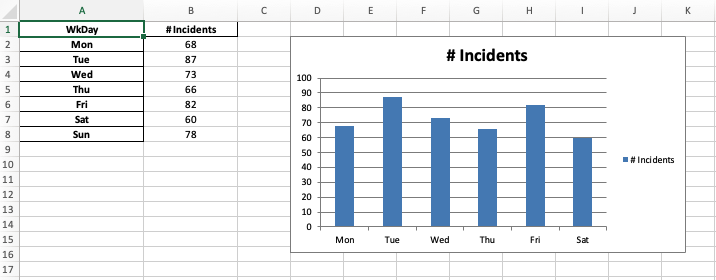

# In Class Excersise: Working with Excel Files in Python

In this class excersise, we will learn how to work with Excel files in Python. We will read Excel files into pandas dataframes, write dataframes to Excel files, and perform some basic data manipulation tasks.

To begin, create a new Colab notebook and name it '**[yourname]_excel_class.ipynb'**. Then follow the instructions below. Create and organize your code in cells in the notebook as you go.

## Part 1: Provo River Streamflow Data

In Unit 1, we worked with a set of streamflow data from gauges on the Provo River. In this exercise, we will import a copy of that data in Excel format, perform some data analysis, and write the results back to a new Excel file.

### Step 1: Installing and importing packages.

We need to install the xlsxwriter as is it not included in the default Colab environment.

```python
!pip install xlsxwriter
```

Next, we will import the required packages.

```python
import xlsxwriter
import pandas as pd
import matplotlib.pyplot as plt
```

### Step 2: Uploading the Excel File to Colab.

1. Download the Excel file from [streamflow_data.xlsx](streamflow_data.xlsx).
2. Upload the file to your Colab environment by clicking on the folder icon on the left sidebar, and then clicking on the upload icon. Or you can drag and drop the file into the file browser.

### Step 3: Read the Data

1. Next will use the `pandas` library to read the data into a dataframe. Use the `read_excel' method and read the sheet named '**Streamflow Data Part 2**'. 
2. Display the first few rows of the dataframe to see what the data looks like.
3. Change the **Date/time** column to a pandas datetime format and make it the index of the dataframe. Display the first few rows again and verify that the **Date/time** column is now the index.

### Step 4: Data Analysis

Note that the first column is a series of dates and times with multiple rows per day. The columns contain streamflow data in cubic feet per second (cfs) for different gauges on the Provo River. 

1. Create a new dataframe called **daily_df** that contains the daily average streamflow for each gauge.
2. Now that each row is for a specific date (not time), change the index of daily_df from a datetime index to a date index.**Hint**: daily_df.index = daily_df.index.date
2. Display the first few rows of the **daily_df** dataframe.
3. Create a line plot of the daily average streamflow for each gauge.

### Step 5: Write the Data to a New Excel File with a Chart

Now we will take the 'df_daily' dataframe and write it to a new Excel file. We will also include a chart of the data similar to the one we created in the previous step.

First, we need to create a new Excel file and write the data to it.

1. Create a new Excel file called 'streamflow_summary.xlsx' using the `xlsxwriter` package. This will give you a 
   'writer' object. Use the pandas `to_excel` method of the 'df_daily' dataframe to write the data to a sheet called 'Data'.
2. Create a workbook object and a worksheet from the writer object.
3. Create two format objects, one for the date column and one for the data columns. Use the `worksheet.set_column` 
   method to apply the formats to the columns. For the column widths, use 12 for the date column and 10 for the data 
   columns.

Next, we will add a chart to the worksheet. 

1. Create a new chart object using the `add_chart` method of the workbook object. Use the 'scatter' chart type, and 
   the 'smooth' subtype. Call your chart object '**chart1**'.
2. Add each of the series to the chart using the `add_series` method. In each case, define the series name using the header in each column, use the dates as the category axis, and the data as the values. Add the first series and then copy-paste the code for the other series.
3. Set the chart title, x-axis title, and y-axis title.
4. Set the chart size to 1000 x 600 pixels.
5. Insert the chart into the worksheet using the `insert_chart` method at cell **H2**.

Finally, we will finish up and close the notebook.

1. Set workbook size to 1800 x 1000 pixels.
2. Close the workbook using the `close` method.

### Step 6: Download the Excel File

1. Run the code to create the Excel file. You will see the file appear in the file browser on the left.
2. Click on the three dots next to the file name and select 'Download' to download the file to your local machine.
3. Open the file in Excel to see the data and chart.

When finished, Your Excel file should look similar to the one below:


## Part 2: Accident Database Analysis

In this part of the exercise, we will work with a dataset of workplace accidents that we used in Unit 1. We will read the data from an Excel file, perform some data analysis, and write the results back to a new Excel file along with some column charts.

Create a new section in your notebook called 'Part 2: Accident Database Analysis' and follow the instructions below.

### Step 1: Uploading the Excel File to Colab.

1. Download the Excel file from [accident_database.xlsx](accident_database.xlsx).
2. Upload the file to your Colab environment by clicking on the folder icon on the left sidebar, and then clicking on the upload icon. Or you can drag and drop the file into the file browser.

### Step 2: Read the Data

1. Next will use the `pandas` library to read the data into a dataframe. Use the `read_excel` method. In this case, 
   you don't need to specify the sheet name as there is only one sheet in the file.
2. Display the first few rows of the dataframe to see what the data looks like.
3. Make the '**Date**' column the index of the dataframe and display the first few rows again.

### Step 3: Data Analysis

1. Create a new dataframe called '**inc_df**' and use the `pandas` groupby method to group the data by '**Incident Type**' 
   and find the mean of the '**Incident Cost**' column. This will give you the average cost of each type of incident. 
   Display your results.
2. Create a bar chart of the average incident cost for each incident type using matplotlib.
3. Create a second dataframe called '**day_df**' that groups the data by '**WkDay**' and finds the total number of 
   incidents on each day of the week (count the number of WkDay items). Display your results. 
4. Reindex the **day_df** dataframe so 
   that the days are in order (Mon,
   Tue, Wed, etc.). Display your results.
4. Create a bar chart of the total number of incidents on each day of the week using matplotlib.

### Step 4: Write the Data to a New Excel File with Charts

Now we will take the '**inc_df**' and '**day_df**' dataframes and write them to a new Excel file. We will also include 
charts of the data similar to the ones we created in the previous steps. Once again, we will use the pandas 
`ExcelWriter` to write the data and then use the `xlsxwriter` package to format the data and add the charts.

1. Create a writer object for a new Excel file called '**accident_summary.xlsx**'. Use the pandas 
`to_excel` 
method of the 'inc_df' and 'day_df' dataframes to write the data to the file. Put the 'inc_df' data on a sheet 
named '**Type**' and the 'day_df' data on a sheet named '**Day**'. 
2. Create a workbook object from the ExcelWriter object. Create a worksheet object associated with the '**Type**' sheet in 
   the 
   workbook.
3. Set the column width to 20 for column A using the `set_column` method of the worksheet object.
   You don't need to include a format object. 
4. Make a currency_format object and apply it to column B using the `set_column` method. Use a column width = 15.
2. Add a column chart called **chart2** to the '**Type**' sheet.  Reference 
  the table in columns A and B of the 'Type' sheet for the chart data. 
3. Add the chart to the 
   worksheet at cell 'D2'.

Now do the same thing to add a column chart to the 'Day' sheet using the data in that sheet.

1. Create a worksheet object associated with the '**Day**' sheet in the workbook.
2. Set the column width to 20 for column A using the `set_column` method of the worksheet object.
   You don't need to include a format object. 
4. Make a number_format object (center align) and apply it to column B using the `set_column` method. Use a column 
   width = 15.
2. Add a column chart called **chart3** to the '**Day**' sheet.  Reference columns A and B of the 'Day' sheet for the 
   chart data.
3. Add the chart to the worksheet at cell 'D2'.
4. Change the workbook size to 1500 x 800 pixels.
5. Close the workbook object.

### Step 5: Download the Excel File

1. Run the code to create the Excel file. You will see the file appear in the file browser on the left.
2. Click on the three dots next to the file name and select 'Download' to download the file to your local machine.
3. Open the file in Excel to see the data and charts.

When finished, Your Excel file should look similar to the one below:




---

## Turning in/Rubric
Turn sharing and editing on, then submit the link to Learning Suite in the feedback box. In-class assignment scores are based on valid effort and completion.
