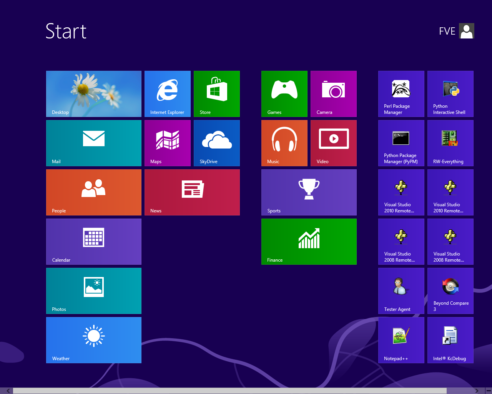
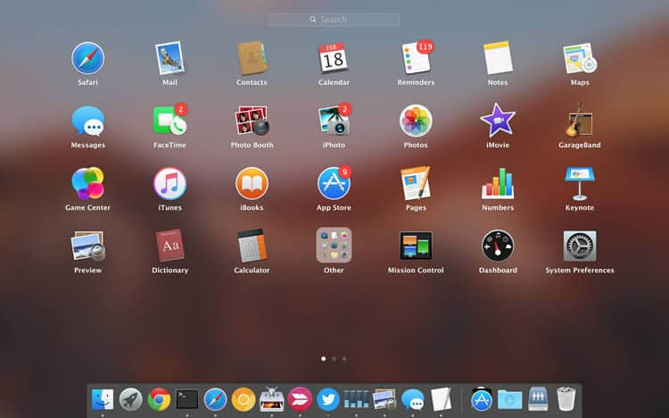
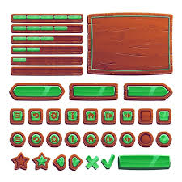

# Reading: ipywidgets

A graphical user interface , or GUI (pronounced “GOOEY”) is the buttons, text boxes, pictures, and stuff that a user of a computer program interacts with.

For example, when you start Instagram on your phone, or print a document from Word, or even when you open Learning Suite, you are looking at and interacting with a graphical user interface. Look at this image and consider the various types of interactive components in each of these GUI’s.

As we’ve discussed previously, Google’s Colaboratory Python Notebook environment is only ONE of MANY different ways to write Python code.
And…Python is only ONE of DOZENS of different programming languages.
And…we are going to use ‘ipywidgets’ to build graphical user interfaces for your code. But realize that this is only ONE of MANY different tools for making GUI’s in a Python notebook. It is a pretty handy one though, and the principles we learn here are transferable to all of the other tools, Python environments, and programming libraries. 

Examples of GUI’s:

{width=100}






**NOTE:** ipywidgest won’t let us build complex GUI’s like the ones pictures above, but we can actually do quite a lot with it. We can make buttons, sliders, checkboxes, text inputs, dropdown boxes and so much more.

ipywidgets are just one method to create this powerful tool in python. Primarily used in Google Colab or Jupyter notebooks. They can be used to create interactive visualizations, dashboards, and more. In this reading, we will learn how to use ipywidgets to create interactive widgets in Jupyter notebooks.


## Installation

To install ipywidgets, you can use the following command:

```python
!pip install ipywidgets
```
**NOTE:** When using Google Colab, you don't need to install it. You only need to install ipywidgets once. If you have already installed it, you can skip this step.


## Importing

To use ipywidgets, you need to import it. You can do this by using the following command:

```python
import ipywidgets as widgets
```


## Creating Widgets

There are many different types of widgets that you can create using ipywidgets. Some of the most common widgets include:
 - Button
 - Checkbox
 - Dropdown
 - FloatSlider and IntSlider (for sliders)
 - RadioButtons and Select (for dropdowns)
 - SelectMultiple (for dropdowns that allow multiple selections)
 - Text and Textarea (for text inputs)
 - ToggleButton and ToggleButtons (for buttons that can be toggled on and off)
 - HBox and VBox (to arrange widgets horizontally or vertically)
 - HTML (to display HTML)
 - Image (to display images)
 - DatePicker (to select dates)
 - And many more

To create a widget, you can use the following command:
    
```python
widget = widgets.WidgetName()
```

For example, to create a button widget, you can use the following command:
    
```python
button = widgets.Button(description='Click me')
```

For a full list of widgets, you can refer to the [ipywidgets documentation - Widget List](https://ipywidgets.readthedocs.io/en/latest/examples/Widget%20List.html){target='blank'}.


## Setting Widget Properties

You can set the properties of a widget by using the following command:

```python
widget.property = value
```

For example, to set the description of a button widget, you can use the following command:

```python
button.style = 'warning'
```

For a full list of properties, you can refer to the [ipywidgets documentation - Widget List](https://ipywidgets.readthedocs.io/en/latest/examples/Widget%20List.html){target='blank'} or read [ipywidgets documentation - Styling of Jupyter widgets](https://ipywidgets.readthedocs.io/en/latest/examples/Widget%20Styling.html){target='blank'} to learn more about to styling widgets.


## Handling Widget Events

You can handle events for a widget by using the following command:

```python
def on_event_name(event):
    # code to handle event

widget.on_event_name(on_event_name)
```

For example, to handle the click event for a button widget, you can use the following command:

```python
def on_button_click(event):
    print('Button clicked')
    
button.on_click(on_button_click)
```

For more details about widget events, you can refer to the [ipywidgets documentation - Widget Events](https://ipywidgets.readthedocs.io/en/latest/examples/Widget%20Events.html){target='blank'}.


## Displaying Widgets

To display a widget, you can use the following command:

```python
display(widget)
```

For example, to display a button widget, you can use the following command:

```python
display(button)
```

You can also use the `widgets.VBox` and `widgets.HBox` widgets to arrange widgets vertically or horizontally. For example, to arrange two widgets vertically, you can use the following command:

```python
vbox = widgets.VBox([widget1, widget2])
display(vbox)
```

For more details about widget layout, you can refer to the [ipywidgets documentation - Widget Layout](https://ipywidgets.readthedocs.io/en/latest/examples/Widget%20Layout.html){target='blank'}.


## Conclusion

In this reading, we learned how to use ipywidgets to create interactive widgets in Jupyter notebooks. We learned how to install ipywidgets, import it, create widgets, set widget properties, handle widget events, and display widgets. We also learned about the different types of widgets and how to arrange widgets vertically or horizontally. We hope you found this reading helpful and that you are now ready to create your own interactive widgets in Jupyter notebooks.

While knowing how to make widgets won't help or is not needed for future work projects in your careers, it is a fun and interesting way to learn how to make your code more interactive and user-friendly. It can also be a great way to learn how to make your code more visually appealing and engaging. This will be a fun addition you can add to your final project in this class.

For more information, you can refer to the [ipywidgets documentation](https://ipywidgets.readthedocs.io/en/latest/index.html){target='blank'}.


# Pre-Class Quiz Challenge

Open a new Colab notebook and do the following:

1. Create two different widgets:
      - One should be a button. Try to change the description, style (color), and tooltip of the button. 
      - The other can be any widget of your choice. Try to changing some properties of the widget.
2. Display the widgets.
3. Try adding an event to one of the widgets. For example, you can add an event to the button that prints a message when the button is clicked.
4. Arrange the widgets vertically using `widgets.VBox` and display them.
5. Run the code and test the widgets to make sure they work as expected.
6. As a challenge, try adding making it so that when the button is clicked, the other widget changes its properties. For example, if you have a slider, try changing the value of the slider when the button is clicked. You could even have the Button disable the other widget when clicked or print the value of the other widget when clicked.
7. Share the link to your Colab notebook via Learning Suite when you take the Pre Class Quiz.
